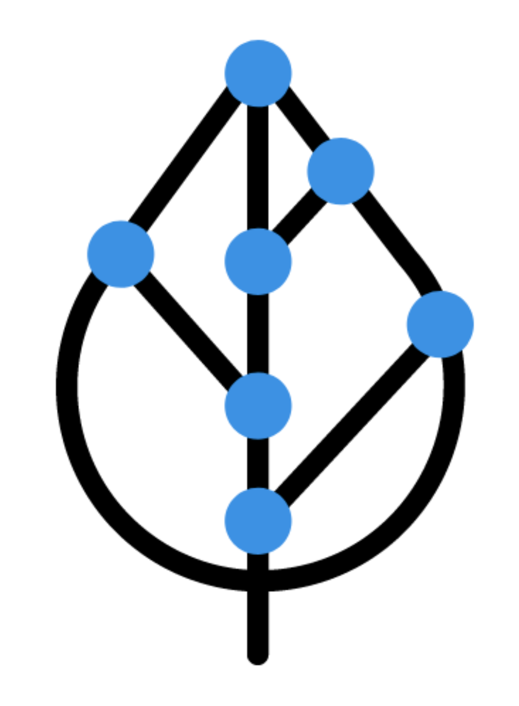
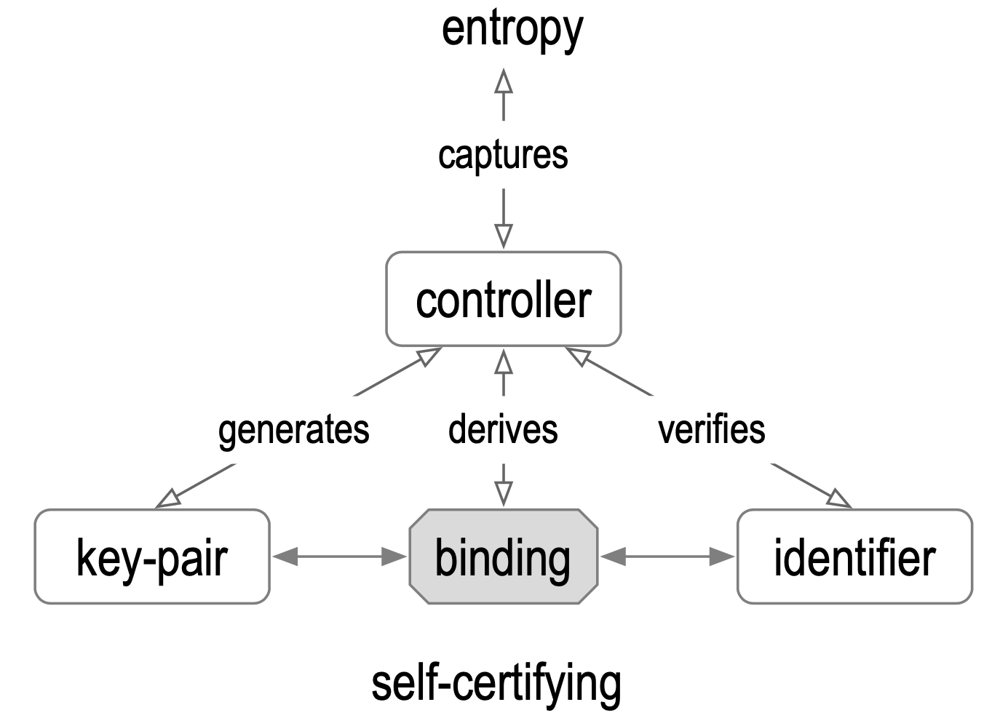
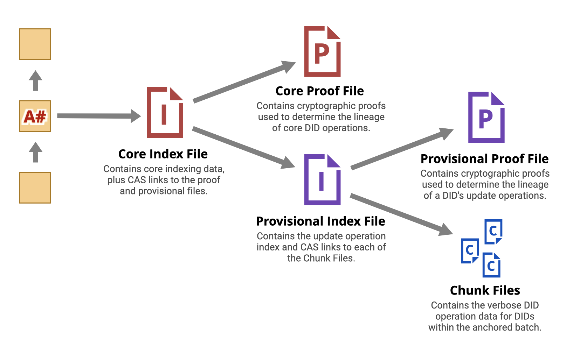
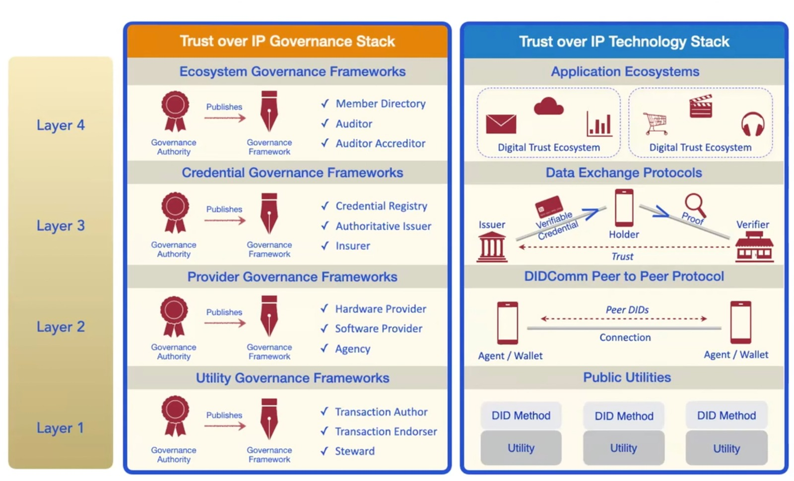

# Q&A about Sidetree
**The questions are mixed basic and detailed, the answers are mostly directed towards generally interested people and newbies.**

Why should you read or step through the Q&A? To get a different angle to the same topic: Sidetree.



```
{TBW} means: to be written
```
- [Q&A about Sidetree](#qa-about-sidetree)
    + [Disclaimer](#disclaimer)
    + [List of questions and definitions](#list-of-questions-and-definitions)
  * [Knowledge you should be confidently applying](#knowledge-you-should-be-confidently-applying)
  * [Actions you should be comfortable with](#actions-you-should-be-comfortable-with)
- [Jump table to categories](#jump-table-to-categories)

Inspired by [specifications](https://identity.foundation/sidetree/spec/) and questions raised during DIF Sidetree WG meetings, but also issues created and handled [here](https://github.com/decentralized-identity/sidetree/issues) and the progress made, here on Github (Turn on 'Watch' if you want to be notified of conversations).

Beware: A Q&A is always *work in progress*. Tips & help welcome.

### Disclaimer
None of the respondents in the **open** repo and presentations have been explicitly named as a source, except for ***@csuwildcat*** (Daniel Buchner, expert), ***@thehenrytsai*** (Henry Tsai, expert) and ***@henkvancann*** (noob). 

If there is no reference added to the answers, then its content stems from either one or more of these sources
- [Spec]https://identity.foundation/sidetree/spec/
- [Github Sidetree](https://github.com/decentralized-identity/sidetree)
- [What bitcoin Did 231](https://www.whatbitcoindid.com/wbd231-daniel-buchner)
- it's Daniel Buchner or Henry Tsai who answered the question. 
Most of the editing is done by @henkvancann, which might have introduced ommission, errors, language glitches and such. Sorry for that, feel free to correct by submitting a pull request (PR).\
For practical reasons educational images uploaded by Github members may have been downloaded. We de-personalised them by giving images a new name. Under these new names these images have been uploaded to github and used in the Q&A to clarify the questions and answers.

Sidetree's content is licensed under the [Apache License 2.0](https://github.com/decentralized-identity/sidetree/blob/master/LICENSE). 

We've done our best to protect the privacy of the Github by investigating the images we used. We haven't come across personal identifiable information (pii). However, should we have made a mistake after all, please let us know and we'll correct this immediately.

### List of questions and definitions

- [Definitions:](#definitions)
      - [Authentic Chained Data Container Task Force](#authentic-chained-data-container-task-force)
      - [Agent](#agent)
      - [Agency](#agency)
      - [Bidirectional model transformation](#bidirectional-model-transformation)
      - [Claim](#claim)
      - [Content-addressable hash](#content-addressable-hash)
      - [Controller](#controller)
      - [Cryptocurrency](#cryptocurrency)
      - [Decentralized Identity](#decentralized-identity)
      - [Delta-based](#delta-based)
      - [Deterministic Ruleset (of Sidetree)](#deterministic-ruleset--of-sidetree)
      - [Entropy](#entropy)
      - [Entity](#entity)
      - [Identity](#identity)
      - [JSON Web Key](#json-web-key)
      - [Key](#key)
      - [Normative](#normative)
      - [Non-normative](#non-normative)
      - [Payload](#payload)
      - [Public Key Infrastructure](#public-key-infrastructure)
      - [Race condition](#race-condition)
      - [Root of trust](#root-of-trust)
      - [Secret](#secret)
      - [Self Certifying Identifier](#self-certifying-identifier)
      - [Self Sovereign Identity](#self-sovereign-identity)
      - [Subject](#subject)
      - [Transfer](#transfer)
      - [Transferable identifier](#transferable-identifier)
      - [Trust-over-IP](#trust-over-ip)
      - [Validator](#validator)
      - [Verifiable Credential](#verifiable-credential)
      - [W3C DID](#w3c-did)
      - [WebAssembly](#webassembly)
      - [(Digital Identity) Wallet](#-digital-identity--wallet)
- [Q&A section General](#qa-section-general)
  * [What is Sidetree?](#what-is-sidetree)
  * [What is the setting of sidetree?](#what-is-the-setting-of-sidetree)
  * [How is the inner working of Sidetree?](#how-is-the-inner-working-of-sidetree)
  * [For who is Sidetree?](#for-who-is-sidetree)
  * [Why should we care about Sidetree or Self Sovereign Identity](#Why-should-we-care-about-Sidetree-or-Self-Sovereign-Identity)
  * [Why use Sidetree?](#why-use-sidetree)
  * [What is so unique to Sidetree?](#what-is-so-unique-to-sidetree)
  * [Is Sidetree a DID?](#is-sidetree-a-did)
  * [How does Sidetree match the `trust-over-ip` model and in the `W3C DID standardization`?](#how-does-sidetree-match-the--trust-over-ip--model-and-in-the--w3c-did-standardization)
  * [Who is Sidetree? Is it a company or a not for profit?](#who-is-sidetree--is-it-a-company-or-a-not-for-profit)
  * [In what programming languages is Sidetree available?](#in-what-programming-languages-is-sidetree-available)
  * [Does Sidetree cooperate with other projects in the self-sovereign Identity field?](#does-sidetree-cooperate-with-other-projects-in-the-self-sovereign-identity-field)
  * [Why is Microsoft so interested in supporting these developments?](#Why-is-Microsoft-so-interested-in-supporting-these-developments)
  * [What's the diffrence between a `normative` and `non-normative` description or theory?](#what-s-the-diffrence-between-a--normative--and--non-normative--description-or-theory)
  * [Is Sidetree privacy preserving / GPDR proof?](#is-sidetree-privacy-preserving---gpdr-proof)
- [Q&A section Sidetree operational](#qa-section-sidetree-operational)
  * [Where can I download Sidetree?](#where-can-i-download-sidetree)
  * [Where can we find the code and how could a coder get started?](#where-can-we-find-the-code-and-how-could-a-coder-get-started)
  * [What are the external dependencies of Sidetree?](#what-are-the-external-dependencies-of-sidetree)
  * [In what can we find the efficiency booster that Sidetree promises to be?](#in-what-can-we-find-the-efficiency-booster-that-sidetree-promises-to-be)
  * ["Process operations in accordance with the protocol deterministic ruleset." What does this mean?](#-process-operations-in-accordance-with-the-protocol-deterministic-ruleset--what-does-this-mean)
  * [What would you see as the main drawback of Sidetree?](#what-would-you-see-as-the-main-drawback-of-sidetree)
  * [How can it be one solution, fit for more DIDs?](#how-can-it-be-one-solution--fit-for-more-dids)
  * [Where you would need something quite different than Sidetree to solve a similar problem?](#where-you-would-need-something-quite-different-than-sidetree-to-solve-a-similar-problem)
  * [How does Sidetree scale](#how-does-sidetree-scale)
  * [How does Sidetree keep data internally consistent over nodes?](#how-does-sidetree-keep-data-internally-consistent-over-nodes)
  * [How does Sidetree keep identifiers secure?](#how-does-sidetree-keep-identifiers-secure)
  * [How does Sidetree handle `race conditions`?](#how-does-sidetree-handle--race-conditions)
  * [What are the security risks of Sidetree with regard to the identity protocol?](#what-are-the-security-risks-of-sidetree-with-regard-to-the-identity-protocol)
  * [Is Sidetree post-quantum secure?](#is-sidetree-post-quantum-secure)
  * [What happens if I or other people are offline?](#what-happens-if-i-or-other-people-are-offline)
  * [How to handle multiple versions of Sidetree protocol. How to keep the network in sync?](#how-to-handle-multiple-versions-of-sidetree-protocol-how-to-keep-the-network-in-sync)
      - [Version Segment Definitions:](#version-segment-definitions)
      - [New Version Activation](#new-version-activation)
  * [How to handle multiple formats of Sidetree JSON files through time. Will they be backwards compatible?](#how-to-handle-multiple-formats-of-sidetree-json-files-through-time-will-they-be-backwards-compatible)
  * [Could Sidetree work with be pruned or charded blockchains?](#could-sidetree-work-with-be-pruned-or-charded-blockchains)
  * [How to bootstrap Sidetree on the internet? Is it like fax machine; the more there are the more effective it is?](#how-to-bootstrap-sidetree-on-the-internet--is-it-like-fax-machine--the-more-there-are-the-more-effective-it-is)
- [Q&A section Userinterface](#qa-section-userinterface)
  * [What does Sidetree look like?](#what-does-sidetree-look-like)
  * [Is there a Sidetree course or webinar available?](#is-there-a-sidetree-course-or-webinar-available)
  * [Could Sidetree work for edge computers that need self sovereign identity? How to (selectively) share control with the owners of the device?](#could-sidetree-work-for-edge-computers-that-need-self-sovereign-identity--how-to--selectively--share-control-with-the-owners-of-the-device)
- [Q&A section Root of trust](#qa-section-root-of-trust)
  * [What do I need to trust in Sidetree?](#what-do-i-need-to-trust-in-sidetree)
  * [How does Sidetree establish the root-of-trust that we need for SSI? How does the data persist?](#how-does-sidetree-establish-the-root-of-trust-that-we-need-for-ssi--how-does-the-data-persist)
- [Q&A section Identifiers](#qa-section-identifiers)
  * [How is a Sidetree identifier different than a regular identifier in DID methods?](#how-is-a-sidetree-identifier-different-than-a-regular-identifier-in-did-methods)
  * [Is my Sidetree identifier public?](#is-my-sidetree-identifier-public)
  * [Is a Sidetree identifier GPDR proof?](#is-a-sidetree-identifier-gpdr-proof)
  * [Does Sidetree support transferable identifiers?](#does-sidetree-support-transferable-identifiers)
  * [File structure](#file-structure)
  * [What do we need IPFS for?](#what-do-we-need-ipfs-for)
- [Q&A section Wallets](#qa-section-wallets)
  * [Do I need a wallet for Sidetree?](#do-i-need-a-wallet-for-sidetree)
  * [How can I backup the Sidetree identifiers in my wallet?](#how-can-i-backup-the-sidetree-identifiers-in-my-wallet)
  * [Can I receive crypto money in my Sidetree wallet?](#can-i-receive-crypto-money-in-my-sidetree-wallet)
  * [Does a Sidetree wallet store virtual credentials connect to my identifiers?](#does-a-sidetree-wallet-store-virtual-credentials-connect-to-my-identifiers)
- [Q&A section Signatures](#qa-section-signatures)
  * [Who can sign off my proofs and identifiers?](#who-can-sign-off-my-proofs-and-identifiers)
  * [What is the practical use of signatures?](#what-is-the-practical-use-of-signatures)
- [Q&A section Proofs](#qa-section-proofs)
  * [What does Sidetree proof?](#what-does-sidetree-proof)
  * [Do I need to show the full IPFS Sidetree database to anybody I transact with, even though I'd only like to show a part of it, for example a virtual credential?](#do-i-need-to-show-the-full-ipfs-sidetree-database-to-anybody-i-transact-with--even-though-i-d-only-like-to-show-a-part-of-it--for-example-a-virtual-credential)
- [Q&A section Private Key Management](#qa-section-private-key-management)
  * [How secure is the Sidetree infrastructure?](#how-secure-is-the-sidetree-infrastructure)
  * [How multi-tasking is Sidetree?](#how-multi-tasking-is-sidetree)
  * [Does your public-private-key format matter in Sidetree?](#does-your-public-private-key-format-matter-in-sidetree)
  * [Not your keys, not your identity?](#not-your-keys--not-your-identity)
  * [The wallet is there to store my Sidetree private keys safely, no?](#the-wallet-is-there-to-store-my-sidetree-private-keys-safely--no)
  * [Are compound private keys (Shamir Secret Sharing) and multisignature schemes possible to create identifiers?](#are-compound-private-keys--shamir-secret-sharing--and-multisignature-schemes-possible-to-create-identifiers)
  * [How to delegate control over my private keys that control my identifiers?](#how-to-delegate-control-over-my-private-keys-that-control-my-identifiers)
- [Q&A section Blockchain](#qa-section-blockchain)
  * [Does Sidetree use a blockchain?](#does-sidetree-use-a-blockchain)
  * [What's the difference between Sidetree and blockchain?](#what-s-the-difference-between-sidetree-and-blockchain)
  * [Why does Sidetree need a blockchain?](#why-does-sidetree-need-a-blockchain)
- [Q&A section Agencies](#qa-section-agencies)
  * [What does the governance framework of Sidetree look like?](#what-does-the-governance-framework-of-sidetree-look-like)

<small><i><a href='http://ecotrust-canada.github.io/markdown-toc/'>Table of contents generated with markdown-toc</a></i></small>

## Knowledge you should be confidently applying
- The definitions above
- W3C DIDs
- Public private key pairs
- Bitcoin Improvement Protocols: BIP32, BIP39, BIP44, BIP47, BIP49, BIP84, BIP174
- hierarchical deterministic derivation paths
- Base58
- Eliptic curves
- {TBW}
## Actions you should be comfortable with
- Amend knowledge and keep existing knowledge up to date
- create a key pair safely and back it up safely
- {TBW}

# Jump table to categories
- [General](#qa-section-general)
- [Sidetree operational](#qa-section-sidetree-operational)
- [Userinterface](#qa-section-userinterface)
- [Identifiers](#qa-section-identifiers)
- [Wallets](#qa-section-wallets)
- [Signatures](#qa-section-signatures)
- [Proofs](#qa-section-proofs)
- [Private Key Management](#qa-section-private-key-management)
- [Blockchain](#qa-key-blockchain)
- [Agencies](#qa-key-agencies)


# Definitions

## Abbreviations
In alphabetic order:\
ACDC = Authentic Chained Data Container Task Force
BX = [Bidirectional model transformation](#bidirectional-model-transformation)
CAS = Content Addressable Storage 
DID = [Decentralized Identity](#decentralized-identity) or Digital Identity dependent of the context.\
DIF = Decentralized Identity Foundation\
DDO = DID Document, look up W3D DID standardization for more info\
DHT = Distributed Hash Table\
DIF = Decentralized Identity Foundation, https://identity.foundation\
DKMI = Decentralized Key Mangement Infrastructure\
JWK = [JSON Web Key](#json-web-key)
IPv4 = standard Internet Protocol, version 4\
PKI = [Public Key Infrastructure](#public-key-infrastructure)\
PR = Pull Request; github terminology\
SSSI = [Self Sovereign Identity](#self-sovereign-identity)\
VC = Verifiable Credential, look up W3D DID standardization for more info\
WASM = [WebAssembly](#WebAssembly)


Definitions in alphabetic order:

Terminology specific for Sidetree can be found [here](https://identity.foundation/sidetree/spec/#terminology). The following definitions are specificly listed to support the **Question and Answers** on a simpler level, and to be able to put Sidetree in relation to other fields of interest.

#### Authentic Chained Data Container Task Force
Or ACDC. The purpose of the Authentic Chained Data Container (ACDC) Task Force  is to draft a TSS (ToIP Standard Specification) that defines the standard requirements for the semantics of Authentic Provenance Chaining of Authentic Data Containers. [See more](https://wiki.trustoverip.org/display/HOME/ACDC+%28Authentic+Chained+Data+Container%29+Task+Force)

#### Agent
A representative for an _identity_. MAY require the use of a _wallet_. MAY support _transfer_

#### Agency
Agents can be people, edge computers and the functionality within [`wallets`](#digital-identity-wallet). The service an agent offers is agency.

#### Bidirectional model transformation
Or `BX`. Keeping a system of models mutually consistent (model synchronization) is vital for model-driven engineering. In a typical scenario, given a pair of inter-related models, changes in either of them are to be propagated to the other to restore consistency. This setting is often referred to as bidirectional model transformation (BX). Delta-based is the way to go for Side-tree.
[Source and more info](https://citeseerx.ist.psu.edu/viewdoc/download?doi=10.1.1.386.7739&rep=rep1&type=pdf)

#### Claim
An assertion of the truth of something, typically one which is disputed or in doubt. A set of claims might convey personally identifying information: ½name, address, date of birth and citizenship, for example. ([Source](https://www.identityblog.com/?p=352)).

#### Content-addressable hash
Content addressing is a way to find data in a network using its content rather than its location. The way we do is by taking the content of the content and hashing it. Try uploading an image to IPFS and get the hash using the below button. In the IPFS ecosystem, this hash is called Content Identifier, or CID.
#### Controller
The entity that has the ability to make changes to an _identity_, _cryptocurrency_ or v_erifiable credential_. 

The controller of an `autonomous identifier` is the entity (person, organization, or autonomous software) that has the capability, as defined by derivation, to make changes to an `Event Log`. This capability is typically asserted by the control of a single inception key. In DIDs this is typically asserted by the control of set of cryptographic keys used by software acting on behalf of the controller, though it may also be asserted via other mechanisms. In Sidetree an AID has one single controller. Note that a DID may have more than one controller, and the DID `subject` can be the DID controller, or one of them.

#### Cryptocurrency
A digital asset designed to work as a medium of exchange wherein individual coin ownership records are stored in a digital ledger or computerized database using strong cryptography to secure transaction record entries, to control the creation of additional digital coin records. See [more](https://en.wikipedia.org/wiki/Cryptocurrency)

#### Decentralized Identity
DID; Decentralized identity is a technology that uses cryptography to allow individuals to create and control their own unique identifiers. They can use these identifiers to obtain `Verifiable Credentials` from trusted organisations and, subsequently, present elements of these credentials as proof of claims about themselves. In this model, the individual takes ownership of their own identity and need not cede control to centralized service providers or companies.

#### Delta-based
Delta-based (vs. _state-based_) is a notion that is hard to grasp. See it simplified as _"keeping Sidetree data internally consistent and in sync"_.

The Sidetree protocol defines a core set of `DID PKI` state change operations, structured as **delta-based** Conflict-Free Replicated Data Types.\
Given pairs of inter-related models (nodes / peers) in Sidetree, changes in either of them are to be propagated to the other to restore consistency; also called [BX](#bidirectional-model-transformation).\
Propagation operations use deltas as input and output rather than compute them internally. Such frameworks (in our case a **tree-oriented**) have been built for the _asymmetric_ BX case, in which one model in the pair is a view of the other and hence does not contain any new information. In practice, however, it is often the case that two models share some information but each of them contains something new not present in the other; we call this case _symmetric_ `BX`.

[Source and more info](https://citeseerx.ist.psu.edu/viewdoc/download?doi=10.1.1.386.7739&rep=rep1&type=pdf)

#### Deterministic Ruleset (of Sidetree)
Which guarantees only one `fork` of a DID’s state history can ever be valid.\
To better understand this, read this [section](https://identity.foundation/sidetree/spec/#late-publishing) that illustrates a DID owner, Alice, creating forks by creating and anchoring operations in the past that she does not expose to the network. Known as _Late Publishing_ of a DID operation. 

#### Entropy
Unpredictable information. Often used as a _secret_ or as input to a _key_ generation algorithm.[More](https://en.wikipedia.org/wiki/Entropy_(information_theory))

The term entropy is also used to describe the degree of unpredictability of a message. Entropy is then measured in bits. The degree or strength of randomness determines how difficult it would be for someone else to reproduce the same large random number. This is called _collision resistance_. 

#### Entity
Entities are not limited to natural persons but may include groups, organizations, software agents, things, and even data items. 

#### Identity
A unique entity. Typically represented with a unique identifier.

#### JSON Web Key
A JSON Web Key (JWK) is a JavaScript Object Notation (JSON) data structure that represents a cryptographic key. [More info](https://tools.ietf.org/html/rfc7517).\
The following **example** JWK declares that the key is an Elliptic Curve key, it is used with the P-256 Elliptic Curve, and its x and y coordinates are the base64url-encoded values shown.  A key identifier is also provided for the key:
```
     {"kty":"EC",
      "crv":"P-256",
      "x":"f83OJ3D2xF1Bg8vub9tLe1gHMzV76e8Tus9uPHvRVEU",
      "y":"x_FEzRu9m36HLN_tue659LNpXW6pCyStikYjKIWI5a0",
      "kid":"Public key used in JWS spec Appendix A.3 example"
     }
```

#### Key
A mechanism for granting or restricing access to something. MAY be used to issue and prove, MAY be used to transfer and control over _identity_ and _cryptocurrency_. [More](https://en.wikipedia.org/wiki/Key_(cryptography))

#### Normative
In general, we call a theory “normative” if it, in some sense, tells you what you should do - what action you should take. If it includes a usable procedure for determining the optimal action in a given scenario. [Souce](https://www.quora.com/What-is-the-difference-between-normative-and-non-normative?share=1).

#### Non-normative
A theory is called non-normative if it does not do that. In general, the purpose of non-normative theories is not to give answers, but rather to describe possibilities or predict what might happen as a result of certain actions.
[Souce](https://www.quora.com/What-is-the-difference-between-normative-and-non-normative?share=1).

#### Payload
The term 'payload' is used to distinguish between the 'interesting' information in a chunk of data or similar, and the overhead to support it. It is borrowed from transportation, where it refers to the part of the load that 'pays': for example, a tanker truck may carry 20 tons of oil, but the fully loaded vehicle weighs much more than that - there's the vehicle itself, the driver, fuel, the tank, etc. It costs money to move all these, but the customer only cares about (and pays for) the oil, hence, 'pay-load'. [source](https://softwareengineering.stackexchange.com/questions/158603/what-does-the-term-payload-mean-in-programming).

Now payload in `Sidetree`. The payload could be one of the following cryptographical building blocks in Sidetree:
- a content digest hash 
- a root hash of a Merkletree
- a public key
Note that the Sidetree never puts raw data or privacy sensitive data in its JSON files.\
_(@henkvancann)_

#### Public Key Infrastructure
A public key infrastructure (PKI) is a set of roles, policies, hardware, software and procedures needed to create, manage, distribute, use, store and revoke digital certificates and manage public-key encryption. [Wikipedia].(https://en.wikipedia.org/wiki/Public_key_infrastructure)

#### Race condition
A race condition or race hazard is the condition of an electronics, software, or other system where the system's substantive behavior is dependent on the sequence or timing of other uncontrollable events. It becomes a bug when one or more of the possible behaviors is undesirable. [Source](https://en.wikipedia.org/wiki/Race_condition).

#### Root of trust
Replace human basis-of-trust with cryptographic root-of-trust. With verifiable digital signatures from asymmetric key cryptography we may not trust in “what” was said, but we may trust in “who” said it.\
The root-of-trust is consistent attribution via verifiable integral non-repudiable statements.

#### Secret
Information controlled by an identity. MAY be used to derive _key_s.

#### Self Certifying Identifier
In brief: A self-certifying identifier cryptographically binds an identifier to a key-pair.\
A controller issues an own Identifier by binding a generated public private keypair to an identifier. After this a controller is able to sign the identifier and create a certificate. Also called a _cryptonym_. The simplest form of a self-certifying identifier includes either the public key or a unique fingerprint of the public key as a `prefix` in the identifier. Image from [KERI](https://github.com/decentralized-identity/keri):



The root-of-trust is fully cryptographic, there is no infrastructure associated with it. If we start there we can build a secure system on top of that. It means SCI gives us strong bindings between the keypair, the controller and the identifier. And so it fixes the main weakness of any administratively issued identifier asserting the binding between the keypair and the identifier and between the controller and the identifier, replacing them with all cryptographically strong bindings.

#### Self Sovereign Identity
SSI is a new model for Internet-scale digital identity based on an emerging set of protocols, cutting edge cryptography and open standards. Technological and social movements have come together that make SSI possible.\
[Source](https://livebook.manning.com/book/self-sovereign-identity/chapter-1/v-8/14).\
Decentralisation of the `root-of-trust` and `verifiable credentials` come into play and delivers  “user-centric identity”: more control and self-determination of individuals, individuals machines and combinations of these, that identify as one.\
_(@henkvancann)_

#### Subject
A digital subject: A person or thing represented or existing in the digital realm which is being described or dealt with. ([Source](https://www.identityblog.com/?p=352)).

#### Transfer
The process of changing the _controller_ of _cryptocurrency_, _identity_ or _verifiable credential_. MAY require the use of a _key_.

#### Transferable identifier
And identifier of which you can rotate its controlling private key. When the private key for a transferable identifier become exposed to potential compromise then control over the identifier may be transferred to a new key-pair to maintain security.

#### Trust-over-IP
It's a term related to the effort of a foundation. The Trust over IP Foundation is an independent project hosted at Linux Foundation to enable the trustworthy exchange and verification of data between any two parties on the Internet. [More](https://trustoverip.org/about/faq/).

#### Validator
a _validator_ is anybody that wants to estblish control-authority over an identifier, created by the controller of the identifier. Validators verify the log, they apply duplicity detection or they leverage somebody else's duplicity detection or apply any other logic so they can say "Yes these are events I can trust".

During validation of virtual credentials for example, a `verifier` checks to see if a `verifiable credential` (VC) has been signed by the controller of this VC using the applicable verification method.

#### Verifiable Credential
VC; A data model for conveying claims made by an issuer about a subject. See [vc-data-model](https://www.w3.org/TR/vc-data-model/) for more.

#### W3C DID
The W3C consortium Decentralized ID standardization. [More](https://w3c.github.io/did-core/).

#### WebAssembly
WASM, or just WA) is an _open standard_ that defines a portable binary-code format for executable programs, and a corresponding textual assembly language, as well as interfaces for facilitating interactions between such programs and their host environment.\
The main goal of WebAssembly is to enable high-performance applications on web pages, but the format is designed to be executed and integrated in other environments as well, including standalone ones. [More info](https://en.wikipedia.org/wiki/WebAssembly).

#### (Digital Identity) Wallet
In our context it is software and sometimes hardware that serves as a key store and functionality. Keys can be private keys and public keys, hashes and pointers. Functionality can be signing, invoices (receive), send, virtual credentials, delegation, etc. This is the [`agency`](#agency) part of a wallet. \
[More about digital ID Wallets](https://www.thalesgroup.com/en/markets/digital-identity-and-security/government/identity/digital-identity-services/digital-id-wallet)\
[More about cryto Wallets](https://cryptocurrencyfacts.com/what-is-a-cryptocurrency-wallet/).

# Q&A section General

## What is Sidetree?
Sidetree is a protocol for creating scalable decentralized public key infrastructure (DPKI) networks that can run atop of any existing decentralized ledger system (e.g. Bitcoin) and be as open, public, and permissionless as the underlying ledger they utilize.
## What is the setting of sidetree?
The protocol allows users to create _globally unique, user-controlled identifiers_ and manage their associated metadata, all _without the need for centralized authorities_ or trusted third parties. The syntax of the identifier and accompanying data model used by the protocol is conformant to that defined by W3C Decentralized Identifiers. Implementations of the protocol can be codified as their own distinct DID Methods and registered in the W3C DID Method Registry.
## How is the inner working of Sidetree?


## For who is Sidetree?
Any team or organisation that wants to create an DID based on Sidetree, because of its typical Layer 2 properties, not bloating any Layer 1 solution. Laying a foundation for layer 3 development,  in the DID to be developed,  that will result in W3C DID compliant VCs.
_(@henkvancann)_

## Why should we care about Sidetree or Self Sovereign Identity
We don't have any native identity today. You can't really have a verified presence in the world. Like if you're getting scammers impersonating you all the time on social media channels, it's really hard. You deserve to have that presence in the digital world, just like you are a person in the real world. 

Even your Twitter handle, for instance, as we know is **certainly leased** to you. These are identifiers that _can be taken from you_ at any time for any number of reasons, whether it be a social provider who doesn't like what you wrote and you're suspended or it's removed or maybe a company just goes out of business.

If you assert your identity and it's backed by strong cryptography, someone browsing an application on the web could validate it themselves. I think that's what we really want to empower people to do, is remove this pressure point from gatekeepers because a lot of them are not even incentivized to care.

We're moving everything to a digital world, just like we don't have paper mail, we have email now. When those things happen, proofs like, 'do you own your car?' or 'the deed to your house', all that kind of stuff, when that starts getting digitized and tied to some identifier, it really better be an identifier that can't be taken from you at a whim, by either a company or some bad actor because that would be pretty scary.\
[Source: What bitocin Did 231](https://www.whatbitcoindid.com/wbd231-daniel-buchner)

## Why use Sidetree?
It is a DIDComm layer (2); which is layer 1 agnostic and uses Layer 1 very efficiently. Sidetree does not require trusted intermediaries, centralized authorities, special protocol tokens, or secondary consensus mechanisms, while preserving the core attributes of decentralization and immutability of the underlying ledger systems it is implemented on.
_(@henkvancann)_

## What is so unique to Sidetree?
Current approaches that utilize these ledger systems to create decentralized identifier networks suffer from severely limited transactional volumes and other performance issues. Sidetree is a ‘Layer 2’ protocol that runs atop decentralized ledger systems.\
Sidetree has a very small footprint on Settlement Layer 1 of the trust-over-IP model. It stashes multiple layer 2 identity transactions into one layer 1 transaction; it's "Lightning-Network-like" in Bitcoin.

## Is Sidetree a DID?
`Sidetree` is not a `DID` method. The related `DID` method is [`did:core`](https://www.w3.org/TR/did-core/) Implementations of the protocol can be codified as their own distinct DID Methods and registered in the W3C DID Method Registry; e.g. [`did:ion`]().\
_(@henkvancann)_

## How does Sidetree match the `trust-over-ip` model and in the `W3C DID standardization`?
[Trust-over-IP](#trust-over-ip):
- Sidetree's goal is {TBW}
- Layer 1 (settlement layer): blockchain agnostic and databases to register identities and settle 'transactions' between between, `DDO`s, and `VC`s, Sidetree uses {TBW}
_(@henkvancann)_
- Layer 2 (communication layer): {TBW}
- Layer 3 (transaction layer): {TBW}
- Layer 4 (application layer): {TBW}
_(@henkvancann)_

## Who is Sidetree? Is it a company or a not for profit?
Sidetree sits under the *Decentralized Identity Foundation*, [DIF](https://identity.foundation), and within that in the *Identity and Discovery* Workgroup.
Due to its licensing structure, Sidetree isn't owned by anyone and everyone at the same time. The Intellectual Property Right of Sidetree is hosted with `DIF`. It is an open source project.

On github Sidetree is - and will become even more - a thickening bunch of repositories:
 -  https://github.com/decentralized-identity/Sidetree 

 Lastly, Microsoft is an important promotor of Sidetree and employer of some contributors.
 _(@henkvancann)_

 ## Why is a company like Microsoft working on decentralized IDs using Bitcoin? 
_What are the feelings with Bitcoin around Microsoft? Is there a general kind of acceptance and like about it?_

Not everyone is into Bitcoin, I would say the majority aren't. They don't care, they're product people, they want to get something done. They do understand that there's one system out there that's just stood and just embattled the test of time. So that part is like sort of empirical; you can't really argue with that part. There are believers among the people who do believe in Bitcoin.

But I'd say the majority, they believe in decentralizing. The reason they believe in it, is for all the things it does, not necessarily how we're doing it, but what it does. What it does for people, what it enables for the business, and so on. I personally believe Sidetree needs to be censorship resistant and tamper-evasive as possible. So that's the reason why I heavily encouraged Microsoft to go this route. But it becomes a humanitarian thing and it's hard to argue with.

The alternative is you could go set up some private permission blockchain or something, but that's only as decentralized as whoever is running those few nodes that gets to decide everything. That's not really something we're interested in, because it's not significantly differentiated from the centralized identity systems we provide today. It's just not something that might be good for people; to get people involved in a system where they could be shut off.

## In what programming languages is Sidetree available?
In Javascript.
_(@henkvancann)_

## Does Sidetree cooperate with other projects in the self-sovereign Identity field?
Yes, Sidetree sits under the *Decentralized Identity Foundation*, [DIF](https://identity.foundation), and is part of the *Identity and Discovery* Workgroup. {TBW There are also non-formal relation with the newly launched trust-over-ip foundation?, how / where does Sidetree fit in trust-over-ip?

## Why is Microsoft so interested in supporting these developments?
_What's the value to Microsoft in working on this?_

There's a lot of things you just can't do with an identity safely unless people own their own IDs. So they can't find moneyed special deals with say just LinkedIn or just any email provider, or something like that, that might have a specific integration. It actually unlocks the ability to do a lot of different things, like do digital diplomas at scale, to do credentialing for skills and stuff like that, at scale.

In a way that's also standardized, like right now, it's just like people can issue these badges, there's different badge protocols. But it's pretty ad hoc, there's no real systemic way of find them and verify them and it's kind of a mess. So in order for us to unlock a ton of business opportunity in LinkedIn, in other investments we've made, things like GitHub and all these other things, you have to have users owning their own ID. It can't be a Microsoft-owned ID or it's just not safe to do these certain use cases.\
[Source: What bitocin Did 231](https://www.whatbitcoindid.com/wbd231-daniel-buchner)

## What's the diffrence between a `normative` and `non-normative` description or theory?
See the [definitions](#normative) section for what both are. For example, theories of ethics are generally `normative` - you should not kill, you should help that person, etc. Economics is most commonly `non-normative` - instead of asking “how should this person choose which goods to buy?”, we are often more interested in “how does this person choose which commodities they buy?”.

## Is Sidetree privacy preserving / GPDR proof?
These are the information-hiding measures taken in the protocol to facilitate compliance with privacy rules:
- No sensitive data on layer 1, which can be an open public blockchain
- THe content in the CAS layer 2, example IPFS, works with `commitments`. A commitment can be shared without revealing the commit value.
- Files-structures are designed to minimize permanently retained data
- Operation Request of type Recover or Deactivate
{TBW : unclear wether `Deactivate` obeys the right to be forgotten}\
_(@henkvancann)_

## Is there like a central, GitHub repository that someone or some group of people are responsible for?
it is in the Decentralized Identity Foundation's GitHub depository, [Sidetree](https://github.com/decentralized-identity/sidetree) is the name of it. So you can contribute code there, you can read every line of code. There's no code insertions after the fact, like every bit of every piece of code that we run, as an ION node, is there. So it's totally inspectable.

# Q&A section Sidetree operational

## Where can I download Sidetree?
On (sub)page(s of) [github](https://github.com/decentralized-identity/sidetree)

## Where can we find the code and how could a coder get started?
The homepage on github [README.md](../README.md) pretty much sums up all the possibilities to download the available code and how developers can engage in the development process currently. We welcome contributions.

## What are the external dependencies of Sidetree?
_I hear ya: "Sidetree is able to do all this **without requiring** trusted intermediaries, centralized authorities, special protocol tokens, or secondary consensus mechanisms, while preserving the core attributes of decentralization and immutability of the underlying ledger systems it is implemented on." But what does Sidetree require instead?_
Sidetree is dependent of:
1. Proper IPFS data management and Identity and Access Management via API keys?
2. Reasonable fees and confirmation-times on layer 1
3. Mining and governance of the layer 1 blockchain it settles on.
4. Ongoing development and blockchain maintenance for safety of the records now and in the future.
5. {TBW}
_(@henkvancann)_

## In what can we find the efficiency booster that Sidetree promises to be?
Sidetree nodes that participate in writing operations into the overlay network do so by **anchoring** Content-Addressable Storage (`CAS`) (e.g. IPFS) references to **aggregated** bundles of operations in an underlying ledger.

## "Process operations in accordance with the protocol deterministic ruleset." What does this mean?
Read this [section](https://identity.foundation/sidetree/spec/#late-publishing) that illustrates a DID owner, Alice, creating forks by creating and anchoring operations in the past that she does not expose to the network. Known as _Late Publishing_ of a DID operation.\
This type of processing guarantees only one `fork` of a DID’s state history can ever be valid.

## What would you see as the main drawback of Sidetree?
There aren't many. Sidetree has Self-Certifying Identifiers, however they are non-transferable. {Right?}
_(@henkvancann)_

## How can it be one solution, fit for more DIDs? 
DID Methods based on the Sidetree protocol all share the same identifier format. The unique identifier segment of a Sidetree-based DID, known as the DID Suffix, is derived by using the Hashing Process to generate a hash value from the canonicalized Create Operation Suffix Data Object. The DID Suffix is cryptographically bound to the initial PKI state of the DID, which means Sidetree DIDs are [self-certifying](#self-certifying-identifier).

## Where you would need something quite different than Sidetree to solve a similar problem?
{TBW}

## How does Sidetree scale
This image speaks a thousand words:\

Sidetree is a lean and mean structure. The content of Sidetree mainly consists of JSON files of hashes, signatures and other cryptographical proofs and pointers. And it connects to other highly scaleable technologies, like IPFS and blockchains.\

The importance of this structure for scaleability is rewarded in the Sidetree-logo.

## How does Sidetree keep data internally consistent over nodes?
In brief: By using **delta-based** Conflict-Free Replicated Data Types. _(@henkvancann)_

Despite early availability on the market, `BX` tools did not gain much user appreciation because of semantic issues. A user should clearly understand the behavior of synchronization procedures implemented by a tool. The majority of algebraic BX frameworks are _state-based_. Synchronizing operations take the states of models before and after update as input, and produce new states of models as output. This design assumes that model alignment, i.e., discovering relations (deltas) between models,
is done by update propagating procedures themselves. Hence, two quite different operations—heuristics-based delta discovery and algebraic delta propagation are merged, which causes several theoretical and practical problems; See the source for several examples.\
To separate delta discovery and propagation, several researchers proposed to build `delta-based` frameworks, in which propagation operations use deltas as input and output rather than compute them internally. Such frameworks (a general one and a **tree-oriented**) have been built for the _asymmetric_ BX case, in which one model in the pair is a view of the other and hence does not contain any new information. In practice, however, it is often the case that two models share some information but each of them contains something new not present in the other; we call this case _symmetric_ `BX`.\
[Source and more info](https://citeseerx.ist.psu.edu/viewdoc/download?doi=10.1.1.386.7739&rep=rep1&type=pdf)

To summarize: Sidetree keeps data consitent by using a delta-based tree-oriented framework and performs _symmetric_-`BX`information sharing.\
_(@henkvancann)_

## How does Sidetree keep identifiers secure?
 - Internally by commitment schemes
 - Externally by stressing the importance of proper key management

## How does Sidetree handle `race conditions`?
{TBW} 

## What are the security risks of Sidetree with regard to the identity protocol?
Harm that can be done to the a `controller`: {TBW}\
Harm that can be done to a `verifier`: {TBW} 

## Is Sidetree post-quantum secure?
{TBW}

## What happens if I or other people are offline?
{TBW}

## How to handle multiple versions of Sidetree protocol. How to keep the network in sync?
The rules and parameters of the Sidetree protocol may change in the future, resulting in new versions of the specification. 
#### Version Segment Definitions:
1. Major: Major protocol evolution, with breaking protocol advancements so large they warrant incrementing the major version.
2. Minor: Critical updates, protocol forking changes, or security patches that require all nodes to upgrade.
3. Patch: Non-critical changes that do not require nodes to upgrade.

#### New Version Activation
New versions of the protocol, or modifications to parameter values by implementers, muat be activated at a specified _Ledger Time_ so **all nodes can remain in sync by enforcing the same ruleset and parameters** beginning at the same logical starting point.\ 
All transactions that occur after the specified Ledger Time will adhere to the associated version’s rules and parameters until a newer version of the protocol is defined and implemented at a future Ledger Time.\
New Version Activation is **necessary for Minor and Major version segments**; the ones with breaking protocol advancements, and protocol forking changes, or security patches.
_(@henkvancann)_

## How to handle multiple formats of Sidetree JSON files through time. Will they be backwards compatible?


## Could Sidetree work with be pruned or charded blockchains?
No, any node needs a full copy of the blockchain that serves as a settlement layer 1. The reason is ordering of operation on DID is done via consensus of the blockchain.\
_(@henkvancann)_
## How to bootstrap Sidetree on the internet? Is it like fax machine; the more there are the more effective it is?
It's bootstrapped by the first DID method that uses Sidetree under the hood. The more use of those DIDs the more Sidetree gets used.  However, there is no network effect as such from extended use. None-the-less there is a huge network effect when mulitple DID methods are running on Sidetree, because they share the same resolution, protocol and file structure in the CAS.
_(@henkvancann)_

## What do you need to purchase to operate Sidetree or on sidetree based DIDs like ION?

But to look up the IDs in ION, you have to have a full node, you've got to have the index of history. So in fact, we're going to be spawning a new reason why people will want to run full nodes, because it actually provides you concrete value you absolutely cannot get any other way. So running a node for us, it's a priority that anyone be able to do it.

So our target hardware has been this little 2017 Intel NUC that I bought for $400, back three years when we started this. This thing is pretty underpowered, it's like a 2017 i5, it's got six gigs of RAM, a half a terabyte hard drive and we're running this thing at full scale, as fast as you could do, even our Azure blades or anything like that. You could run it at home right under your desk! Part of that is running a Bitcoin full node, IPFS, and other things, so anyone should be able to get it started.\
[Source: What bitocin Did 231](https://www.whatbitcoindid.com/wbd231-daniel-buchner)

## What do you need to do?
_to operate Sidetree or on sidetree based DIDs like ION?_\
So we're putting out the install guides, there are `Docker` containers for quick install. See more on [github]((https://github.com/decentralized-identity/sidetree)

## Am I creating value for Microsoft while I contribute to Sidetree? And they will sell it on their behalf?
We're really wanting to encourage people to install and help us, especially if you're technically capable, or you're a coder or have some aptitude. Kick the tires on it, let us know, find bugs, this is for everyone! This is a public utility, we're not trying to make money on this at all, and so just help it be the best it can be.

# Q&A section Userinterface

## What does Sidetree look like?
Currently `Sidetree` is just code, that can be tested and executed in a terminal on the command line. Private key management of Sidetree will look like `wallets`.\
{TBW}\
_(@henkvancann)_


## How does it actually work in terms of me as an individual? Could I have multiple IDs? Could I bind my ID to a bitcoin public address?
Yeah, so you can actually have as many IDs as you want in the system. You could have thousands for instance. Actually, there's this concept that we kind of play around with that is, you're going to have probably a couple persona IDs, so well-known persona IDs. This is great for a lot of people. You want a couple IDs in the world that people know are for example Peter, like when Peter signs this with this ID, that's Peter. It's not anyone else, it's not any scammers, imposters, that's him. There's a lot of public stuff you'll tie to that.

You might tie your resume, your podcast, like signed statements you make, like public things you say. That's all good, we all want that and most users want that. Then you have a ton of identifiers, like maybe 99% of them, that we call peer-wise or pairwise identifiers. Where you meet someone, or a company or an app, you get engaged with, where you want to create an ID just for that connection. So that when you create the ID it keeps that connection sort of silent and private between you two, so you're not leaking information.

So it's not just one ID that signs everything and anytime you see any signature you can like triangulate it back to you. What we're trying to do is section those relationships out so that you can keep them as private as you would like between you and your counter parties. To answer your other question about how many keys and stuff, DIDs are an international standard that's being finalized in the W3C.

So this stuff is actually all built on standards, DIDs are represented by this thing called a DID document, which is just a piece of metadata that contains key references and routing endpoints. You can have as many keys in that document as you want, you have say, like a key that maps to your phone and your laptop and other devices you own, because that's the devices you're going to be using your ID with. You can have a bunch of different keys, so it's not like Bitcoin addresses, where there's like a key behind an address or even just multi-sigged, you can have a lot more variety than that.

Then you can also put endpoints that point to certain things. So you can have an endpoint that points to your Twitter profile or you can have an endpoint that points to a personal data store with encrypted data. That's kind of the more future-looking stuff, when we start getting into apps.\
[Source: What bitocin Did 231](https://www.whatbitcoindid.com/wbd231-daniel-buchner)

## Will I have some interface for managing all my IDs because it will come down to usability for adoption long-term by the general public?
_I would want something like a one-pass or a Dashlane where I can just manage all my IDs in a single location. Is that coming? Is that coming now or is that coming later?_

We're integrating DIDs into our authenticator app called _Microsoft Authenticator_. If you're familiar with like Google Authenticator or some of the other things, right now it handles 2FA and it's got like your passcodes for your `2FA` stuff for apps. We're adding the ID supports so you'll be able to get DIDs. We're not even like up-levelling the content of the DIDs so you don't have to be super technical, it's going to just get IDs for you when you make new connections, help you manage those keys instate.

We're going to be doing everything we can to augment that process to make it as easy for the average person as possible.\
[Source: What bitocin Did 231](https://www.whatbitcoindid.com/wbd231-daniel-buchner)

## Is it mandatory to work with Microsoft (Authenticator)?
You don't have to get Microsoft's wallet. The cool thing about the DID system we're building on Bitcoin, you can have an open source wallet that you go download and all the libraries, everything to create these. IDs are completely untethered from any company. So you could say, _"You know what? I don't trust you Microsoft! I'm going to go get this like completely opensource GPL3 thing that I see out there on GitHub and I'm going to run that"_ and that's perfectly fine. In fact, we encourage it.

## Is there a Sidetree course or webinar available?
- [What bitcoin Did 231 podcast](https://www.whatbitcoindid.com/wbd231-daniel-buchner)
{TBW}


## Could Sidetree work for edge computers that need self sovereign identity? How to (selectively) share control with the owners of the device?
What a Sidetree based DID schema like ION provides you to do, is the ability to create identifiers that aren't just for humans or companies, you can create identifiers for intangible, non-living things, like a package. So instead, I can go get a DID for my package and I could put the service endpoint to point to GitHub. From there, I can go scan ION and find all the packets and all the IDs in the system that declare themselves to be say packages and create a decentralized version of npm where I'm no longer reliant on npm happening to exist or to believe my packet is worth indexing. I can create that index myself. I can present the same sort of userinterface you would see on `npm`, but I don't need a centralized identity in the middle of that.\
[Source: What bitocin Did 231](https://www.whatbitcoindid.com/wbd231-daniel-buchner)\
{TBW}


# Q&A section Root of trust

## What does an ID system gain from a blockchain?
Because there's lots of bullshit going around about people using blockchains for all sorts of nonsense. I would actually harken back to what Satoshi first called Bitcoin before it was blockchain, which was **timechain**. It turns out that `PKI` backs identifiers. An analogy of what one is, is the DNS system.

The identifier in the DNS system is a domain name and then the backing PKI data is your zone file in DNS that lists your named servers, routing information. Then there's the _certificate of authorities_ that have a sort of the backing cryptography. So this is an example of a PKI system. 

Every `PKI` system, if it isn't centralized, like a system where they just kind of decree that this users is usurped, if you want to decentralize that, the most important piece is having a **global immutable append-only log**, because everyone needs to see the state of some identifier. 

If Alice creates an ID and she initially associates her phone with using her ID and a public key on the phone. When she gets a new phone, she's going to switch that key. So everyone needs to be able to see that event, globally and deterministically, or else someone could masquerade as Alice. They could say, "Well, I have her old key so I'm her." You have to have this sort of linear chronology of what happened when, it's a state machine. So what a blockchain does, really elegantly that we never had before, is: **it's an oracle for entering events into a chronology.**\
[Source: What bitocin Did 231](https://www.whatbitcoindid.com/wbd231-daniel-buchner)


## What is it about Bitcoin? 
_This stuff can be done on Ethereum and other blockchains as well, but just specifically, what is it about Bitcoin that enables this to make it possible to create these IDs?_

First we need to understand [what does an ID system gain from a blockchain](what-does-an-id-system-gain-from-a-blockchain). In brief: it's an oracle for entering events into a chronology. That's exactly what we use the Bitcoin network for. In its most primitive sense, we use Bitcoin to enter in events in a chronology that nodes sort of watch for and compute so they all can understand the state of every ID that's anchored in Bitcoin. So it's very important. 

So why would we pick Bitcoin versus some other blockchain?

Well because we're not actually concerned with any of the super sexy smart contracts, and other stuff. Not to say that there's less interesting stuff in Bitcoin, but we just don't care about features like that, which are not applicable for us. What we most care about is entering stuff in the most immutable, hardened record imaginable and right now, that's Bitcoin. It's pretty hard to argue that isn't Bitcoin, so that's why we use it, is because it has those attributes and it suffices, it does exactly what we need it to do.\
[Source: What bitocin Did 231](https://www.whatbitcoindid.com/wbd231-daniel-buchner)

## What do I need to trust in Sidetree?
{TBW}

## How does Sidetree establish the root-of-trust that we need for SSI? How does the data persist?
{TBW}

# Q&A section Identifiers

## DIDs based on Sidetree could stop SIM-swapping?
Oh yeah, it has this potential. I mean if carriers were able to tie your account to a DID or something hardened, literally an attacker would have to physically come take from you, just like they would have to take your Bitcoin, absolutely! I don't think we have this sort of transient ID problem where it can just be like one button push from an operator on their end switches your account.\
[Source: What bitocin Did 231](https://www.whatbitcoindid.com/wbd231-daniel-buchner)

## How is a Sidetree identifier different than a regular identifier in DID methods?
{TBW}

## Is my Sidetree identifier public?
{TBW}

## Is a Sidetree identifier GPDR proof?
{TBW}

## Does Sidetree support transferable identifiers?
{TBW}

# File structure

## What do we need IPFS for?
To store transactions between - and changes to DDO's. Sidetree is a Layer 2 solution on top of a Layer 1 settlement layer: a blockchain of choice.

# Q&A section Wallets

## Do I need a wallet for Sidetree?
{TBW}

## How can I backup the Sidetree identifiers in my wallet?
{TBW}
## Can I receive crypto money in my Sidetree wallet?
{TBW}
## Does a Sidetree wallet store virtual credentials connect to my identifiers?
{TBW}

# Q&A section Signatures

## Who can sign off my proofs and identifiers?
{TBW}
## What is the practical use of signatures?
{TBW}

# Q&A section Proofs

## What does Sidetree proof?
{TBW}

## Do I need to show the full IPFS Sidetree database to anybody I transact with, even though I'd only like to show a part of it, for example a virtual credential?
{TBW}

# Q&A section Private Key Management

## How secure is the Sidetree infrastructure?
{TBW}

## How multi-tasking is Sidetree?
{TBW}
## Does your public-private-key format matter in Sidetree?
{TBW}

## Not your keys, not your identity?
{TBW}

## The wallet is there to store my Sidetree private keys safely, no?
{TBW}
## Are compound private keys (Shamir Secret Sharing) and multisignature schemes possible to create identifiers?
{TBW}
## How to delegate control over my private keys that control my identifiers?
{TBW}
# Q&A section Blockchain

## what does an ID system gain from a blockchain?
I would actually harken back to what Satoshi first called Bitcoin before it was blockchain, which was timechain. It turns out that `PKI`, which is public key infrastructure and that's like the thing that backs identifiers. I'll give you an analogy of what one is today. An existing example is the DNS system.

The identifier is a domain name and then the backing PKI data is your zone file in DNS that lists your named servers, routing information, then there's the certificate of authorities that have the sort of the backing cryptography. So that's an example of a PKI system. Every PKI system, if it isn't centralized, like a system where they just kind of decree that this users is usurped, if you want to decentralize that, the most important piece is having a global immutable append-only log, because everyone needs to see the state of some identifier. Like if Alice creates an ID and she initially associates, say her phone that she has at the time with her ID and a public key on it, when she goes to get a new phone, she's going to switch that key up.

So everyone needs to be able to see that event, globally and deterministically, or else someone could masquerade as Alice. They could say, "Well, I have her old key so I'm her." You have to have this sort of linear chronology of what happened when, it's a state machine. So what a blockchain does, really elegantly that we never had before, is it's an oracle for entering events into a chronology. That's exactly what we use it for. In its most primitive sense, we use Bitcoin to enter in events in a chronology that nodes sort of watch for and compute so they all can understand the state of every ID that's anchored in Bitcoin. So it's very important.\
[Source: What bitocin Did 231](https://www.whatbitcoindid.com/wbd231-daniel-buchner)

## So why would we pick Bitcoin versus some other blockchain, like Ethereum or Hyperledger?
Because we're not actually concerned with any of the super sexy smart contracts, interesting... Whatever you might call it. Not to say that there's less interesting stuff in Bitcoin, but we just don't care about features like that, that is not applicable for us. What we most care about is entering stuff in the most immutable, hardened record imaginable and right now, that's Bitcoin. It's pretty hard to argue that isn't Bitcoin, so that's why we use it, is because it has those attributes and it suffices, it does exactly what we need it to do.\
[Source: What bitocin Did 231](https://www.whatbitcoindid.com/wbd231-daniel-buchner)

## Does Sidetree use a blockchain?
Yes, it needs a global blockchain to provide an ordered settlement layer 1 that has reached consensus over the unique representation of the "truth". Sidetree sits on top of this Layer 1, in layer 2 of the `ToIP model` and is blockchain agnostic.\

_(@henkvancann)_

## What's the difference between Sidetree and blockchain?
Lots, it's a totally different beast. There are only a few similarities, for the record:
- THe tree-like structure of Side-tree resembles the Merkletree in which blockchain tend to store proofs of transactions (hashes)
- Core Proof Files form the signature-chained backbone for the state lineages of all DIDs in the system. 

## Why does Sidetree need a blockchain? 
_...when it has nodes in a network that could federatively establish consensus?_

The ledger (blockchain) acts as a linear chronological sequencing oracle, which the Sidetree protocol leverages to **order** DID PKI operations in an **immutable** history all observing nodes can **replay** and validate. It is this ability to replay the precise sequence of DID PKI state change events, and process those events using a common set of deterministic rules, that allows Sidetree nodes to achieve a consistent view of DIDs and their DID Document states, without requiring any additional consensus mechanism.
The underlaying blockchain provides the consensus mechanism to come to immutable time-stamped ordering.

## Every time I want to verify an ID, does something happen on the Bitcoin blockchain? 
_Therefore, do I have to pay some kind of transaction fee?_

No, so one thing that's an interesting about this. When we talk about `PKI` systems, and I'll use the analogy of DNS:\
You don't have change your DNS records when you log into Facebook, right? You change your DNS records very infrequently like when you want to move an IP address. So much like that, the system of DIDs, like maybe when you get a new phone, you want to swap out the public key that was on your old one, for the new phone.

So it's a very infrequent activity. When you go to do authentications, like if you authenticated into an app your DID by signing a public and private key challenge based on the ID, none of that actually touches Bitcoin. In fact, it doesn't even touch ION or any other DID schema based on Sidetree. The ID system that we're helping to build, is completely standalone. That's like once you have your ID and you want to use it, you would go onto the website and the website will assert to you, "Hey, please log in." You would say, "Well, I'm DID123" and what the website's going to do is say, "Well, I don't believe you. I'm going to look that DID up. I'm going to find the keys that I know are associated with it." \
When it does, that look up doesn't incur any Bitcoin cost or anything like that, they're just finding cache data and they say, "Great, I have the keys. Now I'm going to sign something and you're going to be able to answer this challenge if you truly own that ID." \
So that entire activity happened at a third layer like well above, it doesn't touch any blockchain stuff at all.\
[Source: What bitocin Did 231](https://www.whatbitcoindid.com/wbd231-daniel-buchner)

## Will Sidetree put more sensitive data on a public blockchain, like Bitcoin? 

Any other data than just identifiers, that you'd want to expose has nothing to do with ION or Bitcoin. None of that is embedded in Bitcoin. That's completely off and on regular infrastructure. It's up to you what you want to disclose. So when I say registry of IDs, it's mean that ION essentially provides you the ability to iterate over every ID that's been entered into the system. This is pretty cool and it has some interesting applications. One application that I like to throw out there that Devs might resonate with a little bit is like `npm`.\
[Source: What bitocin Did 231](https://www.whatbitcoindid.com/wbd231-daniel-buchner)
# Q&A section Agencies

## What does the governance framework of Sidetree look like?
> Decentralized systems must coordinate across multiple parties, all acting independently in their own self-interest. This means that the rules of engagement and interaction must be spelled out and agreed to ahead of time, with incentives, disincentives, consequences, processes, and procedures made clear.
{TBW}
DRAFT BY _(@henkvancann)_

## Sidetree is like a better version of two-factor authentication?
Yeah, a better version of two-factor authentication. It gives us an opportunity to do things potentially in the future, better underpinning for things like DNS. It is a global registry, at least ION has the ability to be and I know that sounds scary, it's a global registry of IDs, but when I say registry, what I mean is, every ID in ION is, you know at least the identifier. You might not know anything else about the ID, you don't know that it's a person or a dog on the internet, or anything like that. But you know the ID and the keys. So if you ever ran into that person, you could at least like say, "Hey, prove you're you."\
[Source: What bitocin Did 231](https://www.whatbitcoindid.com/wbd231-daniel-buchner)