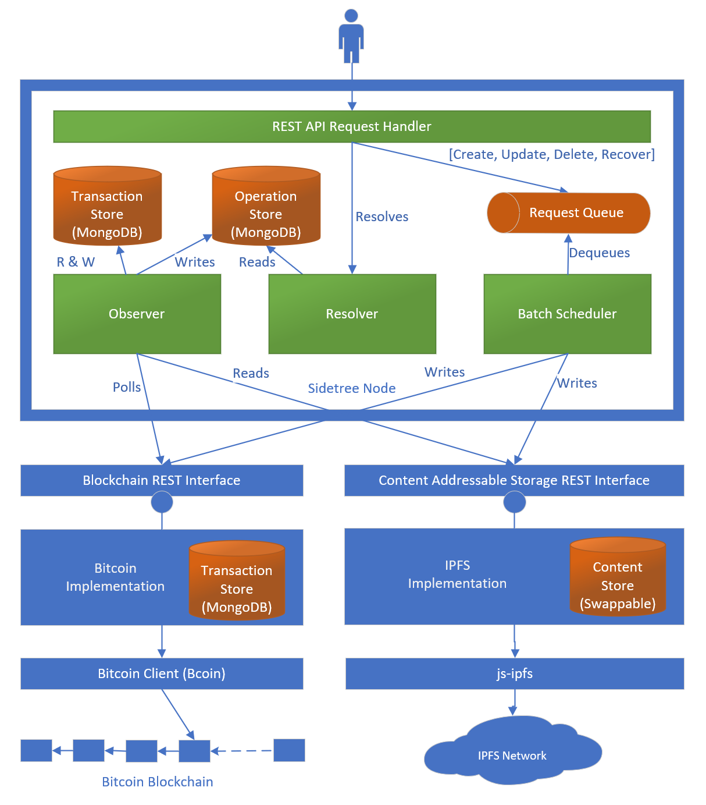

**Sidetree Node.js Implementation Design Document**
===================================================

# Architecture


# DID Cache


# Merkle Rooter


# Observer


# Sidetree REST API


# Blockchain REST API
The blockchain REST API interface aims to abstract the underlying blockchain away from the main protocol logic. This allows the underlying blockchain to be replaced without affecting the core protocol logic. The interface also allows the protocol logic to be implemented in an entirely different language while interfacing with the same blockchain.

All hashes used in the API are Base64URL encoded SHA256 hash.
>Note: Consider using "multihash" format defined by the "multiformats" initiative.

>TODO: Decide on signature format.
>TODO: Decide on compression.

## Response HTTP status codes

| HTTP status code | Description                              |
| ---------------- | ---------------------------------------- |
| 200              | Everything went well.                    |
| 401              | Unauthenticated or unauthorized request. |
| 400              | Bad request from the client.             |
| 500              | Unexpected service side error.           |

## Fetch Sidetree file hashes
Fetches Sidetree file hashes in chronological order.

>Note: The call may not to return all the known hashes in one batch, in which case the caller can use the last hash given in the returned batch of hashes to fetch subsequent hashes.

|                     |      |
| ------------------- | ---- |
| Minimum API version | v1.0 |

### Request path
```
GET /<api_version>/
```

### Request headers
|                       |                        |
| --------------------- | ---------------------- |
| ```Content-Type```    | ```application/json``` |

### Request body schema
```json
{
  "afterHash": "Optional. A valid Sidetree file hash. When not given, Sidetree file hashes since inception will be returned. When given, only Sidetree file hashes after the given hash will be returned."
}
```

### Request example
```
GET /v1.0/
```
```json
{
  "afterHash": "exKwW0HjS5y4zBtJ7vYDwglYhtckdO15JDt1j5F5Q0A"
}
```

### Response body schema
```json
{
  "moreHashes": "True if there are more hashes beyond the returned batch of hashes. False otherwise.",
  "sidetreeFileHashes": [
    {
      "timestamp": "The timestamp in ISO 8601 format 'YYYY-MM-DDThh:mm:ssZ' indicating when this hash was anchored to the blockchain.",
      "hash": "N-JQZifsEIzwZDVVrFnLRXKREIVTFhSFMC1pt08WFzI"
    }
  ]
}
```

### Response body example
```json
{
  "moreHashes": false,  
  "sidetreeFileHashes": [
    {
      "timestamp": "2018-09-13T19:20:30",
      "hash": "b-7y19k4vQeYAqJXqphGcTlNoq-aQSGm8JPlE_hLmzA"
    },
    {
      "timestamp": "2018-09-13T20:00:00",
      "hash": "N-JQZifsEIzwZDVVrFnLRXKREIVTFhSFMC1pt08WFzI"
    }
  ]
}
```

## Write a Sidetree file hash
Writes a Sidetree file hash to the underlying blockchain.

|                     |      |
| ------------------- | ---- |
| Minimum API version | v1.0 |

### Request path
```
POST /<api_version>/
```

### Request headers
|                       |                        |
| --------------------- | ---------------------- |
| ```Content-Type```    | ```application/json``` |

### Request body schema
```json
{
  "sidetreeFileHash": "A Sidetree file hash."
}
```

### Request example
```
POST /v1.0/
```
```json
{
  "sidetreeFileHash": "exKwW0HjS5y4zBtJ7vYDwglYhtckdO15JDt1j5F5Q0A"
}
```


# CAS REST API Interface
The CAS (content addressable storage) REST API interface aims to abstract the underlying Sidetree storage away from the main protocol logic. This allows the CAS to be updated or even replaced if needed without affecting the core protocol logic. Conversely, the interface also allows the protocol logic to be implemented in an entirely different language while interfacing with the same CAS.

## Response HTTP status codes

| HTTP status code | Description                              |
| ---------------- | ---------------------------------------- |
| 200              | Everything went well.                    |
| 401              | Unauthenticated or unauthorized request. |
| 400              | Bad request from the client.             |
| 500              | Unexpected service side error.           |


## Fetch a batch of operations
Fetches the batch of Sidetree operations identified by the hash.

|                     |      |
| ------------------- | ---- |
| Minimum API version | v1.0 |

### Request path
```
GET /<api_version>/<base64url_hash>
```

### Request example
```
GET /v1.0/b-7y19k4vQeYAqJXqphGcTlNoq-aQSGm8JPlE_hLmzA
```

### Response body schema
```json
{
  "operations": "Array of Sidetree operations"
}
```

### Response body example
```json
{
  "operations": [
    {
      "sigature": "kno67RidYQsuFRxCCJE7PtDLOPa-YTdWgZsVE8iSTX8",
      "delta": { "RFC_6902_JSON_PATCH" },
      "previousVersionHash": "_n7Df09kKDx8dTulec_dOBQrHGWObqO1eFWDCed5QsY"
    },
    {
      "sigature": "AgLqetfyB0pSrXZ34xyxSglfS599_gEOu6iX0xhAoRA",
      "delta": { "RFC_6902_JSON_PATCH" },
      "previousVersionHash": "Kmedd1O_7_yej-2h12prNRq0f_jfFAbcaA3JynrjadU"
    }
  ]
}
```

## Store a batch of operations
Store a batch of Sidetree operations identified by the hash.

|                     |      |
| ------------------- | ---- |
| Minimum API version | v1.0 |

### Request path
```
POST /<api_version>/
```

### Request headers
|                       |                        |
| --------------------- | ---------------------- |
| ```Content-Type```    | ```application/json``` |

### Request example
```
POST /v1.0/
```
```json
{
  "operations": [
    {
      "sigature": "kno67RidYQsuFRxCCJE7PtDLOPa-YTdWgZsVE8iSTX8",
      "delta": { "RFC_6902_JSON_PATCH" },
      "previousVersionHash": "_n7Df09kKDx8dTulec_dOBQrHGWObqO1eFWDCed5QsY"
    },
    {
      "sigature": "AgLqetfyB0pSrXZ34xyxSglfS599_gEOu6iX0xhAoRA",
      "delta": { "RFC_6902_JSON_PATCH" },
      "previousVersionHash": "Kmedd1O_7_yej-2h12prNRq0f_jfFAbcaA3JynrjadU"
    }
  ]
}
```

### Response body schema
```json
{
  "hash": "Hash of data written to CAS"
}
```

### Response body example
```json
{
  "hash": "b-7y19k4vQeYAqJXqphGcTlNoq-aQSGm8JPlE_hLmzA"
}
```