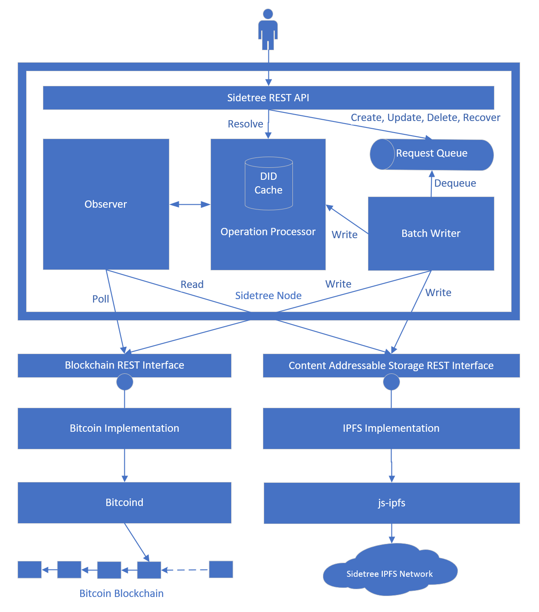

Sidetree Node.js Implementation Document
===================================================
This document focuses on the Node.js implementation of the Sidetree protocol.

# Overview



# Terminology

# DID Cache

The DID cache holds most of the state of a Sidetree node. It is a singleton class with the following methods for state update and retrieval.

## Apply

This is the core method to update the state of a DID Document:

```javascript
public apply (transactionNumber: number, operationIndex: number, operation: WriteOperation)
```
The `operation` is a JSON object representing a create, update, or a delete operation. Recall from the protocol description that the hash of this object is the *operation hash*, which represents the version of the document produced as the result of this operation.

The `transactionNumber` and `operationIndex` parameters together provides a deterministic ordering of all operations. The `transactionNumber` is an incrementing number starting from 1 that uniquely identifies the transaction. The `operationIndex` is the index of this operation amongst all the operations within the same batch.

> Note: `transactionNumber` and `operationIndex` are explicitly called out as parameters for the `apply` method for clarity. They may be embedded within the `operation` parameter in actual implementation.

Under normal processing, the _observer_ would process operations in chronological order. However the implementation accepts `apply` calls with out-of-ordered operations. This is used to handle delays and out-of-orderedness introduced by the CAS layer.

It is useful to view the operations as producing a collection of version *chains* one per DID. Each create operation introduces a new chain and each update operation adds an edge to an existing chain. There could be holes in the chain if some historical update is missing - as noted above, this could be caused due to CAS delays.

When two update operations reference the same (prior) version of a DID Document, the cache removes from consideration the later of the two operations and all operations directly and indirectly referencing the removed operation. This ensures that the document versions of a particular DID form a chain without any forks. For illustration, assume we have recorded four operations for a particular DID producing the following chain:
```
v0 -> v1 -> v2 -> v3
```
If we find an earlier update operation `v0 -> v4`, the new chain for the DID would be:
```
v0 -> v4
```

In the above description, *earlier* and *later* refer to the logical time of the operation derived from the position of the operation in the blockchain.


## Rollback

This method is used to handle rollbacks (forks) in the blockchain.

```javascript
public rollback(transactionNumber: number)
```

The effect of this method is to delete the effects of any operation added with a *blockId* greater than the one provided.

## Lookup

This method looks up the DID Document given an _operation hash_.

```javascript
public lookup(operationHash: Buffer): DidDocument
```

If there is a missing update in the chain leading up to the provided `operationHash`, the method returns `null`.

## Version chain navigation methods

These methods navigate the version chain.

```javascript
public first(operationHash: Buffer): Buffer
public last(operationHash: Buffer): Buffer
public next(operationHash: Buffer): Buffer
public prev(operationHash: Buffer): Buffer
```

## Resolve

The resolve method returns the latest document for a given DID. It is implemented as `lookup(last(did))`.


# Merkle Rooter
The Merkle Rooter batches write operations (Create, Update, Delete and Recover) operations and anchors them on a blockchain. 

> TODO: more content to be added.

# Observer

The observer watches the public blockchain to identify Sidetree operations, verifying their authenticity, and building a local cache to help a Sidetree node perform resolve operations quickly.

> TODO: more content to be added.


# Blockchain REST API
The blockchain REST API interface aims to abstract the underlying blockchain away from the main protocol logic. This allows the underlying blockchain to be replaced without affecting the core protocol logic. The interface also allows the protocol logic to be implemented in an entirely different language while interfacing with the same blockchain.

All hashes used in the API are Base58 encoded multihash.

>TODO: Decide on signature format.
>TODO: Decide on compression.


## Response HTTP status codes

| HTTP status code | Description                              |
| ---------------- | ---------------------------------------- |
| 200              | Everything went well.                    |
| 401              | Unauthenticated or unauthorized request. |
| 400              | Bad client request.                      |
| 500              | Server error.                            |


## Fetch Sidetree transactions
Fetches Sidetree transactions in chronological order.

> Note: The call may not to return all Sidetree transactions in one batch, in which case the caller can use the block number of the last given transaction to fetch subsequent transactions.

|                     |      |
| ------------------- | ---- |
| Minimum API version | v1.0 |

### Request path
```
GET /<api-version>/transactions?after=<transaction-number>
```

### Request headers
| Name                  | Value                  |
| --------------------- | ---------------------- |
| ```Content-Type```    | ```application/json``` |


### Request query parameters
- `after`

  Optional. A valid transaction number. When not given, all Sidetree transactions since inception will be returned.
  When given, only Sidetree transactions after the specified transaction will be returned.

### Request example
```
GET /v1.0/transactions?after=88
```

### Response body schema
```json
{
  "moreTransactions": "True if there are more transactions beyond the returned batch. False otherwise.",
  "transactions": [
    {
      "blockNumber": "The block number of the block that contains this transaction. Used for protocol version selection",
      "transactionNumber": "An incrementing number starting from 1 that globally uniquely identifies a Sidtree transaction.",
      "anchorFileHash": "Hash of the anchor file of this transaction."
    },
    ...
  ]
}
```

### Response body example
```json
{
  "moreTransactions": false,  
  "transactions": [
    {
      "blockNumber": 545236,
      "transactionNumber": 89,
      "anchorFileHash": "QmWd5PH6vyRH5kMdzZRPBnf952dbR4av3Bd7B2wBqMaAcf"
    },
    {
      "blockNumber": 545236,
      "transactionNumber": 90,
      "anchorFileHash": "QmbJGU4wNti6vNMGMosXaHbeMHGu9PkAUZtVBb2s2Vyq5d"
    }
  ]
}
```


## Write a Sidetree transaction
Writes a Sidetree transaction to the underlying blockchain.

|                     |      |
| ------------------- | ---- |
| Minimum API version | v1.0 |

### Request path
```
POST /<api-version>/transactions
```

### Request headers
| Name                  | Value                  |
| --------------------- | ---------------------- |
| ```Content-Type```    | ```application/json``` |

### Request body schema
```json
{
  "anchorFileHash": "A Sidetree file hash."
}
```

### Request example
```
POST /v1.0/transactions
```
```json
{
  "anchorFileHash": "QmbJGU4wNti6vNMGMosXaHbeMHGu9PkAUZtVBb2s2Vyq5d"
}
```

### Response body schema
None.


## Get block
Gets the data of a block identified by the block hash.

|                     |      |
| ------------------- | ---- |
| Minimum API version | v1.0 |

### Request path
```
GET /<api-version>/blocks/<block-hash>
```

### Request headers
None.

### Request body schema
None.

### Request example
```
Get /v1.0/blocks/0000000000000000001bfd6c48a6c3e81902cac688e12c2d87ca3aca50e03fb5
```

### Response body schema
```json
{
  "blockNumber": "The block number.",
  "blockHash": "The block hash, should be the same as the value given in query path."
}
```

### Response body example
```json
{
  "blockNumber": 545236,
  "blockHash": "0000000000000000002443210198839565f8d40a6b897beac8669cf7ba629051"
}
```


## Get last block hash
Gets the last confirmed block. This API serves two purposes:
1. Allows the Rooter to determine protocol version to be used.
2. Provides the block hash to be used for generating proof-of-work.

|                     |      |
| ------------------- | ---- |
| Minimum API version | v1.0 |

### Request path
```
GET /<api-version>/blocks/last
```

### Request headers
None.

### Request body schema
None.

### Request example
```
Get /v1.0/blocks/last
```

### Response body schema
```json
{
  "blockNumber": "The block number of the last known block.",
  "blockHash": "The block hash of the last known block."
}
```

### Response body example
```json
{
  "blockNumber": 545236,
  "blockHash": "0000000000000000002443210198839565f8d40a6b897beac8669cf7ba629051"
}
```


# CAS REST API Interface
The CAS (content addressable storage) REST API interface aims to abstract the underlying Sidetree storage away from the main protocol logic. This allows the CAS to be updated or even replaced if needed without affecting the core protocol logic. Conversely, the interface also allows the protocol logic to be implemented in an entirely different language while interfacing with the same CAS.

All hashes used in the API are Base58 encoded multihash.

## Response HTTP status codes

| HTTP status code | Description                              |
| ---------------- | ---------------------------------------- |
| 200              | Everything went well.                    |
| 401              | Unauthenticated or unauthorized request. |
| 400              | Bad client request.                      |
| 500              | Server error.                            |


## Read content
Read the content of a given address and return it in the response body as octet-stream.

|                     |      |
| ------------------- | ---- |
| Minimum API version | v1.0 |

### Request path
```
GET /<api-version>/<hash>
```

### Request example
```
GET /v1.0/QmWd5PH6vyRH5kMdzZRPBnf952dbR4av3Bd7B2wBqMaAcf
```
### Response headers
| Name                  | Value                  |
| --------------------- | ---------------------- |
| ```Content-Type```    | ```application/octet-stream``` |


## Write content
Write content to CAS.

|                     |      |
| ------------------- | ---- |
| Minimum API version | v1.0 |

### Request path
```
POST /<api-version>/
```

### Request headers
| Name                  | Value                  |
| --------------------- | ---------------------- |
| ```Content-Type```    | ```application/octet-stream``` |

### Response headers
| Name                  | Value                  |
| --------------------- | ---------------------- |
| ```Content-Type```    | ```application/json``` |

### Response body schema
```json
{
  "hash": "Hash of data written to CAS"
}
```

### Response body example
```json
{
  "hash": "QmWd5PH6vyRH5kMdzZRPBnf952dbR4av3Bd7B2wBqMaAcf"
}
```
