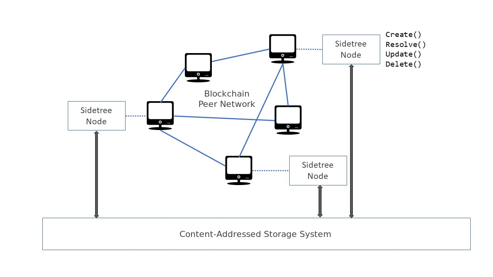

# Sidetree Protocol Specification

This specification document describes the Sidetree protocol, which can be applied to any decentralized ledger system (e.g. Bitcoin) to create a 'Layer 2' PKI network. Identifiers and PKI metadata in the protocol are expressed via the emerging [_Decentralized Identifiers_](https://w3c-ccg.github.io/did-spec/) standard, and implementations of the protocol can be codified as their own distinct DID Methods. Briefly, a _DID Method_ is a deterministic mechanism for creating unique identifiers and managing metadata (_DID Documents_) associated with these identifiers, without the need for a centralized authority, denoted by unique prefixes that distinguish one DID Method's identifiers from another (`did:foo`, `did:bar`, etc.).

## Overview

Using blockchains for anchoring and tracking unique, non-transferable, digital entities is a useful primitive, but the current strategies for doing so suffer from severely limited transactional performance constraints. Sidetree is a layer-2 protocol for anchoring and tracking _[DID Documents](https://w3c-ccg.github.io/did-spec/)_ across a blockchain. The central design idea involves batching multiple _DID Document_ operations into a single blockchain transaction. This allows Sidetree to inherit the immutability and verifiability guarantees of blockchain without being limited by its transaction rate.



Architecturally, a Sidetree network is a network consisting of multiple logical servers (_Sidetree nodes_) executing Sidetree protocol rules, overlaying a blockchain network as illustrated by the above figure. Each _Sidetree node_ provides service endpoints to perform _operations_ (e.g. Create, Resolve, Update, and Delete) against _DID Documents_. The blockchain consensus mechanism helps serialize Sidetree operations published by different nodes and provide a consistent view of the state of all _DID Documents_ to all Sidetree nodes, without requiring its own consensus layer. The Sidetree protocol batches multiple operations in a single file (_batch file_) and stores the _batch files_ in a _distributed content-addressable storage (DCAS or CAS)_. A reference to the operation batch is then anchored on the blockchain. The actual data of all batched operations are stored as one . Anyone can run a CAS node without running a Sidetree node to provide redundancy of Sidetree _batch files_.


## Terminology

| Term                  | Description                                                                    |
|-----------------------|--------------------------------------------------------------------------------|
| Anchor file           | The file containing metadata of a batch of Sidetree operations, of which the hash is written to the blockchain as a Sidetree transaction. |
| Batch file            | The file containing all the operation data batched together.                   |
| CAS                   | Same as DCAS.                                                                  |
| DCAS                  | Distributed content-addressable storage.                                       |
| DID Document          | A document containing metadata of a DID, see [DID specification](https://w3c-ccg.github.io/did-spec/). |
| DID unique suffix     | The unique portion of a DID. e.g. The unique suffix of 'did:sidetree:abc' would be 'abc'. |
| Operation             | A change to a DID Document.                                                    |
| Operation hash        | The hash of the encoded payload of an _operation request_.                     |
| Operation request     | A JWS formatted request sent to a Sidetree node to perform an _operation_.     |
| Original DID Document | A DID Document that is used in create operation to generate the DID.           |
| Recovery key          | A key that is used to perform recovery or delete operation.                    |
| Sidetree node         | A logical server executing Sidetree protocol rules.                            |
| Transaction           | A blockchain transaction representing a batch of Sidetree operations.          |


## Format and Encoding
* JSON is used as the data encapsulation format.
* Base64URL encoding is used whenever encoding is needed for binary data or cryptographic consistency.
* [_Multihash_](https://multiformats.io/multihash/) is used to represent hashes.


## Sidetree Protocol Versioning & Parameters
Sidetree protocol and parameters are expected to evolve overtime. Each version of the protocol will define its protocol rules and parameters, and the logical _blockchain time_ in which the new rules and parameters will take effect. All subsequent transactions will adhere to the same rules and parameters until a newer protocol version is defined.

The following lists the parameters used by this version of the Sidetree protocol:

| Protocol Parameter          | Description                                                                    | Value      |
|-----------------------------|--------------------------------------------------------------------------------| ---------: |
| Hash algorithm              | The hash algorithm for computation such as for DID generation.                 |     SHA256 |
| Maximum anchor file size    | The maximum compressed anchor file size.                                       |       1 MB |
| Maximum batch file size     | The maximum compressed batch file size.                                        |      20 MB |
| Maximum encoded hash length | The maximum accepted string length of an encoded hash.                         |        100 |
| Maximum operation size      | The maximum uncompressed operation size.                                       |      2 000 |
| Maximum operation count     | The maximum number of operations per batch.                                    |     10 000 |

## Sidetree Operations

A [_DID Document_](https://w3c-ccg.github.io/did-spec/#ex-2-minimal-self-managed-did-document
) is a document containing information about a DID, such as the public keys of the DID owner and service endpoints used. Sidetree protocol enables the creation of, lookup for, and updates to DID Documents through _Sidetree operations_. All operations are authenticated with a signature using a key specified in the corresponding DID Document.

An update operation to a DID Document contains only the changes from the previous version of the DID Document.

> NOTE: Create and recover operations require a complete DID Document as input.

### Sidetree Operation Hashes

An _operation hash_ is the hash of the _encoded payload_ of a Sidetree operation request. The exact request schema for all operations are defined in [Sidetree REST API](#sidetree-rest-api) section.

## Sidetree DID and Original DID Document
A Sidetree DID is intentionally the hash of the encoded DID Document given as the create operation payload (_original DID Document_), prefixed by the Sidetree method name. Given how _operation hash_ is computed, A DID is also the operation hash of the initial create operation.

Since the requester is in control of the _original DID Document_, the requester can deterministically calculate the DID before the create operation is anchored on the blockchain.

A valid _original DID Document_ must be a valid generic DID Document that adheres to the following additional Sidetree protocol specific rules:
1. The document must NOT have the `id` property.
1. The document must contain at least 1 entry in the `publicKey` array property.
1. The `id` property of a `publickey` element must be specified and be a fragment (e.g. `#key1`).
1. Can have `service` property.
1. If an Identity Hub `serviceEndpoint` is desired, an entry must exist in the `service` array that conforms to the Identity Hub Service Endpoint descriptor schema.

See [DID Create API](#original-did-document-example) section for an example of an original DID Document.


## Unpublished DID Resolution

DIDs may include attached values that are used in resolution and other activities. The standard way to pass these values are through _DID Parameters_, as described in the [W3C DID spec](https://w3c.github.io/did-spec/#generic-did-parameter-names).

Many DID Methods feature a period of time (which may be indefinite) between the generation of an ID and the ID being anchored/propagated throughout the underlying trust system (i.e. blockchain, ledger). The community has recognized the need for a mechanism to support resolution and use of identifiers during this period. As such, the community will introduce a _Generic DID Parameter_ `initial-values` that any DID method can use to signify initial state variables during this period. 

Sidetree uses the `initial-values` DID parameter to enable unpublished DID resolution. After generating a new Sidetree DID, in order to use this DID immediately, the user will attach the `initial-values` DID Parameter to the DID, with the value being the encoded string of the _original DID Document_.

e.g. `did:sidetree:<unique-portion>;initial-values=<encoded-original-did-document>`.

This allows any entity to support all of the following usage patterns:

- Resolving unpublished DIDs.
- Authenticating with unpublished DIDs.
- Signing and verifying credentials signed against unpublished DIDs.
- Authenticating with either the DID or DID with `initial-values` parameter, after it is published.
- Signing and verifying credentials signed against either the DID or DID with `initial-values` parameter, after it is published.

### `published` Flag

At such time an ID is published/anchored, a user can provide either the parametered or unparametered version of the ION DID URI to an external party, and it will be resolvable. There is no required change for any party that had been holding the parametered version of the URI - it will continue to resolve just as it had prior to being anchored. In addition, the community will introduce a generic, standard property: `published` in the [DID resolution spec](https://w3c-ccg.github.io/did-resolution/#output-resolvermetadata), that is added to the DID resolution response. The `published` property indicates whether a DID has been published/anchored in the underlying trust system a DID Method writes to. When an entity resolves any DID from any DID Method and finds that the DID has been published, the entity may drop the `initial-values` DID parameter from their held references to the DID in question, if they so desire. However, dropping the `initial-values` DID parameter after publication is purely an elective act - the ID will resolve correctly regardless.


## Sidetree Operation Batching
The Sidetree protocol increases operation throughput by batching multiple operations together then anchoring a reference to this batch on the blockchain.
For every batch of Sidetree operations created, there are two files that are created and stored in the CAS layer: 
1. Batch file - The file containing the actual change data of all the operations batched together.
2. Anchor file - The hash of the _anchor file_ is written to the blockchain as a Sidetree transaction, hence the name _'anchor'_. This file contains the following:

    1. Metadata about the associated Sidetree operations, including a content addressable hash of the operation _batch file_.
    2. Array of DID suffixes (the unique portion of the DID string that differentiates one DID from another) for all DIDs that are declared to have operations within the associated _batch file_.

### Batch File Schema
The _batch file_ is a ZIP compressed JSON document of the following schema:
```json
{
  "operations": [
    "Encoded operation",
    "Encoded operation",
    ...
  ]
}
```

### Anchor File Schema
The _anchor file_ is a JSON document of the following schema:
```json
{
  "batchFileHash": "Encoded multihash of the batch file.",
  "didUniqueSuffixes": ["Unique suffix of DID of 1st operation", "Unique suffix of DID of 2nd operation", "..."]
}
```

### Anchor String Schema
The anchor string is the data that is stored on the blockchain. The data is stored in the following format:

```
[encoded_number_of_operations].[hash_of_batch_file]

WHERE

 encoded_number_of_operations: The total number of operations included in the batch file converted to 4 bytes (in little endian format) and then encoded as Base64 URL string

 hash_of_batch_file: The hash of the batch file
```

#### Example
The following anchor string encodes 10000 operations and the hash of the batch file.

```
ECcAAA.QmWd5PH6vyRH5kMdzZRPBnf952dbR4av3Bd7B2wBqMaAcf
```

### Operation chaining of a DID


## DDoS Attack & Mitigation

Given the protocol was designed to enable operations to be performed at large volumes with cheap unit costs, DDoS is a real threat to the system.

Without any mitigation strategy, malicious but protocol adherent nodes can create and broadcast operation batches that are not intended for any other purpose than to force other observing nodes to process their operations in accordance with the protocol.

Sidetree protocol defines the following mechanisms to enable scaling, while preventing DDoS attacks:

#### Maximum batch size
   
   By defining a maximum number of operations per batch, the strategy circumvents participants to anchor arbitrarily large trees on the system. At its core, this mitigation strategy forces the attacker to deal with the organic economic pressure exerted by the underlying chain's transactional unit cost. Each instantiation of a Sidetree-based DID Method may select a different maximum batch size; the size for the default configuration is TBD. 

#### Proof of Fee

   Each Sidetree transaction on the target chain is required to include a deterministic, protocol-specified fee, based on the number of DID operations they seek to include via the on-chain transaction. The deterministic protocol rules for the default configuration are still under discussion, but the following are roughly represent the direction under discussion:

   1. Simple inclusion of a transaction in a block will enable the transaction writer to include a baseline of N operations
   2. Any number of operations that exceed N will be subject to proof that a fee was paid that meets or exceeds a required amount, determined as follows:
      1. Let the block range R include the last block the node believes to be the latest confirmed and the 9 blocks that precede it.
      2. Compute an array of median fees M, wherein the result of each computation is the median of all transactions fees in each block, less any Sidetree-bearing transactions.
      3. Let the target fee F be the average of all the values contained in M.
      4. Let the per operation cost C be F divided by the baseline amount N.
   3. To test the batch for adherence to the Proof of Fee requirement, divide the number of operations in the batch by the fee paid in the host transaction, and ensure that the resulting per operation amount exceeds the required per operation cost C.

### One Operation per DID per Batch
  Only one operation per DID per batch is allowed, this prevents the operation chain of any DID from growing at an intractable rate.

#### One-Time Password (OTP) for Operations
  Upon DID creation, the create operation payload must include:
  1. The hash of a _one-time password_ (OTP) for the next recovery operation.
  1. The hash of a _one-time password_ (OTP) for the next update operation.

  The DID owner must reproduce and present the correct OTP in the subsequent operation for the operation to be considered valid. In addition, each subsequent operation must also include the hash of the new OTP(s) for the next operation. This scheme enables efficient dismissal of counterfeit operations without needing to evaluate signatures.

  See [Sidetree REST API](#sidetree-rest-api) section for the schema used to specify OTPs and OTP hashes in each operation.

## Sidetree Transaction Processing
A Sidetree transaction represents a batch of operations to be processed by Sidetree nodes. Each transaction is assigned a monotonically increasing number (but need not be increasing by one), the _transaction number_ deterministically defines the order of transactions, and thus the order of operations. A _transaction number_ is assigned to all Sidetree transactions irrespective of their validity, however a transaction __must__ be  __valid__ before individual operations within it can be processed. An invalid transaction is simply discarded by Sidetree nodes. The following rules must be followed for determining the validity of a transaction:

1. _Anchor file_ validation rules:
   1. The anchor file must strictly follow the schema defined by the protocol. An anchor file with missing or additional properties is invalid.
   1. The anchor file fetched from CAS must not exceed the maximum allowed anchor file size.
   1. Must use the hashing algorithm specified by the protocol.
   1. All DID unique suffixes specified in the anchor file must be unique.
1. _Batch file_ validation rules:
   1. The batch file must strictly follow the schema defined by the protocol. A batch file with missing or additional properties is invalid.
   1. The batch file must not exceed the maximum allowed batch file size.
   1. Must use the hashing algorithm specified by the protocol.
   1. DID unique suffixes found in the batch file must match DID unique suffixes found in anchor file exactly and in same order.
1. The transaction must meet the proof-of-fee requirements defined by the protocol.
1. Every operation in the batch file must adhere to the following requirements to be considered a _well-formed operation_, one _not-well-formed_ operation in the batch file renders the entire transaction invalid:

   1. Follow the operation schema defined by the protocol, it must not have missing or additional properties.

   1. Must not exceed the operation size specified by the protocol.

   1. Must use the hashing algorithm specified by the protocol.

> NOTE: A transaction is __not__ considered to be _invalid_ if the corresponding _anchor file_ or _batch file_ cannot be found. Such transactions are _unresolvable transactions_, and must be reprocessed when the _anchor file_ or _batch file_ becomes available.

## DID Deletion and Recovery
Sidetree protocol requires the specification by the DID owner of dedicated cryptographic keys, called _recovery keys_, for deleting or recovering a DID. At least one recovery key is required to be specified in every _Create_ and _Recover_ operation. Recovery keys can only be changed by another recovery operation. Once a DID is deleted, it cannot be recovered.

The most basic recovery operation, most often used to regain control after loss or theft of a controlling device/key, is one coded as a specific recovery activity and invokes a designated recovery key to sign the operation. The operation is processes by observing nodes as an override that supercedes all other key types present in the current DID Document.


## Sidetree Client Guidelines
A Sidetree client manages the private keys and performs DID Document operations on behalf of the DID owner. The Sidetree client needs to comply to the following guidelines to keep the DIDs it manages secure.

1. The client MUST keep the operation payload once it is submitted to a Sidetree node until it is generally available and observed. If the submitted operation is not observed, the same operation payload MUST be resubmitted. Submitting a different operation payload would put the DID in risk of a _late publish_ attack which can lead to an unrecoverable DID if the original operation payload contains a recovery key rotation and the recovery key is lost.


## Sidetree REST API
A _Sidetree node_ exposes a set of REST API that enables the creation of new DIDs and their initial state, subsequent DID Document updates, and DID Document resolutions.


### Response HTTP status codes

| HTTP status code | Description                              |
| ---------------- | ---------------------------------------- |
| 200              | Everything went well.                    |
| 401              | Unauthenticated or unauthorized request. |
| 400              | Bad client request.                      |
| 500              | Server error.                            |


### JSON Web Signature (JWS)
Every operation request sent to a Sidetree node __must__ be signed using the __flattened JWS JSON serialization__ scheme.

The JWS operation request header must be protected and be encoded in the following schema:

#### Protected header schema
```json
{
  "operation": "create | update | delete | recover",
  "kid": "ID of the key used to sign the original DID Document.",
  "alg": "ES256K"
}
```

#### JWS operation Create Request Example
```http
POST / HTTP/1.1

{
  "header": "ewogICJvcGVyYXRpb24iOiAiY3JlYXRlIiwKICAia2lkIjogImtleTEiLAogICJhbGciOiAiRVMyNTZLIgp9",
  "payload": "eyJAY29udGV4dCI6Imh0dHBzOi8vdzNpZC5vcmcvZGlkL3YxIiwicHVibGljS2V5IjpbeyJpZCI6IiNrZXkxIiwidHlwZSI6IlNlY3AyNTZrMVZlcmlmaWNhdGlvbktleTIwMTgiLCJwdWJsaWNLZXlIZXgiOiIwMmY0OTgwMmZiM2UwOWM2ZGQ0M2YxOWFhNDEyOTNkMWUwZGFkMDQ0YjY4Y2Y4MWNmNzA3OTQ5OWVkZmQwYWE5ZjEifSx7ImlkIjoiI2tleTIiLCJ0eXBlIjoiUnNhVmVyaWZpY2F0aW9uS2V5MjAxOCIsInB1YmxpY0tleVBlbSI6Ii0tLS0tQkVHSU4gUFVCTElDIEtFWS4yLkVORCBQVUJMSUMgS0VZLS0tLS0ifV0sInNlcnZpY2UiOlt7InR5cGUiOiJJZGVudGl0eUh1YiIsInB1YmxpY0tleSI6IiNrZXkxIiwic2VydmljZUVuZHBvaW50Ijp7IkBjb250ZXh0Ijoic2NoZW1hLmlkZW50aXR5LmZvdW5kYXRpb24vaHViIiwiQHR5cGUiOiJVc2VyU2VydmljZUVuZHBvaW50IiwiaW5zdGFuY2VzIjpbImRpZDpiYXI6NDU2IiwiZGlkOnphejo3ODkiXX19XX0",
  "signature": "mAJp4ZHwY5UMA05OEKvoZreRo0XrYe77s3RLyGKArG85IoBULs4cLDBtdpOToCtSZhPvCC2xOUXMGyGXDmmEHg"
}
```

### DID and DID Document Creation
Use this API to create a Sidetree DID and its initial state.

An encoded _original DID Document_ must be supplied as the request payload, see [Original DID Document](#Sidetree-DID-and-Original-DID-Document) section for the requirements of a valid original DID Document.

#### Request path
```http
POST / HTTP/1.1
```

#### Request headers
| Name                  | Value                  |
| --------------------- | ---------------------- |
| ```Content-Type```    | ```application/json``` |

#### Request body schema
```json
{
  "protected": "Encoded protected header.",
  "payload": "Encoded create payload JSON object defined by the schema below.",
  "signature": "Encoded signature."
}
```

#### Create operation payload schema
```json
{
  "didDocument": "Encoded original DID Document",
  "nextUpdateOtpHash": "Hash of the one-time password to be used for the next update.",
  "nextRecoveryOtpHash": "Hash of the one-time password to be used for the next update.",
}
```

#### Original DID Document example
```json
{
  "@context": "https://w3id.org/did/v1",
  "publicKey": [{
    "id": "#key1",
    "type": "Secp256k1VerificationKey2018",
    "publicKeyHex": "02f49802fb3e09c6dd43f19aa41293d1e0dad044b68cf81cf7079499edfd0aa9f1"
  }],
  "service": [{
    "id": "IdentityHub",
    "type": "IdentityHub",
    "serviceEndpoint": {
      "@context": "schema.identity.foundation/hub",
      "@type": "UserServiceEndpoint",
      "instance": ["did:bar:456", "did:zaz:789"]
    }
  }]
}
```

#### Response headers
| Name                  | Value                  |
| --------------------- | ---------------------- |
| ```Content-Type```    | ```application/json``` |

#### Response body schema
The response body is the constructed DID Document of the DID created.

#### Response body example
```json
{
  "@context": "https://w3id.org/did/v1",
  "id": "did:sidetree:EiBJz4qd3Lvof3boqBQgzhMDYXWQ_wZs67jGiAhFCiQFjw",
  "publicKey": [{
    "id": "#key1",
    "type": "Secp256k1VerificationKey2018",
    "publicKeyHex": "029a4774d543094deaf342663ae672728e12f03b3b6d9816b0b79995fade0fab23"
  }],
  "service": [{
    "id": "IdentityHub",
    "type": "IdentityHub",
    "serviceEndpoint": {
      "@context": "schema.identity.foundation/hub",
      "@type": "UserServiceEndpoint",
      "instance": ["did:bar:456", "did:zaz:789"]
    }
  }]
}
```


### DID Document resolution
This API fetches the latest DID Document of a DID.
Two forms of string can be passed in the URI:
1. Standard DID format: `did:sidetree:<unique-portion>`.

   e.g.
   ```did:sidetree:exKwW0HjS5y4zBtJ7vYDwglYhtckdO15JDt1j5F5Q0A```

   The latest DID Document will be returned if found.

1. DID with `initial-values` DID parameter: `did:sidetree:<unique-portion>;initial-values=<encoded-original-did-document>`

   e.g.
   ```did:sidetree:exKwW0HjS5y4zBtJ7vYDwglYhtckdO15JDt1j5F5Q0A;initial-values=ewogICAgICAiQGNvbnRleHQiOiAiaHR0cHM6Ly93M2lkLm9yZy9kaWQvdjEiLAogICAgICAicHVibGljS2V5IjogWwogICAgICAgIHsKICAgICAgICAgICAgImlkIjogIiNrZXkxIiwKICAgICAgICAgICAgInR5cGUiOiAiU2VjcDI1NmsxVmVyaWZpY2F0aW9uS2V5MjAxOCIsCiAgICAgICAgICAgICJwdWJsaWNLZXlIZXgiOiAiMDM0ZWUwZjY3MGZjOTZiYjc1ZThiODljMDY4YTE2NjUwMDdhNDFjOTg1MTNkNmE5MTFiNjEzN2UyZDE2ZjFkMzAwIgogICAgICAgIH0KICAgICAgXQogICAgfQ```

   Standard resolution is performed if the DID is found to registered on the blockchain. If the DID Document cannot be found, the encoded DID Document given in the `initial-values` DID parameter is used directly to generate and return as the resolved DID Document, in which case the supplied encoded DID Document is subject to the same validation as an _original DID Document_ in a create operation.

#### Request path
```http
GET /<did-or-method-name-prefixed-encoded-original-did-document> HTTP/1.1
```

#### Request headers
None.

#### Request body schema
None.

#### Request example - DID
```http
GET /did:sidetree:exKwW0HjS5y4zBtJ7vYDwglYhtckdO15JDt1j5F5Q0A HTTP/1.1
```

#### Request example - Method name prefixed, encoded original DID Document
```http
GET /did:sidetree:exKwW0HjS5y4zBtJ7vYDwglYhtckdO15JDt1j5F5Q0A;initial-values=ewogICAgICAiQGNvbnRleHQiOiAiaHR0cHM6Ly93M2lkLm9yZy9kaWQvdjEiLAogICAgICAicHVibGljS2V5IjogWwogICAgICAgIHsKICAgICAgICAgICAgImlkIjogIiNrZXkxIiwKICAgICAgICAgICAgInR5cGUiOiAiU2VjcDI1NmsxVmVyaWZpY2F0aW9uS2V5MjAxOCIsCiAgICAgICAgICAgICJwdWJsaWNLZXlIZXgiOiAiMDM0ZWUwZjY3MGZjOTZiYjc1ZThiODljMDY4YTE2NjUwMDdhNDFjOTg1MTNkNmE5MTFiNjEzN2UyZDE2ZjFkMzAwIgogICAgICAgIH0KICAgICAgXQogICAgfQ HTTP/1.1
```

#### Response body schema
The response body is the latest DID Document.

#### Response body example
```json
{
  "@context": "https://w3id.org/did/v1",
  "id": "did:sidetree:EiBJz4qd3Lvof3boqBQgzhMDYXWQ_wZs67jGiAhFCiQFjw",
  "publicKey": [{
    "id": "#key1",
    "type": "Secp256k1VerificationKey2018",
    "publicKeyHex": "029a4774d543094deaf342663ae672728e12f03b3b6d9816b0b79995fade0fab23"
  }],
  "service": [{
    "id": "IdentityHub",
    "type": "IdentityHub",
    "serviceEndpoint": {
      "@context": "schema.identity.foundation/hub",
      "@type": "UserServiceEndpoint",
      "instance": ["did:bar:456", "did:zaz:789"]
    }
  }]
}
```


### Updating a DID Document
The API to update a DID Document.

#### Request path
```http
POST / HTTP/1.1
```

#### Request headers
| Name                  | Value                  |
| --------------------- | ---------------------- |
| ```Content-Type```    | ```application/json``` |

#### Request body schema
```json
{
  "protected": "Encoded protected header.",
  "payload": "Encoded update payload JSON object defined by the schema below.",
  "signature": "Encoded signature."
}
```

#### Update payload schema
```json
{
  "didUniqueSuffix": "The unique suffix of the DID",
  "patches": ["An array of patches each must adhere to the patch schema defined below."],
  "updateOtp": "The one-time password to be used for this update.",
  "nextUpdateOtpHash": "Hash of the one-time password to be used for the next update.",
}
```

#### Update patch schema
##### Add public keys
```json
{
  "action": "add-public-keys",
  "publicKeys": [
    {
      "id": "A string that begins with '#'.",
      "type": "Secp256k1VerificationKey2018 | RsaVerificationKey2018",
      "publicKeyHex": "Must be compressed format (66 chars) for Secp256k1VerificationKey2018, else any property can be used.",
    }
  ]
}
```

Example:
```json
{
  "action": "add-public-keys",
  "publicKeys": [
    {
      "id": "#key1",
      "type": "Secp256k1VerificationKey2018",
      "publicKeyHex": "0268ccc80007f82d49c2f2ee25a9dae856559330611f0a62356e59ec8cdb566e69"
    },
    {
      "id": "#key2",
      "type": "RsaVerificationKey2018",
      "publicKeyPem": "-----BEGIN PUBLIC KEY...END PUBLIC KEY-----"
    }
  ]
}
```

##### Remove public keys
```json
{
  "action": "remove-public-keys",
  "publicKeys": ["Array of 'id' property of public keys to remove."]
}
```

Example:
```json
{
  "action": "remove-public-keys",
  "publicKeys": ["#key1", "#key2"]
}
```

##### Add service endpoints
```json
{
  "action": "add-service-endpoints",
  "serviceType": "IdentityHub",
  "serviceEndpoints": [
    "Array of DID to add."
  ]
}
```

Example:
```json
{
  "action": "add-service-endpoints",
  "serviceType": "IdentityHub",
  "serviceEndpoints": [
    "did:sidetree:EiDk2RpPVuC4wNANUTn_4YXJczjzi10zLG1XE4AjkcGOLA",
    "did:sidetree:EiBQilmIz0H8818Cmp-38Fl1ao03yOjOh03rd9znsK2-8A"
  ]
}
```

##### Remove service endpoints
```json
{
  "action": "remove-service-endpoints",
  "serviceType": "IdentityHub",
  "serviceEndpoints": [
    "Array of DID to remove."
  ]
}
```

Example:
```json
{
  "action": "remove-service-endpoints",
  "serviceType": "IdentityHub",
  "serviceEndpoints": [
    "did:sidetree:EiDk2RpPVuC4wNANUTn_4YXJczjzi10zLG1XE4AjkcGOLA",
    "did:sidetree:EiBQilmIz0H8818Cmp-38Fl1ao03yOjOh03rd9znsK2-8A"
  ]
}
```


#### Update payload example
```json
{
  "didUniqueSuffix": "EiBQilmIz0H8818Cmp-38Fl1ao03yOjOh03rd9znsK2-8A",
  "patches": [
    {
      "action": "add-public-keys",
      "publicKeys": [
        {
          "id": "#key1",
          "type": "Secp256k1VerificationKey2018",
          "publicKeyHex": "0268ccc80007f82d49c2f2ee25a9dae856559330611f0a62356e59ec8cdb566e69"
        },
        {
          "id": "#key2",
          "type": "RsaVerificationKey2018",
          "publicKeyPem": "-----BEGIN PUBLIC KEY...END PUBLIC KEY-----"
        }
      ]
    },
    {
      "action": "remove-service-endpoints",
      "serviceType": "IdentityHub",
      "serviceEndpoints": [
        "did:sidetree:EiBJz4qd3Lvof3boqBQgzhMDYXWQ_wZs67jGiAhFCiQFjw",
        "did:sidetree:EiAJ6AlyUPaEOxXk-AdXoEikeTf7DhcXvF61MfgnjJgazg"
      ]
    }
  ],
  "updateOtp": "iDk2RpPVuC4wNANUTn_4YXJczjzi10zLG1XE4AjkcGOLAa",
  "nextUpdateOtpHash": "EiDJesPq9hAIPrBiDw7PBZG8OUCG4XT5d6debxCUIVFUrg",
}
```

#### Response body
None.


### DID Deletion
The API to delete a given DID.

#### Request path
```
POST /
```

#### Request headers
| Name                  | Value                  |
| --------------------- | ---------------------- |
| ```Content-Type```    | ```application/json``` |

#### Request body schema
```json
{
  "protected": "Encoded protected header.",
  "payload": "Encoded delete payload JSON object define by the schema below.",
  "signature": "Encoded signature."
}
```

#### Delete payload schema
```json
{
  "didUniqueSuffix": "The unique suffix of the DID to be deleted.",
  "recoveryOtp": "The current one-time recovery password."
}
```

#### Delete payload example
```json
{
  "didUniqueSuffix": "EiAJ6AlyUPaEOxXk-AdXoEikeTf7DhcXvF61MfgnjJgazg",
  "recoveryOtp": "BJzEi4qd3Lvof3boqBQgzhMDYXWQ_wZs67jGiAhFCiQFjw"
}
```

#### Response body
None.

### DID Recovery

#### Request path
```http
POST / HTTP/1.1
```

#### Request headers
| Name                  | Value                  |
| --------------------- | ---------------------- |
| ```Content-Type```    | ```application/json``` |

#### Request body schema
```json
{
  "protected": "Encoded protected header.",
  "payload": "Encoded recovery payload JSON object defined by the schema below.",
  "signature": "Encoded signature."
}
```

#### Recovery payload schema
```json
{
  "didUniqueSuffix": "The unique suffix of the DID to be recovered.",
  "recoveryOtp": "The one-time password to be used for this recovery.",
  "newDidDocument": "The new DID Document.",
  "nextRecoveryOtpHash": "Hash of the one-time password to be used for the next recovery.",
  "nextUpdateOtpHash": "Hash of the one-time password to be used for the next update.",
}
```

#### Response body
None.


### Fetch the current service versions (optional).
Fetches the current version of the core and the dependent services. The service implementation defines the versioning scheme and its interpretation.

Returns the service _names_ and _versions_ of the core and the dependent blockchain and CAS services.

> NOTE: This API does **NOT** return the protocol version. This just represents the version of the current service(s) itself.

#### Request path
```
GET /version
```

#### Request headers
None.

#### Request example
```
GET /version
```

#### Response body schema
```json
[
  {
    "name": "A string representing the name of the service",
    "version": "A string representing the version of currently running service."
  },
  ...
]
```

#### Response example
```http
HTTP/1.1 200 OK

[
  {
  "name":"core",
  "version":"0.4.1"
  },
  {
    "name":"bitcoin",
    "version":"0.4.1"
  },
  {
    "name":"ipfs",
    "version":"0.4.1"
  }
]
```

## Merkle Root Hash Inclusion (Currently not used, may support in the future)
Sidetree _anchor file_ also includes the root hash of a Merkle tree constructed using the hashes of batched operations.

The main protocol does *not* rely on the root hash to operate and the usefulness of the Merkle root is still being discussed, but since this hash is small, stored off-chain, and cheap to compute and store, we do. There is an opportunity for an API or service to return a concise receipt (proof) for a given operation such that this operation can be cryptographically proven to be part of a batch without the need of the entire batch file. Note this receipt cannot be provided in the response of the operation request because Merkle tree construction happens asynchronously when the final batch is formed.

Specifically, Sidetree uses an unbalanced Merkle tree construction to handle the (most common) case where the number of operations in a batch is not mathematically a power of 2: a series of uniquely sized balanced Merkle trees is formed where operations with lower index in the list of operations form larger trees; then the smallest balanced subtree is merged with the next-sized balanced subtree recursively to form the final Merkle tree.

### Sidetree Operation Batching Examples
The following illustrates the construction of the Merkle tree with an array of 6 operations:
* The smallest balance subtree I of 2 leaves [4, 5] is merged with the adjacent balanced tree J of 4 leaves [0, 1, 2, 3] to form the final Merkle tree.
* Receipt for [0] will be [B, H, I], and receipt for [5] will be [E, J].

```
                          ROOT=H(J+I)
                          /          \
                        /              \
                J=H(G+H)                 \
              /        \                   \
            /            \                   \
      G=H(A+B)             H=H(C+D)          I=H(E+F)
      /      \             /     \           /      \
    /        \           /        \         /        \
  A=H([0])  B=H([1])  C=H([2])  D=H([3])  E=H([4])  F=H([5])
    |         |         |         |         |         |
    |         |         |         |         |         |
[   0    ,    1    ,    2    ,    3    ,    4    ,    5   ]

Where: [1] -> Denotes the binary buffer of the 1st element in the array of operation data.
        |  -> Denotes the logical relationship between an operation data and its hash.
       H() -> Denotes a hash function that returns a binary buffer representing the hash.
       A+B -> Denotes the concatenation of two binary buffers A and B.
```

The following illustrates the construction of the Merkle tree with an array of 7 operations:
* The smallest balanced subtree G of 1 leaf [6] is merged with the adjacent balanced subtree J of 2 leaves [4, 5] to form parent L, which in turn is merged with the adjacent balanced subtree K of 4 leaves [0, 1, 2, 3] to form the final Merkle tree.
* Receipt for [0] will be [B, I, L]; receipt for [4] will be [F, G, K]; receipt for [6] will be [J, K].
```
                             ROOT=H(K+L)
                          /               \
                        /                  \
                K=H(H+I)                    L=H(J+G)
              /        \                     /       \
            /            \                  /          \
      H=H(A+B)             I=H(C+D)        J=H(E+F)      \
      /      \             /     \         /      \        \
     /        \           /       \       /         \        \
  A=H([0])  B=H([1])  C=H([2])  D=H([3])  E=H([4])  F=H([5])  G=H([6])
    |         |         |         |         |         |         |
    |         |         |         |         |         |         |
[   0    ,    1    ,    2    ,    3    ,    4    ,    5    ,    6   ]
```

### Operation Receipts

While currently unused, Sidetree proposes the following JSON schema to represent a receipt:

```json
{
  "receipt": [
    {
      "hash": "A Merkle tree node hash.",
      "side": "Must be 'left' or 'right', denotes the position of this hash."
    },
    ...
  ]
}
```

Where the first entry in ```receipt``` is the sibling of the operation hash in the Merkle tree; followed by the uncle, then the great uncle and so on.

> NOTE: This scheme does __not__ include the root hash as the last entry of the receipt.

> NOTE: Receipt array will be empty thus is optional if no batching occurs (i.e. a tree of one operation).


## FAQs
* Why introduce the concept of an _anchor file_? Why not just anchor the _batch file hash_ directly on blockchain?

  It would be ideal to be able to fetch metadata about the batched operations efficiently,
  without needing to download the entire batch file.
  This design is needed for the implementation of "light nodes", it also opens up possibilities of other applications of the Sidetree protocol.

* Why assign a _transaction number_ to invalid transactions?

  In the case of an _unresolvable transaction_, it is unknown if the transaction will be valid or not if it becomes resolvable, thus it is assigned a transaction number such that if the transaction turns out to be valid, the transaction number of valid transactions that occur at a later time remain immutable. This also enables all Sidetree nodes to refer to the same transaction using the same transaction number.
