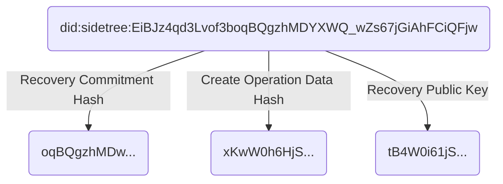

Sidetree Protocol
==================

**Specification Status:** Editor's Draft

**Latest published version:**
  [identity.foundation/sidetree/spec](https://identity.foundation/sidetree/spec)

**Editors:**
~ [Daniel Buchner](https://www.linkedin.com/in/dbuchner/) (Microsoft)
~ [Orie Steele](https://www.linkedin.com/in/or13b/) (Transmute)
~ [Henry Tsai](https://www.linkedin.com/in/henry-tsai-6b884014/) (Microsoft)

**Contributors:**

**Participate:**
~ [GitHub repo](https://github.com/decentralized-identity/sidetree)
~ [File a bug](https://github.com/decentralized-identity/sidetree/issues)
~ [Commit history](https://github.com/decentralized-identity/sidetree/commits/master)

------------------------------------

## Abstract

Sidetree is a protocol for creating scalable 'Layer 2' Decentralized Identifier/DPKI networks that can run atop any decentralized ledger system (e.g. Bitcoin) and be as open, public, and permissionless as the underlying ledger they utilize. Identifiers and PKI metadata in the protocol are expressed via the emerging [W3C Decentralized Identifiers](https://w3c.github.io/did-core/) standard. Implementations of the protocol can be codified as their own distinct _DID Methods_ in the [W3C DID Method Registry](https://w3c-ccg.github.io/did-method-registry/). _DID Methods_ are deterministic mechanisms for creating unique, user-owned identifiers (`did:method:123`) and managing their associated PKI metadata (represented in the _DID Document_ data format), all without the need for centralized authorities or trusted third parties. DID Method indicators are present in DID identifier strings via unique prefixes that distinguish one from another (`did:foo:123`, `did:bar:123`, etc.); Sidetree is not a DID Method in itself, but a protocol that can be implemented atop decentralized ledgers to create DID Method implementations (i.e. `did:ion`, `did:elem`).

## Introduction

_This section is non-normative_

Decentralized ledgers (e.g. Bitcoin) introduced the first-ever solution to the linear chronological oracle problem, which unlocked the ability to create robust decentralized identifier networks. However, current approaches that utilize these ledger systems to create decentralized identifier networks suffer from severely limited transactional volumes and other performance issues. Sidetree is a 'Layer 2' protocol that runs atop decentralized ledger systems to enable scalable [W3C _Decentralized Identifier_](https://w3c.github.io/did-core/) (DID) implementations that can be fully open, public, and permissionless. Sidetree is able to do all this without requiring trusted intermediaries, centralized authorities, special protocol tokens, or secondary consensus mechanisms, while preserving the core attributes of decentralization and immutability of the underlying ledger systems it is implemented on.

Architecturally, Sidetree-based DID Method implementations are overlay networks composed of independent peer nodes (_Sidetree nodes_) that observe an underlying decentralized ledger (as illustrated above), replicate DID PKI state data linked from the ledger, and execute against that data a set of deterministic protocol rules to produce an eventually strongly consistent view of all Decentralized Identifiers in the network. The Sidetree protocol defines a core set of DID PKI state change _operations_, structured as delta-based Conflict-Free Replicated Data Types (i.e. [Create](#create), [Update](#update), [Recover](#recover), or [Revoke](#revoke)), that mutate a Decentralized Identifier's _DID Document_ state. _Sidetree nodes_ that participate in writing operations into the overlay network do so by anchoring _Content-Addressable Storage (CAS)_ (e.g. IPFS) references to aggregated bundles of _operations_ in an underlying ledger. The ledger acts as a linear chronological sequencing oracle, which the protocol leverages to order DID PKI operations in an immutable history all observing nodes can replay and validate. It is this ability to replay the precise sequence of DID PKI state change events, and process those events using a common set of deterministic rules, that allows _Sidetree nodes_ to achieve a consistent view of DIDs and their _DID Document_ states, without requiring any additional consensus mechanism.

## Terminology

| Term                  | Description                                                                    |
|-----------------------|--------------------------------------------------------------------------------|
| Anchor File           | JSON Document containing proving and index data for Create, Recovery, and Revocation operations, and a CAS URI for the associated Map File. This file is anchored to the target ledger. |
| Map File              | JSON Document containing Update operation proving and index data, as well as CAS URI for Batch File chunks.                   |
| Batch File            | JSON Document containing all verbose operation data for the corresponding set of DIDs specified in the related Map File.                   |
| CAS                   | Content-addressable storage protocol/network (e.g. IPFS)                       |
| DID Document          | JSON Document containing public key references, service endpoints, and other PKI metadata that corresponds to a given DID (as defined in the [W3C DID Specification](https://w3c.github.io/did-core/)). |
| DID Unique Suffix { #did-unique-suffix }  | The unique identifier string within a DID URI. e.g. The unique suffix of `did:sidetree:123` would be `123`. |
| DID Suffix Data       | Data required to deterministically generate a DID.                             |
| DID Operation         | Set of delta-based modifications that change the state of a DID Document when applied.                                               |
| Operation Request     | JWS formatted request sent to a _Sidetree Node_ to include a _DID Operation_ in a batch of operations.     |
| Recovery Key          | Public/private key pair used to perform a Recovery or Revocation operation.          |
| Sidetree Node         | Executable code that implements all the required components, functionality, and rules specified in the Sidetree protocol specification.                            |
| Transaction           | Ledger transaction that anchors a set of Sidetree operations, via a CAS URI for an associated Anchor File.          |

## Protocol Versioning & Default Parameters

The rules and parameters of the Sidetree protocol MAY change in future versions. Each version of the protocol will define a set of protocol rules and parameters with default suggested values. The following are the parameters used by this version of the Sidetree protocol - implementers MAY choose different options than the defaults listed below:

| Protocol Parameter          | Description                                                                   | Suggested Defaults |
|-----------------------------|-------------------------------------------------------------------------------|:-------------------|
| `HASH_ALGORITHM` { #hash-algorithm }       | Algorithm for generating hashes of protocol-related values.    |             SHA256 |
| `KEY_ALGORITHM` { #key-algorithm }         | Asymmetric public key algorithm for signing DID operations.    |          secp256k1 |
| `SIGNATURE_ALGORITHM` { #sig-algorithm }   | Asymmetric public key signature algorithm.                     |             ES256K |
| `CAS_PROTOCOL` { #cas-protocol }       | The CAS network protocol used within an implementation.            |               IPFS |
| `CID_ALGORITHM` { #cid-algorithm }       | Algorithm for generating CAS Identifiers.                        |           IPFS CID |
| `COMPRESSION_ALGORITHM` { #compression-algorithm } | File compression algorithm                             |                ZIP |
| `COMMITMENT_VALUE` { #commitment-value } | Cryptographically unguessable value to be revealed in the next operation. |      32 bytes |
| `GENESIS_TIME` { #genesis-time }                 | The point in the target ledger's transaction history at which Sidetree implementation is first activated (e.g. block number in a blockchain).    |             630000 |
| `MAX_ANCHOR_FILE_SIZE` { #max-anchor-file-size } | Maximum compressed anchor file size.                     |               1 MB |
| `MAX_MAP_FILE_SIZE` { #max-map-file-size }       | Maximum compressed map file size.                        |               1 MB |
| `MAX_BATCH_FILE_SIZE`  { #max-batch-file-size }  | Maximum compressed batch file size.                      |              10 MB |
| `MAX_ENCODED_HASH_LENGTH`   | Maximum accepted string length of an encoded hash.                            |          100 bytes |
| `MAX_OPERATION_SIZE`        | Maximum uncompressed operation size.                                          |               1 kb |
| `MAX_OPERATION_COUNT`       | Maximum number of operations per batch.                                       |             10,000 |

### Protocol Version Activation

New versions of the protocol, or modifications to parameter values by implementers, MUST be activated at a specified _blockchain time_ so all nodes can remain in sync by enforcing the same ruleset and parameters beginning at the same logical starting point. All transactions that occur after the specified _blockchain time_ will adhere to the associated version's rules and parameters until a newer version of the protocol is defined and implemented at a future _blockchain time_.

## Network Topology

The figure below illustrates the three primary components of a Sidetree-based DID overlay network:

1. The underlying ledger system that serves as the global anchoring and linear sequencing system for DID operations.
2. The Sidetree nodes themselves, which interact with the ledger system to anchor operations, fetch and replicate data from the CAS network, and process operations in accordance with the protocol deterministic ruleset.
3. An integrated Content-Addressable Storage (CAS) network layer Sidetree nodes use to distribute and replicate DID operation files.


## File Structures

The protocol defines the following three file structures, which house DID operation data and are designed to support key functionality to enable light node configurations, minimize permanently retained data, and ensure performant resolution of DIDs.


### Anchor File

Anchor files contain [Create](#create), [Recover](#recover), and [Revoke](#revoke) operation values, as well as a CAS URI for the related Sidetree Map file (detailed below). As the name suggests, Anchor files are anchored to the target ledger system via embedding a CAS URI in the ledger's transactional history.

::: example
```json
{
  "map_file": CAS_CID,
  "operations": {
    "create": [
      {
        "initial_document_hash": DOCUMENT_HASH,
        "initial_recovery_key": RECOVERY_PUBLIC_KEY,
        "initial_recovery_commitment": COMMITMENT_HASH
      },
      {...}
    ],
    "recover": [
      {
        "id": DID_UNIQUE_SUFFIX,
        "recovery_reveal_value": REVEAL_VALUE,
        "new_recovery_commitment": COMMITMENT_HASH,
        "new_document_hash": DOCUMENT_HASH,
        "new_recovery_key": RECOVERY_PUBLIC_KEY,
        "sig": KEY_SIGNATURE
      },
      {...}
    ],
    "revoke": [
      {
        "id": DID_UNIQUE_SUFFIX,
        "recovery_reveal_value": REVEAL_VALUE,
        "sig": KEY_SIGNATURE
      },
      {...}
    ]
  }
}
```
:::

A valid Anchor File is a JSON document that MUST NOT exceed the [`MAX_ANCHOR_FILE_SIZE`](#max-anchor-file-size), and composed as follows:

1. The Anchor File MUST contain a `map_file` property, and its value MUST be a _CAS URI_ for the related Map File.
2. If the set of operations to be anchored contain any [Create](#create), [Recover](#recovery), or [Revoke](#revoke) operations, the Anchor File MUST contain an `operations` property, and its value MUST be an object composed as follows:

  - If there are any [Create](#create) operations to be included in the Anchor File:
    1. The `operations` object MUST include a `create` property, and its value MUST be an array.
    2. For each [Create](#create) operation to be included in the `create` array, herein referred to as [_Anchor File Create Entries_](#anchor-file-create-entry){id="anchor-file-create-entry"}, use the following process to compose and include each entry:
        - The object MUST contain an [`initial_recovery_key`](#initial-recovery-key){id="initial-recovery-key"} property, and its value MUST be an _Initial Recovery Public Key_, as generated via the [Create](#create) operation process.
        - The object MUST contain an [`initial_recovery_commitment`](#initial-recovery-commitment){id="initial-recovery-commitment"} property, and its value MUST be an _Initial Recovery Commitment Hash_, as generated via the [Create](#create) operation process.
        - The object MUST contain an `initial_document_hash` property, and its value MUST be a hash (generated via the [`HASH_ALGORITHM`](#hash-algorithm)) of the [_Create Operation Data Object_](#create-data-object) (ensure this is a hash of the `base64` encoded version of the object).
    3. The Anchor File MUST NOT include multiple [Create](#create) operations that produce the same [DID Unique Suffix](#did-unique-suffix).
    

<!--
  - The object MUST contain an `initial_state` property, and its value MUST be a hash (generated via the [`HASH_ALGORITHM`](#hash-algorithm)) of the following `base64` encoded object:

      ```json
      {
        "next_update_commitment": HASH_OF_UPDATE_COMMITMENT_VALUE,
        "patches": [ PATCH_ONE, PATCH_TWO, ... ]
      }
      ```
      - The object MUST contain an `next_update_commitment` property, and its value MUST be the _Initial Update Commitment_, as generated via the [Create](#create) operation process.
      - The object MUST contain a `patches` property, and its value MUST be an array of [DID State Patches](#did-state-patches), generated during the [Create](#create) operation process.
-->


  - If there are any [Recovery](#recover) operations to be included in the Anchor File:
    1. The `operations` object MUST include a `recover` property, and its value MUST be an array.
    2. For each [Recovery](#recover) operation to be included in the `recover` array, herein referred to as [_Anchor File Recovery Entries_](#anchor-file-recovery-entry), use the following process to compose and include entries:
        - The object MUST contain an `id` property, and its value MUST be the [DID Unique Suffix](#did-unique-suffix) of the DID the operation pertains to. An Anchor File MUST NOT contain more than one operation of any type with the same [DID Unique Suffix](#did-unique-suffix).
        - The object MUST contain a `recovery_reveal_value` property, and its value MUST be the last recovery [COMMITMENT_VALUE](#commitment-value).
        - The object MUST contain a `new_recovery_commitment` property, and its value MUST be the next _Recovery Commitment Hash_ generated during the [Recovery](#recover) operation process.
        - The object MUST contain an `new_document_hash` property, and its value MUST be a hash (generated via the [`HASH_ALGORITHM`](#hash-algorithm)) of the [_Recovery Operation Data Object_](#recover-data-object) (ensure this is a hash of the `base64` encoded version of the object).
        - The object MUST contain a `sig` property, and its value MUST be a signature over the other values present in the object.
        - The object MAY include a `new_recovery_key` property, and if included, its value MUST be the public key generated during the [Recovery](#recover) operation process.


<!--
  - The object MUST contain an `new_state_hash` property, and its value MUST be a hash (generated via the [`HASH_ALGORITHM`](#hash-algorithm)) of the following `base64` encoded object:

      ```json
      {
        "patches": [ PATCH_ONE, PATCH_TWO, ... ]
      }
      ```
      - The object MUST contain a `patches` property, and its value MUST be an array of [DID State Patches](#did-state-patches), generated during the [Recovery](#recover) operation process.
  - The object MUST contain a `sig` property, and its value MUST be a signature over the other values present in the object.
  - The object MAY include a `new_recovery_key` property, and if included, its value MUST be the public key generated during the [Recovery](#recover) operation process.
-->

  - If there are any [Revoke](#revoke) operations to be included in the Anchor File:
    1. The `operations` object MUST include a `revoke` property, and its value MUST be an array.
    2. For each [Revoke](#revoke) operation to be included in the `revoke` array, use the following process to compose and include entries:
        - The object MUST contain an `id` property, and its value MUST be the [DID Unique Suffix](#did-unique-suffix) of the DID the operation pertains to. An Anchor File MUST NOT contain more than one operation of any type with the same [DID Unique Suffix](#did-unique-suffix).
        - The object MUST contain a `recovery_reveal_value` property, and its value MUST be the last recovery [COMMITMENT_VALUE](#commitment-value).
        - The object MUST contain a `sig` property, and its value MUST be a signature over the concatenated values of the `id` property and the `recovery_reveal_value` property.

### Map File

The Map file in the Sidetree protocol contains Update operation proving data, as well as the CAS-linked Batch file chunks.
::: example
```json
{
  "chunks": [
    { "chunk_hash": CHUNK_HASH }
  ],
  "operations": {
    "update": [
      {
        "id": DID_UNIQUE_SUFFIX,
        "update_reveal_value": REVEALED_COMMITMENT_VALUE,
        "update_patch_hash": PATCH_HASH,
        "sig": UPDATE_KEY_SIGNATURE
      },
      {...}
    ]
  }
}
```
:::

A valid Map File is a JSON document that MUST NOT exceed the [`MAX_MAP_FILE_SIZE`](#max-map-file-size), and composed as follows:

1. The Anchor File MUST contain a `chunks` property, and its value MUST be an array of _Batch Chunk Entries_ for the related Batch File data.
    - Future versions of the protocol will specify a process for separating the total operations in a batch into multiple _Batch Chunk Entries_, but for this version of the protocol there MUST be only one _Batch Chunk Entry_ object present in the array, which is composed as follows:
      1. The _Batch Chunk Entry_ object MUST contain a `chunk_hash` property, and its value MUST be a Content Identifier representing the single Batch File, generated via the [`CID_ALGORITHM`](#cid-algorithm).
2. If there are any [Update](#update) operations to be included in the Map File, the Map File MUST include an `operations` property, and its value MUST be an object composed as follows:
  1. The `operations` object MUST include an `update` property, and its value MUST be an array.
  2. For each [Update](#update) operation to be included in the `update` array, herein referred to as [Map File Update Entries](#map-file-update-entry), use the following process to compose and include entries:
        - The object MUST contain an `id` property, and its value MUST be the [DID Unique Suffix](#did-unique-suffix) of the DID the operation pertains to.
        - The object MUST contain a `update_reveal_value` property, and its value MUST be the last update [COMMITMENT_VALUE](#commitment-value).
        - The object MUST contain an `update_patch_hash` property, and its value MUST be a hash (generated via the [`HASH_ALGORITHM`](#hash-algorithm)) of the [_Update Operation Data Object_](#update-data-object) (ensure this is a hash of the `base64` encoded version of the object).
        - The object MUST contain a `sig` property, and its value MUST be a signature over the other values present in the object.
        - The object MAY include a `new_recovery_key` property, and if included, its value MUST be the public key generated during the [Recovery](#recover) operation process.

### Batch Files

Batch Files are JSON Documents, compressed via the [COMPRESSION_ALGORITHM](#compression-algorithm) contain Sidetree Operation source data, which are composed of delta-based CRDT entries that modify the state of a Sidetree identifier's DID Document.

For the this version of the protocol, there will only exist a single Batch File that contains all the state modifying data for all operations in the included set. Future versions of the protocol will separate the total set of included operations into mutliple chunks, each with their own Batch File.

::: example Create operation Batch File entry
```json
{
  "operations": [
    { SIDETREE_OPERATION },
    { SIDETREE_OPERATION },
    ...
  ]
}
```
:::

In this version of the protocol, Batch Files are constructed as follows:

1. The Batch File MUST include an `operation` property, and its value MUST be an array.
2. Each [operation](#did-operation) entry to be included in the Batch File MUST be a `base64` encoded value of the operation data matching the type of operation it represents, and shall be appended to the `operation` array as follows:
    1. If any Create operations were present in the associated Anchor File, append all [_Create Operation Data Objects_](#create-data-object) in the same index order as their matching [_Anchor File Create Entry_](#anchor-file-create-entry).
    2. If any Recovery operations were present in the associated Anchor File, append all [Recovery Operation Data Objects_](#recovery-data-object) in the same index order as their matching [_Anchor File Recovery Entry_](#anchor-file-recovery-entry).
    3. If any Update operations were present in the associated Map File, append all [Update Operation Data Objects_](#update-data-object) in the same index order as their matching [_Map File Update Entry_](#map-file-update-entry).


## DID Unique Suffix Composition

DID Methods based on the Sidetree protocol all share the same identifier format. The identifier is a hash of values from the [Create](#create) operation's _Suffix Data Object_ (generated using the [`HASH_ALGORITHM`](#hash-algorithm)), and composed of the following:



## DID Operations

Sidetree-based DIDs support a variety of DID operations, all of which require the DID owner to generate specific data values and cryptographic material. The sections below describe how to perform each type of operation, and how those operations are represented in the CAS-replicated files that are anchored to the underlying ledger system.

While virtually all DID owners will engage User Agent applications on their local devices to perform these operations, most will not generate the anchoring transactions on the underlying ledger. Instead, most users will likely send the anchoring-related operation values they generate to external nodes for anchoring. This is relatively safe, because operations require signatures that an external node cannot forge. The only attack available to a rouge node operator is to not anchor the operations a DID owner sends them. However, the DID owner can detect this (via a scan of subsequent blocks) and send their operation to a different node or do it themselves, if they so desire.

::: note
  This specification does not define an API for sending public DID operation values to third-party Sidetree nodes for external anchoring, as that is an elective activity has no bearing on the technical workings of the protocol, its capabilities, or its security guarantees.
:::

### Create

Use the following process to generate a Sidetree-based DID:

1. Generate a key pair via the [`KEY_ALGORITHM`](#key-algorithm). The public key MUST be retained for use as the _Initial Recovery Public Key_ portion of the [DID Unique Suffix](#did-unique-suffix), while the the private key MUST be securely stored for use in subsequent [Recovery](#recovery) operations.
2. Generate and retain a [`COMMITMENT_VALUE`](#commitment-value) for use in the next Recovery operation, herein referred to as _Initial Recovery Commitment_.
3. Generate a _Recovery Commitment Hash_ using the [`HASH_ALGORITHM`](#hash-algorithm) and retain the hash for inclusion in an [Anchor File](#anchor-file), if publication of the DID is desired.
4. Generate and retain a [`COMMITMENT_VALUE`](#commitment-value) for use in the next Update operation, herein referred to as _Update Commitment_.
5. Generate an _Update Commitment Hash_ using the [`HASH_ALGORITHM`](#hash-algorithm) and retain the hash for inclusion in an [Anchor File](#anchor-file), if publication of the DID is desired.
6. Generate a `base64` encoded representation of the following object, herein referred to as the [_Create Operation Data Object_](#create-data-object){ id="create-data-object" }:
    ```json
    {
      "next_update_commitment": HASH_OF_UPDATE_COMMITMENT_VALUE,
      "document_data": {...}
    }
    ```
    - The object MUST contain a `next_update_commitment` property, and its value MUST be the hash of a new _Update Commitment_ to be revealed for the next Update operation.
    - The object MUST contain a `document_data` property, and its value MUST be the composed _Sidetree Document State Object_.

### Update

The following process must be used to update the state a Sidetree-based DID:

1. Retrieve the _Update Reveal Value_ that matches the previously anchored _Update Commitment_.
2. Generate an object, herein referred to as the [_Update Operation Data Object_](#update-data-object){ id="update-data-object" }, composed as follows:
    ```json
    {
      "next_update_commitment": COMMITMENT_HASH,
      "patches": [ PATCH_1, PATCH_2, ... ]
    }
    ```
    - The object MUST contain a `next_update_commitment` property, and its value MUST be the hash of a new _Update Commitment_ (generated using the [`HASH_ALGORITHM`](#hash-algorithm)), to be revealed for the next Update operation.
    - The object MUST contain a `patches` property, and its value MUST be an array of [DID State Patches](#did-state-patches).

### Recover

Use the following process to generate a Sidetree-based DID:

1. Retrieve the _Recovery Reveal Value_ that matches the previously anchored _Recovery Commitment_.
2. Generate and retain a [`COMMITMENT_VALUE`](#commitment-value) for use in the next Recovery operation, herein referred to as _Next Recovery Commitment_.
3. Generate a _Recovery Commitment Hash_ of the _Next Recovery Commitment_ using the [`HASH_ALGORITHM`](#hash-algorithm), and retain the hash for inclusion in an [Anchor File](#anchor-file).
4. Generate and retain a [`COMMITMENT_VALUE`](#commitment-value) for use in the next Update operation, herein referred to as _Next Update Commitment_.
4. Generate an _Update Commitment Hash_ of the _Next Update Commitment_ using the [`HASH_ALGORITHM`](#hash-algorithm), and retain the hash for inclusion in an [Anchor File](#anchor-file).
6. Optionally, the recovering entity MAY generate a new key pair, via the [`KEY_ALGORITHM`](#key-algorithm), for inclusion in the Anchor File (to support key rolling, etc.). The private key MUST be securely stored for use in subsequent [Recovery](#recover) operations.
7. Generate a `base64` encoded representation of the following object, herein referred to as the [_Recovery Operation Data Object_](#recover-data-object){ id="recover-data-object" }, composed as follows:
    ```json
    {
      "next_update_commitment": HASH_OF_UPDATE_COMMITMENT_VALUE,
      "document_data": {...}
    }
    ```
    - The object MUST contain a `next_update_commitment` property, and its value MUST be the hash of a new _Update Commitment_ to be revealed for the next Update operation.
    - The object MUST contain a `document_data` property, and its value MUST be the composed _Sidetree Document State Object_.

### Revoke

The following process must be used to revoke a Sidetree-based DID:

1. Retrieve the _Recovery Reveal Value_ that matches the previously anchored _Recovery Commitment_.
2. Concatenate the [DID Unique Suffix](#did-unique-suffix) hash with the _Recovery Reveal Value_ and sign over the resulting string using the [`SIGNATURE_ALGORITHM`](#sig-algorithm). Retain the signature for inclusion in an [Anchor File](#anchor-file)

## DID State Patches

Sidetree defines a pluggable patching mechanism that can be extended to define new _Patch Actions_. There are only a few required _Patch Actions_ that every implementation MUST support, related to the handling and management of protocol-active keys (keys that are empowered to modify DID state). Support for any of the additional _Patch Actions_ defined in the spec is elective. Implementers MAY use the _Patch Action_ format to introduce new _Patch Actions_ that are as strict or permissive as they choose.

::: warning
Implementers of Sidetree-based DID networks that are truly open, permissionless, and decentralized should carefully consider the ramifications of adding unstructured, free-form _Patch Actions_ that are not strictly evaluated by nodes at the time of ingest, as this is very likely to result in abuse of the implementation in a myriad of ways that are not intended, and could compromise the game theoretical economic viability of the implementation.
:::

### Patching Protocol-Active Keys

#### Add public keys

::: example
```json
{
  "action": "add-public-keys",
  "publicKeys": [
    {
      "id": "123",
      "type": "Secp256k1VerificationKey2018",
      "publicKeyHex": "0268ccc80007f82d49c2f2ee25a9dae856559330611f0a62356e59ec8cdb566e69",
    }
  ]
}
```
:::

The `add-public-keys` _Patch Action_ is required - implementers MUST support this mechanism as the means by which they ingest and track additions of keys to the protocol-active key set. To construct an `add-public-keys` patch, construct an object of the following composition:

1. The object MUST include an `action` property, and its value MUST be `add-public-keys`.
2. The object MUST include a `publicKeys` property, and its value MUST be an array.
3. Each protocol-active public key being added MUST be represented by an entry in the `publicKeys` array, and each entry must be an object composed as follows:
    1. The object MUST include a `type` property, and its value MUST be `Secp256k1VerificationKey2018`. (future support for other key types will be addressed in future versions of the specification)
    2. The object MUST include an `id` property, and its value MUST be a string of no greater than 7 bytes of ASCII encoded characters.
    3. The object MUST include a `publicKeyHex` property, and its value MUST be the compressed format (66 chars) of the `Secp256k1VerificationKey2018` key type.
    

#### Remove public keys

::: example
```json
{
  "action": "remove-public-keys",
  "publicKeys": ["key1", "key2"]
}
```
:::

The `remove-public-keys` _Patch Action_ is required - implementers MUST support this mechanism as the means by which they ingest and track removal of keys from the protocol-active key set. To construct a `remove-public-keys` patch, construct an object of the following composition:

1. The object MUST include an `action` property, and its value MUST be `remove-public-keys`.
2. The object MUST include a `publicKeys` property, and its value MUST be an array.
3. Each protocol-active public key being removed MUST be represented by an entry in the `publicKeys` array, and each entry must be an ASCII encoded string (of no greater than 7 bytes) that corresponds with a current key in the protocol-active key set.

## Transaction & Operation Processing

### Transaction Anchoring

Once an Anchor File, Map File, and associated Batch Files have been assembled for a given set of operations, a reference to the Anchor File must be embedded within the target ledger to enter the set of operations into the Sidetree implementation's global state. The following process:

1. Generate a transaction for the underlying ledger
2. Generate and include the following value, herein referred to as the [_Anchor String_](#anchor-string){id="anchor-string"}, within the transaction:
    1. Convert the total number of operations in the Batch File to a 4 byte little endian string, then `base64` encode the result, herein referred to as the _Operation Count_.
    2. Using the [`CID_ALGORITHM`](#cid-algorithm), generate a CID for the Anchor File, herein referred to as the _Anchor File CID_.
    3. Join the _Operation Count_ and _Anchor File CID_ with a `.` as follows:
        ```js
        "ECcAAA" + "." + "QmWd5PH6vyRH5kMdzZRPBnf952dbR4av3Bd7B2wBqMaAcf"
        ```
    4. Embed the _Anchor String_ in the transaction such that it can be located and parsed by any party that traverses the history of the target ledger.
2. If the implementation implements a [per-op fee](#proof-of-fee), ensure the transaction includes the fee amount required for the number of operations being anchored.
3. Encode the transaction with any other data or values required for inclusion by the target ledger, and broadcast it.

### CAS File Propagation

To ensure other nodes of the implementation can retrieve the [operation files](#file-structures) required to ingest the included operations and update the states of the DIDs it contains, the implementer must ensure that the files associated with a given set of operations being anchored are available to peers seeking to request and replicate them across the CAS storage layer. Use the following procedure for propagating transaction-anchored CAS files:

1. If the underlying ledger is subject to a period of inclusion delay (e.g. block time), implementers SHOULD wait until they receive minimal confirmation of inclusion before exposing/propagating the [operation files](#file-structures) across the CAS network.
2. After confirmation is received, implementers SHOULD use the most effective means of proactive propagation the [`CAS_PROTOCOL`](#cas-protocol) supports.
3. A Sidetree-based implementation node that anchors operations should not assume other nodes on the CAS network will indefinitely retain and propagate the [files](#file-structures) for a given set of operations they anchor. A node SHOULD retain and propagate any files related to the operations it anchors.

### Transaction Processing

Regardless of the ledger system an implementer chooses, the implementer MUST be able to sequence Sidetree-specific transactions within it in a deterministic order, such that any observer can derive the same order if the same logic is applied. The implementer MUST, either at the native transaction level or by some means of logical evaluation, assign Sidetree-specific transactions a monotonically increasing number, herein referred to as the _Transaction Number_, which are themselves immutably, deterministically ordered. _Transaction Numbers_ MUST be assigned to all Sidetree-specific transactions present in the underlying ledger after [`GENESIS_TIME`](#genesis-time), regardless of whether or not they are valid.

1. An implementer MUST develop implementation-specific logic that enables deterministic ordering and iteration of all protocol-related transactions in the underlying ledger, such that all operators of the implementation process them in the same order.
2. Starting at [`GENESIS_TIME`](#genesis-time), begin iterating transactions using the implementation-specific logic.
3. For each transaction found during iteration that is determined to be a protocol-related transaction, process the transaction as follows:
    1. Assign the transaction a _Transaction Number_.
    2. If the implementation supports enforcement value locking, and the transaction is encoded in accordance with the implementation's value locking format, skip the remaining steps and process the transaction as described in the [Proof of Fee](#proof-of-fee) section on [Value Locking](#value-locking).
    3. The [_Anchor String_](#anchor-string) MUST be formatted correctly - if it IS NOT, discard the transaction and continue iteration.
    4. If the implementation DOES NOT support enforcement of a [per-operation fee](#proof-of-fee), skip this step. If enforcement of a [per-operation fee](#proof-of-fee) is supported, ensure the transaction fee meets the [per-operation fee](#proof-of-fee) requirements for inclusion - if it DOES NOT, discard the transaction and continue iteration. 
    5. If the implementation DOES NOT support enforcement of [Value Locking](#value-locking), skip this step. If enforcement of [Value Locking](#value-locking) is supported, ensure the transaction's fee meets the [Value Locking](#value-locking) requirements for inclusion - if it does not, discard the transaction and continue iteration.
    6. Parse the [_Anchor String_](#anchor-string) to derive the _Operation Count_ and _Anchor File CID_.
    7. Use the [`CAS_PROTOCOL`](#cas-protocol) to fetch the [Anchor File](#anchor-file) using the _Anchor File CID_. If the file cannot be located, retain a reference that signifies the need to retry fetch of the file. If the file successfully retrieved, proceed to the next section on how to [process an Anchor File](#anchor-file-processing)

## Anchor File Processing

The follow sequence of rules and processing steps must be followed to correctly process an Anchor File:

1. The anchor file MUST NOT exceed the [`MAX_ANCHOR_FILE_SIZE`](#max-anchor-file-size) - if it does, cease processing and discard the file data.
2. The anchor file MUST validate against the protocol-defined [Anchor File](#anchor-file) schema and construction rules - if it DOES NOT, cease processing and discard the file data.
    - While this rule is articulated in the [Anchor File](#anchor-file) section of the specification, it should be emphasized to ensure accurate processing: an [Anchor File](#anchor-file) MUST NOT include multiple operations in the `operations` section of the Anchor File for the same [DID Unique Suffixes](#did-unique-suffix) - if any duplicates are found, cease processing and discard the file data.
3. Iterate the [_Anchor File Create Entries_](#anchor-file-create-entry), and for each entry, process as follows:
    1. Derive the [DID Unique Suffixes](#did-unique-suffix) from the values present in the entry, and ensure there IS NOT an existing DID matching the same [DID Unique Suffixes](#did-unique-suffix) in the state-history of the implementation. If another valid [Create](#create) operation has already anchored a DID of the same [DID Unique Suffixes](#did-unique-suffix) in a transaction preceding the transaction that anchors the entries being iterated, do not process the operation and move to the next operation in the array.
    2. Persist an entry for the new DID within the implementation to hold this and future operational data, and retain the [_Initial Recovery Commitment_](#initial-recovery-commitment) and [_Initial Recovery Key](#initial-recovery-key) values from [_Anchor File Create Entries_](#anchor-file-create-entry) for use in validating a future Recovery operation.
4. Iterate the [_Anchor File Recovery Entries_](#anchor-file-recovery-entry), and for each entry, process as follows:
    1. Ensure the [DID Unique Suffixes](#did-unique-suffix) of the operation entry has not been included in another valid operation that was previously processed in the scope of this Anchor File. If another previous, valid operation was present for the same DID, do not process the operation and move to the next operation in the array.
    2. Persist an entry for the operation within implementation in reference to its [DID Unique Suffixes](#did-unique-suffix) in the ledger-relative chronological order.
    

::: todo
Make sure we do allow multiple ops being processed if some are invalid.
:::

::: todo
Confirm how we handle ops where there was not a previous op found.
:::

1. _Anchor file_ validation rules:
   1. The anchor file must strictly follow the schema defined by the protocol. An anchor file with missing or additional properties is invalid.
   1. The anchor file fetched from CAS must not exceed the maximum allowed anchor file size.
   1. Must use the hashing algorithm specified by the protocol.
   1. All DID unique suffixes specified in the anchor file must be unique.
1. _Batch file_ validation rules:
   1. The batch file must strictly follow the schema defined by the protocol. A batch file with missing or additional properties is invalid.
   1. The batch file must not exceed the maximum allowed batch file size.
   1. Must use the hashing algorithm specified by the protocol.
   1. DID unique suffixes found in the batch file must match DID unique suffixes found in anchor file exactly and in same order.
1. The transaction must meet the proof-of-fee requirements defined by the protocol.
1. Every operation in the batch file must adhere to the following requirements to be considered a _well-formed operation_, one _not-well-formed_ operation in the batch file renders the entire transaction invalid:

   1. Follow the operation schema defined by the protocol, it must not have missing or additional properties.

   1. Must not exceed the operation size specified by the protocol.

   1. Must use the hashing algorithm specified by the protocol.

## Proof of Fee

Sidetree implementations MAY choose to impose a per-op fee that is used to gate the transaction on the target chain is required to include a deterministic, protocol-specified fee, based on the number of DID operations they seek to include via the on-chain transaction. The deterministic protocol rules for the default configuration are still under discussion, but the following are roughly represent the direction under discussion:

1. Simple inclusion of a transaction in a block will enable the transaction writer to include a baseline of N operations
2. Any number of operations that exceed N will be subject to proof that a fee was paid that meets or exceeds a required amount, determined as follows:
  1. Let the block range R include the last block the node believes to be the latest confirmed and the 9 blocks that precede it.
  2. Compute an array of median fees M, wherein the result of each computation is the median of all transactions fees in each block, less any Sidetree-bearing transactions.
  3. Let the target fee F be the average of all the values contained in M.
  4. Let the per operation cost C be F divided by the baseline amount N.
3. To test the batch for adherence to the Proof of Fee requirement, divide the number of operations in the batch by the fee paid in the host transaction, and ensure that the resulting per operation amount exceeds the required per operation cost C.

## Value Locking


## Resolution


<!--
2. The `recovery_reveal_value` MUST be the value that corresponds to the currently valid _Recovery Commitment Hash_ - if it DOES NOT, cease processing the operation and move to the next operation in the array.
    3. The included signature MUST a signature over the operation values that validates against the currently valid _Recovery Public Key_ - if it DOES NOT, cease processing the operation and move to the next operation in the array.
    4. With the reveal value and signature validated, persist the operation data within the implementation to hold this and future operational data, and retain the [_Initial Recovery Commitment_](#initial-recovery-commitment) and [_Initial Recovery Key](#initial-recovery-key) values from [_Anchor File Create Entries_](#anchor-file-create-entry) for use in validating a future Recovery operation.
-->

### Unpublished DID Resolution

DIDs may include attached values that are used in resolution and other activities. The standard way to pass these values are through _DID Parameters_, as described in the [W3C DID spec](https://w3c.github.io/did-spec/#generic-did-parameter-names).

Many DID Methods feature a period of time (which may be indefinite) between the generation of an ID and the ID being anchored/propagated throughout the underlying trust system (i.e. blockchain, ledger). The community has recognized the need for a mechanism to support resolution and use of identifiers during this period. As such, the community will introduce a _Generic DID Parameter_ `initial-values` that any DID method can use to signify initial state variables during this period. 

Sidetree uses the `initial-values` DID parameter to enable unpublished DID resolution. After generating a new Sidetree DID, in order to use this DID immediately, the user will attach the `initial-values` DID Parameter to the DID, with the value being the encoded string of the create operation request.

e.g. `did:sidetree:<unique-portion>;initial-values=<encoded-create-operation-request>`.

This allows any entity to support all of the following usage patterns:

- Resolving unpublished DIDs.
- Authenticating with unpublished DIDs.
- Signing and verifying credentials signed against unpublished DIDs.
- Authenticating with either the DID or DID with `initial-values` parameter, after it is published.
- Signing and verifying credentials signed against either the DID or DID with `initial-values` parameter, after it is published.

### Resolver Metadata

#### `published` property

At such time an ID is published/anchored, a user can provide either the parametered or unparametered version of the ION DID URI to an external party, and it will be resolvable. There is no required change for any party that had been holding the parametered version of the URI - it will continue to resolve just as it had prior to being anchored. In addition, the community will introduce a generic, standard property: `published` in the [DID resolution spec](https://w3c-ccg.github.io/did-resolution/#output-resolvermetadata), that is added to the DID resolution response. The `published` property indicates whether a DID has been published/anchored in the underlying trust system a DID Method writes to. When an entity resolves any DID from any DID Method and finds that the DID has been published, the entity may drop the `initial-values` DID parameter from their held references to the DID in question, if they so desire. However, dropping the `initial-values` DID parameter after publication is purely an elective act - the ID will resolve correctly regardless.