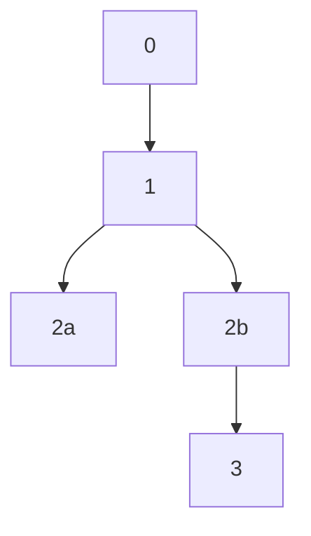

## Resolution

### Operation Compilation

1. Upon invocation of resolution, retrieve all observed operations for the [DID Unique Suffix](#did-unique-suffix) of the DID URI being resolved.
2. If record of the DID being published has been observed, proceed to Step 3. If there is no observed record of the DID being published, skip all remaining [Operation Compilation](#operation-compilation) steps and process the DID as follows:
    1. If the DID URI ****does not**** include a `-METHOD-initial-state` _DID URL Parameter_ with a Method-specific prefix that matches the name of the implementation, abort resolution and return _Unresolvable_.
    2. If the DID URI ****does**** include a `-METHOD-initial-state` _DID URL Parameter_ with a Method-specific prefix that matches the name of the implementation, process the DID as follows:
        1. Split the `-METHOD-initial-state` _DID URL Parameter_ string value by the period (`.`) character, and ensure the resulting array contains ****exactly**** two (2) members. If the resulting array contains fewer than two members, abort resolution and return _Unresolvable_.
        2. Using the implementation's [`DATA_ENCODING_SCHEME`](#data-encoding-scheme), decode the both members of the array and retain the resulting values. If the values fail to properly decode in accordance with the implementation's [`DATA_ENCODING_SCHEME`](#data-encoding-scheme), abort resolution and return _Unresolvable_.
        3. Let the decoded value at the 0 index be the DID's [_Create Operation Suffix Data Object_](#create-suffix-data-object), and validate it as such. If the value is found to be a valid [_Create Operation Suffix Data Object_](#create-suffix-data-object), proceed, if the value fails validation, abort resolution and return _Unresolvable_.
        4. Let the decoded value at the 0 index be the DID's [_Create Operation Delta Object_](#create-delta-object) (which is present in a [_Chunk File Delta Entry_](#chunk-file-delta-entry) for published, anchored DIDs), and validate it as such. If the value is found to be a valid [_Create Operation Delta Object_](#create-delta-object) , proceed, if the value fails validation, abort resolution and return _Unresolvable_.
        5. If all steps above are successful, internally flag the state of the DID as _Unpublished_ and continue to Step 4 of the Operation Compilation process ([create operation processing](#create-operation-processing)) as if the values decoded and validated in the steps above represent the only operation associated with the DID.

3. [Assembly of the _Operation Hash Map_](#operation-hash-map-construction){id="operation-hash-map-construction"}: if no entries are present in the DID's _Operation Storage_ area without the _Mapped_ flag, proceed to the next step, if entries do exist in the DID's _Operation Storage_ begin iterating them forward from 0-index as follows:
    1. If the entry is a [Create](#create) operation, create a persistent [_Create Operation Pool_](#create-operation-pool){id="create-operation-pool"} reference for it, and all other Create-type operations found during this iteration. 
    2. If the entry is not a [Create](#create) operation, derive the _Map Hash_ as follows:
        - If the entry is a [Recovery](#recovery) or [Deactivate](#deactivate) operation, hash the [JCS canonicalized](https://tools.ietf.org/html/draft-rundgren-json-canonicalization-scheme-17) [IETF RFC 7517](https://tools.ietf.org/html/rfc7517) JWK representation value of the entry's `recovery_key` property using the [Hashing Process](#hashing-process) and let the resulting hash value be the _Map Hash_.
        - If the entry is an [Update](#update) operation, hash the value of the entry's `update_reveal_value` property using the [Hashing Process](#hashing-process) and let the resulting hash value be the _Map Hash_.
    3. Ensure a key exists in the _Operation Hash Map_ corresponding to the _Map Hash_, and that the corresponding value is an array. If no property exists for the _Map Hash_, create one and let its value be an array.
    4. Insert the entry into the array of the _Map Hash_ at its proper position in ascending [`Ledger Time`](#ledger-time) order.
    5. Mark the entry in the _Operation Storage_ area with the _Mapped_ flag.

4. [Create operation processing](#create-operation-processing){id="create-operation-processing"}: If no operations are present in the [_Create Operation Pool_](#create-operation-pool), cease resolution of the DID and declare the DID _Unresolvable_. If the [_Create Operation Pool_](#create-operation-pool) contains operation entries, process them as follows:
    1. If a _Next Recovery Commitment_ value has not already been stored in relation to the DID, store the value of the `recovery_commitment` property from the entry's [_Create Operation Suffix Data Object_](#create-suffix-data-object) as the _Next Recovery Commitment_ for use in processing the next Recovery operation.
    2. Retrieve the [_Chunk File Delta Entry_](#chunk-file-delta-entry) from the pre-processed [Chunk File](#chunk-file) associated with the operation and proceed to the processing instruction, or, if the [Chunk File](#chunk-file) has not yet been retrieved and processed (i.e. node is a [_Light Node_](#light-node) implementation, file was previously unavailable, etc.), perform the following steps:
        1. Using the [`CAS_PROTOCOL`](#cas-protocol), fetch the [Chunk File](#chunk-files) using the associated _Chunk File URI_. If the file is unable to be retrieved:
            1. Set the _Next Update Commitment_ value to `null`.
            2. Skip all further Create operation processing steps and proceed to [post-Create operation processing](#post-create-operation-processing).
        2. Validate the [Chunk File](#chunk-file) using the [Chunk File Processing](#chunk-file-processing) procedure. If the [Chunk File](#chunk-file) is valid, proceed, if the file is invalid:
            1. Set the _Next Update Commitment_ value to `null`.
            2. Skip all further Create operation processing steps and proceed to [post-Create operation processing](#post-create-operation-processing).
    3. Validate the [_Chunk File Delta Entry_](#chunk-file-delta-entry). If the [_Chunk File Delta Entry_](#chunk-file-delta-entry) is valid, proceed, if the Entry is invalid, let the state of the DID reflect an _Empty DID State_.
    4. Generate a hash of the decoded [_Chunk File Delta Entry_](#chunk-file-delta-entry) via the [Hashing Process](#hashing-process) and ensure the hash equals the value of the [_Create Operation Suffix Data Object_](#create-suffix-data-object) `delta_hash` property. If the values are exactly equal, proceed, if they are not:
        1. Set the _Next Update Commitment_ value to `null`.
        2. Skip all further Create operation processing steps and proceed to [post-Create operation processing](#post-create-operation-processing).
    5. Store the `update_commitment` value of the [_Chunk File Delta Entry_](#chunk-file-delta-entry) as the _Next Update Commitment_ for use in processing the next Update operation.
    6. Begin iterating the `patches` array in the [_Chunk File Delta Entry_](#chunk-file-delta-entry), and for each [DID State Patch](#did-state-patch) entry, perform the following steps:
        1. Validate the entry in accordance any requirements imposed by the [Patch Action](#standard-patch-actions) type indicated by the `action` value of the entry. If the entry is valid, proceed, if the entry fails validation, skip the entry and proceed to the next entry.
        2. Apply the patch as directed by the [Patch Action](#standard-patch-actions) type specified by the `action` property. If any part of the patch fails or produces an error, reverse all modifications to the DID's state and proceed to the next entry.

5. [Recovery and deactivate operation processing](#recovery-deactivate-operation-processing){id="recovery-deactivate-operation-processing"}: when Create operations have been successfully processed, process any [Recovery](#recovery) and [Deactivate](#deactivate) operations that may exist in the _Operation Hash Map_ using the following processing loop:
    1. If a property is present in the _Operation Hash Map_ that matches the _Next Recovery Commitment_ exactly, process its array of operation entries using the following steps. If no property exists in the _Operation Hash Map_ that matches the _Next Recovery Commitment_ exactly, exit [recovery and deactivate operation processing](#recovery-deactivate-operation-processing) and advance to [update operation processing](#update-operation-processing).
    2. Iterate the array of operation entries forward from 0-index using the process enumerated below until a valid entry is found and processed:
        - If the entry is a [Recovery](#recovery) operation:
            1. Use the `recovery_key` value of the [_Recovery Operation Signed Data Object_](#recovery-signed-data-object) to validate its JWS signature. If the signature is valid, proceed, if the signature is invalid, skip the entry and iterate forward to the next entry. If there are no further operation entries, and the _Next Update Commitment_ value ****IS**** set to `null`, proceed to [compiled state processing](#compiled-state-processing). If the _Next Update Commitment_ value ****IS NOT**** set to `null`, proceed to [update operation processing](#update-operation-processing).
            2. Store the `recovery_commitment` value of the [_Recovery Operation Signed Data Object_](#recovery-signed-data-object) as the new value for the _Next Recovery Commitment_, for use in processing the next [Recovery](#recovery) operation.
            3. Retrieve the [_Chunk File Delta Entry_](#chunk-file-delta-entry) from the pre-processed [Chunk File](#chunk-file) associated with the operation and proceed to the processing instruction, or, if the [Chunk File](#chunk-file) has not yet been retrieved and processed (e.g. node is a [_Light Node_](#light-node) implementation), perform the following steps:
                1. Using the [`CAS_PROTOCOL`](#cas-protocol), fetch the [Chunk File](#chunk-files) data using the associated _Chunk File URI_. If the file data is able to be retrieved, proceed, if the file cannot be found:
                    1. Set the _Next Update Commitment_ value to `null`.
                    2. Use the new _Next Recovery Commitment_ in another run of the [recovery and deactivate operation processing](#recovery-deactivate-operation-processing) loop.
                2. Validate the [Chunk File](#chunk-file) using the [Chunk File Processing](#chunk-file-processing) procedure. If the [Chunk File](#chunk-file) is valid, proceed, if the file is invalid:
                    1. Set the _Next Update Commitment_ value to `null`.
                    2. Use the new _Next Recovery Commitment_ in another run of the [recovery and deactivate operation processing](#recovery-deactivate-operation-processing) loop.
            4. Validate the [_Chunk File Delta Entry_](#chunk-file-delta-entry). If the [_Chunk File Delta Entry_](#chunk-file-delta-entry) is valid, proceed, if the entry is invalid:
                1. Let the state of the DID reflect an _Empty DID State_.
                2. Use the new _Next Recovery Commitment_ in another run of the [recovery and deactivate operation processing](#recovery-deactivate-operation-processing) loop.
            5. Generate a hash of the decoded [_Chunk File Delta Entry_](#chunk-file-delta-entry) via the [Hashing Process](#hashing-process) and ensure the hash equals the value of the [_Recovery Operation Signed Data Object_](#recovery-signed-data-object) `delta_hash` property. If the values are exactly equal, proceed, if the values are not exactly equal:
                1. Set the _Next Update Commitment_ value to `null`.
                2. Use the new _Next Recovery Commitment_ in another run of the [recovery and deactivate operation processing](#recovery-deactivate-operation-processing) loop.
            6. Assign the `update_commitment` value of the [_Chunk File Delta Entry_](#chunk-file-delta-entry) as the new value for the _Next Update Commitment_, for use in processing the next Update operation.
            7. Begin iterating the `patches` array in the [_Chunk File Delta Entry_](#chunk-file-delta-entry), and for each [DID State Patch](#did-state-patch) entry, perform the following steps:
                1. Validate the entry in accordance any requirements imposed by the [Patch Action](#standard-patch-actions) type indicated by the `action` value of the entry. If the entry is valid, proceed, if the entry fails validation, use the new _Next Recovery Commitment_ in another run of the [recovery and deactivate operation processing](#recovery-deactivate-operation-processing) loop.
                2. Apply the patch as directed by the [Patch Action](#standard-patch-actions) type specified by the `action` property. If any part of the patch fails or produces an error, reverse all modifications to the DID's state and use the new _Next Recovery Commitment_ in another run of the [recovery and deactivate operation processing](#recovery-deactivate-operation-processing) loop.
                
        - If the entry is a [Deactivate](#deactivate) operation:
            1. Use the `recovery_key` value of the [_Deactivate Operation Signed Data Object_](#deactivate-signed-data-object) to validate its JWS signature. If the signature is valid, proceed, if the signature is invalid, skip the entry and iterate forward to the next entry.
            2. The [_Deactivate Operation Signed Data Object_](#deactivate-signed-data-object) ****must**** include a `did_suffix` property with a value that exactly equal to the [DID Suffix](#did-suffix) of the DID being operated on, if the value is not exactly equal, skip the entry and proceed to the next operation.
            3. Set the _Next Update Commitment_ value to `null`, mark the DID as _Deactivated_, and process no further operation entries for this DID.

6. [Update operation processing](#update-operation-processing): if the DID is marked as _Deactivated_ or the _Next Update Commitment_ value ****IS**** set to `null`, skip [Update](#update) processing and proceed to [compiled state processing](#compiled-state-processing). If the _Next Update Commitment_ value ****IS NOT**** set to `null` and no [Deactivate](#deactivate) operations were successfully processed during [recovery and deactivate operation processing](#recovery-deactivate-operation-processing), process any Update operations that may exist in the _Operation Hash Map_ using the following processing loop:

    1. If a property is present in the _Operation Hash Map_ that matches the _Next Update Commitment_ exactly, process its array of operation entries using the following steps. If no property exists in the _Operation Hash Map_ that matches the _Next Recovery Commitment_ exactly, exit [update operation processing](#update-operation-processing) and advance to [compiled state processing](#compiled-state-processing).
    2. Iterate the array of operation entries forward from 0-index using the process enumerated below until a valid entry is found and processed:
      
        1. Using the `kid` from the operation's [_Update Operation Signed Data Object_](#update-signed-data-object), locate the key currently associated with the DID that matches the `kid` value, and ensure it is designated as a key allowed to perform operations (e.g. has an [`add-public-keys`](#add-public-keys) Patch Action `usage` designation of `ops`). If no currently associated key matches the `kid` value, or the key is not designated as a key allowed to perform operations, skip the entry, and iterate forward to the next operation.
        2. Using the specified key, validate the [_Update Operation Signed Data Object_](#update-signed-data-object) signature. If the signature is valid, proceed, if the signature is invalid, skip the entry and iterate forward to the next operation.
        3. Retrieve the [_Chunk File Delta Entry_](#chunk-file-delta-entry) from the pre-processed [Chunk File](#chunk-file) associated with the operation and proceed to the processing instruction, or, if the [Chunk File](#chunk-file) has not yet been retrieved and processed (i.e. node is a [_Light Node_](#light-node) implementation, file was previously unavailable, etc.), perform the following steps:
            1. Using the [`CAS_PROTOCOL`](#cas-protocol), fetch the [Chunk File](#chunk-files) using the associated _Chunk File URI_. If the file is unable to be retrieved:
                1. Set the _Next Update Commitment_ value to `null`.
                2. Exit [update operation processing](#update-operation-processing) and advance to [compiled state processing](#compiled-state-processing).
            2. Validate the [Chunk File](#chunk-file) using the [Chunk File Processing](#chunk-file-processing) procedure. If the [Chunk File](#chunk-file) is valid, proceed, if the file is invalid:
                1. Set the _Next Update Commitment_ value to `null`.
                2. Exit [update operation processing](#update-operation-processing) and advance to [compiled state processing](#compiled-state-processing).
        4. Validate the [_Chunk File Delta Entry_](#chunk-file-delta-entry). If the [_Chunk File Delta Entry_](#chunk-file-delta-entry) is valid, proceed, if the entry is invalid, let the state of the DID reflect an _Empty DID State_.
        5. Generate a hash of the decoded [_Chunk File Delta Entry_](#chunk-file-delta-entry) via the [Hashing Process](#hashing-process) and ensure the hash equals the value of the [_Update Operation Signed Data Object_](#update-signed-data-object) `delta_hash` property. If the values are exactly equal, proceed, if they are not:
            1. Set the _Next Update Commitment_ value to `null`.
            2. Exit [update operation processing](#update-operation-processing) and advance to [compiled state processing](#compiled-state-processing).
        6. Store the `update_commitment` value of the [_Chunk File Delta Entry_](#chunk-file-delta-entry) as the _Next Update Commitment_ for use in processing the next Update operation.
        7. Begin iterating the `patches` array in the [_Chunk File Delta Entry_](#chunk-file-delta-entry), and for each [DID State Patch](#did-state-patch) entry, perform the following steps:
            1. Validate the entry in accordance any requirements imposed by the [Patch Action](#standard-patch-actions) type indicated by the `action` value of the entry. If the entry is valid, proceed, if the entry fails validation, exit [update operation processing](#update-operation-processing) and advance to [compiled state processing](#compiled-state-processing).
            2. Apply the patch as directed by the [Patch Action](#standard-patch-actions) type specified by the `action` property. If any part of the patch fails or produces an error, reverse all modifications to the DID's state and exit [update operation processing](#update-operation-processing) and advance to [compiled state processing](#compiled-state-processing).

6. [Compiled state processing](#compiled-state-processing){id="compiled-state-processing"}: After the DID's operations have been evaluated in the compilation steps above, the implementation ****MUST**** use the DID's compiled state to generate a valid DID Document in accordance with the [W3C Decentralized Identifiers](https://w3c.github.io/did-core/) specification.
7. If the DID Document is being rendered in the JSON-LD representation variant, the implementer ****SHOULD**** add an `@base` entry to the document's `@context`, and set the `@base` value to the `id` of the resolved DID. This ensures relative path values in the output DID Document are correctly projected into id-related strings by JSON-LD parsers.
8. Once a valid DID Document state has been generated, proceed to the [DID Resolver Output](#did-resolver-output) process, if you intend to output the resolved DID Document in accordance with the [Decentralized Identifier Resolution](#https://w3c-ccg.github.io/did-resolution/) specification.

### DID Resolver Output

The following describes how to construct [Decentralized Identifier Resolution](#https://w3c-ccg.github.io/did-resolution/)-compliant _Resolution Result_ based on a DID resolved via the [Operation Compilation](#operation-compilation) process described in the section above.

If the compiled DID ****was not**** determined to be _Unresolvable_, as defined in the [Operation Compilation](#operation-compilation) process above, proceed as follows:

1. Generate a JSON object for the _Resolution Result_, structured in accordance with the [Decentralized Identifier Resolution](https://w3c-ccg.github.io/did-resolution/#example-14-example-did-resolution-result) specification.
2. Set the `didDocument` property of the _Resolution Result_ object to the resolved DID Document generated via the [Operation Compilation](#operation-compilation) process.
3. The _Resolution Result_ object ****MUST**** include a `methodMetadata` property, and its value ****MUST**** be an object.
4. The _Resolution Result_ `methodMetadata` object ****MUST**** include a `published` property with a boolean value. If the compiled DID state is flagged as _Unpublished_ and/or _Unresolvable_ (per the [Operation Compilation](#operation-compilation) process), the `published` property ****MUST**** be set to `false`, otherwise, set the value to `true`.
5. If the compiled DID state is flagged as _Non-Updatable_ (per the [Operation Compilation](#operation-compilation) process), the _Resolution Result_ `methodMetadata` object ****MUST**** include a `non-updatable` property with a boolean value, and its value ****MUST**** be set to `true`.

#### Unresolvable DIDs

...

### Late Publishing

Sidetree is an eventually strongly consistent, conflict-free resolution system based on cryptographically signed, delta-based DID operations, which derives its deterministic order of operations from the position of operation entries in a decentralized ledger's immutable linear chronology. Unlike the native tokens of a strongly immutable blockchain (e.g. Bitcoin), DIDs represent unique identifiers that are generally intended to be _non-transferrable_. As such, the Sidetree protocol provides no technical mechanism for exchanging ownership of DIDs with 'double-spend' assurance, the way one might do with a fungible cryptocurrency token.

For Sidetree, _non-transferrability_ manifests in a distinct way: a DID owner is ultimately in control of their past, present, and future state changes, and can expose state change operations as they choose across the lineage of their DID's operational history. DID owners can create forks within _their own_ DID state history, and nothing forces them to expose DID state operations they anchor. A DID operation anchored in the past, at Time X, can be exposed to sometime in the future, at Time Y. This means Sidetree nodes could become aware of past operations that create a change in the lineage of a DID - this is known as _Late Publishing_ of a DID operation. However, due to the _non-transferrability_ of DIDs, this condition is isolated to each DID's own state lineage, and resolved by Sidetree's deterministic ruleset, which guarantees only one fork of a DID's state history can ever be valid. To better understand this, consider the following diagram that illustrates a DID owner, Alice, creating forks by creating and anchoring operations in the past that she does not expose to the network:

As you can see above, Alice has created a fork by anchoring the divergent operations `2a` and `2b`. Let us assume Alice refrains from publishing the [CAS files](#file-structures) that other Sidetree nodes would detect to locate and replicate the date for operation `2a`, and further, assume Alice continues creating more operation history stemming from operation `2b`. Whenever Alice exposes the DID operation data for `2a`, other Sidetree nodes will need to decide which operation between `2a` and `2b` is the 'right' operation. The Sidetree protocol includes a strict rule that resolves this conflict, and any variation of it: the earliest operation in [Ledger Time](#ledger-time) always wins. If operation `2a` precedes operation `2b` in [Ledger Time](#ledger-time), whenever she decides to publish operation `2a`, all other Sidetree nodes would process the operation and immediately deem operation `2a` to be the valid, correct operational fork. This remains true even if Alice continues building operational history stemming from operation `2b` any amount of time into the future.

With this example of _late publishing_ in mind, the most important aspect to remember is that DID owners decide what the PKI state of their DIDs should be, and remain in control of that state independent of the shape of their DID operational history. The net takeaway is that regardless of how a DID owner decides to update the state of their DID, the decision over what that state is remains entirely their choice.