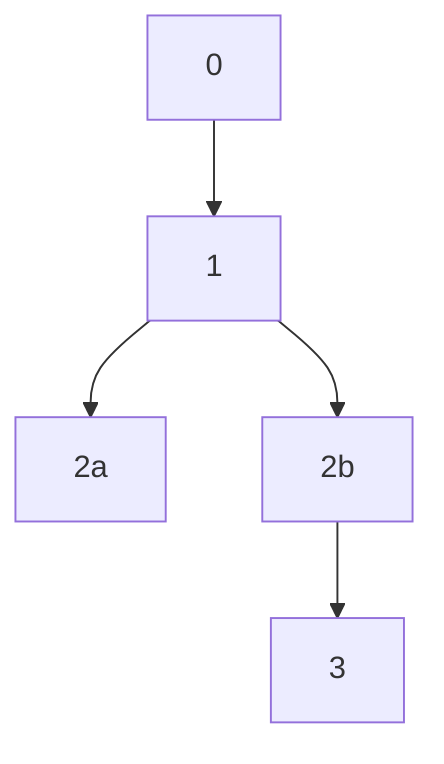

## Resolution

### Operation Compilation

1. Upon invocation of resolution, retrieve all observed operations for the [DID Unique Suffix](#did-unique-suffix) of the DID URI being resolved.
2. If record of the DID being published has been observed, proceed to Step 3. If there is no observed record of the DID being published, skip all remaining [Operation Compilation](#operation-compilation) steps and process the DID as follows:

    1. If the DID URI is a [_Short-Form DID URI_](#short-form-did), abort resolution and return _Not Found_.
    2. If the DID URI is a [_Long-Form DID URI_](#long-form-did-uris), process as follows:
        1. Isolate the last colon-separated (`:`) segment of the DID URI.
        2. Using the implementation's [`DATA_ENCODING_SCHEME`](#data-encoding-scheme), decode the value. If the values fail to properly decode in accordance with the implementation's [`DATA_ENCODING_SCHEME`](#data-encoding-scheme), abort resolution and return _Unresolvable_.
        3. JSON parse the resulting value, apply the [canonicalization](#json-canonicalization-scheme) algorithm, reencode the resulting value and ensure it is the same as the initial value from Step 1. If the values do not match, abort resolution and return _Unresolvable_.
        4.  Use the [Hashing Process](#hashing-process) to generate a hash of the canonicalized [_Create Operation Suffix Data Object_](#create-suffix-data-object) and ensure it matches the [DID Unique Suffix](#did-unique-suffix), if the values do not match, abort resolution and return _Unresolvable_.
        5. Validate the resulting object in accordance with the [_Create Operation Suffix Data Object_](#create-suffix-data-object) schema. If the value is found to be a valid [_Create Operation Suffix Data Object_](#create-suffix-data-object). If the value fails validation, abort resolution and return _Unresolvable_.
        6. Validate the [_Create Operation Delta Object_](#create-delta-object) (which is present in a [_Chunk File Delta Entry_](#chunk-file-delta-entry) for published, anchored DIDs). If the value is found to be a valid [_Create Operation Delta Object_](#create-delta-object). If the value fails validation, abort resolution and return _Unresolvable_.
        7. If all steps above are successful, flag the DID as _Unpublished_ and continue to [Create operation processing](#create-operation-processing) as if the values decoded and validated in the steps above represent the only operation associated with the DID.

3. [Constructing the _Operation Hash Map_](#operation-hash-map-construction){id="operation-hash-map-construction"}: generate a [_Create Operation Pool_](#create-operation-pool){id="create-operation-pool"}, which will house references to any Create operations processed in the steps below, and begin iterating through the operations present in the DID's _Operation Storage_ area as follows:
      1. Type-specific operation evaluation:
    
          - If the entry is a [Create](#create) operation:
          
            Create a reference for the operation in the [_Create Operation Pool_](#create-operation-pool), ensuring operations are positioned in ascending [`Anchor Time`](#anchor-time) order. 

          - If the entry is a [Recovery](#recover) or [Deactivate](#deactivate) operation:
          
            Hash the [canonicalized](#json-canonicalization-scheme) [IETF RFC 7517](https://tools.ietf.org/html/rfc7517) JWK representation value of the entry's `recoveryKey` property using the [`HASH_PROTOCOL`](#hash-protocol), then hash the resulting hash value again using the [`HASH_PROTOCOL`](#hash-protocol) and let the resulting hash value be the _Map Hash_ entry.

          - If the entry is an [Update](#update) operation:
          
            Hash the [canonicalized](#json-canonicalization-scheme) [IETF RFC 7517](https://tools.ietf.org/html/rfc7517) JWK representation value of the entry's `updateKey` property using the [`HASH_PROTOCOL`](#hash-protocol), then hash the resulting hash value again using the [`HASH_PROTOCOL`](#hash-protocol) and let the resulting hash value be the _Map Hash_ entry.

      2. Ensure a key exists in the _Operation Hash Map_ corresponding to the _Map Hash_, and that the corresponding value is an array. If no property exists for the _Map Hash_, create one and let its value be an array.
      3. Insert the entry into the array of the _Map Hash_ at its proper position in ascending [`Anchor Time`](#anchor-time) order.

4. [Create operation processing](#create-operation-processing){id="create-operation-processing"}: If no operations are present in the [_Create Operation Pool_](#create-operation-pool), cease resolution of the DID and return _Unresolvable_. If the [_Create Operation Pool_](#create-operation-pool) contains operation entries, process them as follows:
    1. Store the value of the `recoveryCommitment` property from the entry's [_Create Operation Suffix Data Object_](#create-suffix-data-object) as the _Next Recovery Commitment_ for use in processing the next Recovery operation.
    2. Retrieve the [_Chunk File Delta Entry_](#chunk-file-delta-entry) corresponding to the operation and proceed to Step 3. If the [_Chunk File Delta Entry_](#chunk-file-delta-entry) is not present because the associated [Chunk File](#chunk-files) has not yet been retrieved and processed (i.e. node is a [_Light Node_](#light-node) implementation, file was previously unavailable, etc.), perform the following steps:
        1. Using the [`CAS_PROTOCOL`](#cas-protocol), fetch the [Chunk File](#chunk-files) using the associated _Chunk File URI_. If the file cannot be retrieved, proceed to [recovery and deactivate operation processing](#recovery-deactivate-operation-processing).
        2. Validate the [Chunk File](#chunk-file) using the [Chunk File Processing](#chunk-file-processing) procedure. If the [Chunk File](#chunk-file) is valid. If the file is invalid, proceed to [recovery and deactivate operation processing](#recovery-deactivate-operation-processing).
    3. Validate the [_Chunk File Delta Entry_](#chunk-file-delta-entry). If the [_Chunk File Delta Entry_](#chunk-file-delta-entry) is invalid, proceed to [Recovery and deactivate operation processing](#recovery-deactivate-operation-processing).
    4. Generate a hash of the [canonicalized](#json-canonicalization-scheme) [_Chunk File Delta Entry_](#chunk-file-delta-entry) via the [`HASH_PROTOCOL`](#hash-protocol) and ensure the hash matches the value of the [_Create Operation Suffix Data Object_](#create-suffix-data-object) `deltaHash` property. If the values are ****exactly**** equal, proceed, if they are not, proceed to [recovery and deactivate operation processing](#recovery-deactivate-operation-processing).
    5. Store the `updateCommitment` value of the [_Chunk File Delta Entry_](#chunk-file-delta-entry) as the _Next Update Commitment_ for use in processing the next Update operation.
    6. Begin iterating the `patches` array in the [_Chunk File Delta Entry_](#chunk-file-delta-entry), and for each [DID State Patch](#did-state-patch) entry, perform the following steps:
        1. Validate the entry in accordance any requirements imposed by the [Patch Action](#standard-patch-actions) type indicated by the `action` value of the entry. If the entry is valid, proceed, if the entry fails validation, reverse all modifications to the DID's state and proceed to [recovery and deactivate operation processing](#recovery-deactivate-operation-processing).
        2. Apply the patch as directed by the [Patch Action](#standard-patch-actions) type specified by the `action` property. If any part of the patch fails or produces an error, reverse all modifications to the DID's state and proceed to [recovery and deactivate operation processing](#recovery-deactivate-operation-processing).

5. [Recovery and deactivate operation processing](#recovery-deactivate-operation-processing){id="recovery-deactivate-operation-processing"}: when Create operations have been processed, process any [Recovery](#recover) and [Deactivate](#deactivate) operations that may exist in the _Operation Hash Map_ via the iteration procedure below. If no [Recovery](#recover) and [Deactivate](#deactivate) operations are present, proceed to [update operation processing](#update-operation-processing).
    1. If a property is present in the _Operation Hash Map_ that matches the _Next Recovery Commitment_ exactly, process its array of operation entries using the following steps. If no property exists in the _Operation Hash Map_ that matches the _Next Recovery Commitment_ exactly, exit [recovery and deactivate operation processing](#recovery-deactivate-operation-processing) and advance to [update operation processing](#update-operation-processing).
    2. Iterate the array of operation entries forward from 0-index using the process enumerated below until all valid entries are found and processed:
        - If the entry is a [Recovery](#recover) operation:
            1. Retrieve the operation's [_Core Proof File Recovery Entry_](#core-proof-file-recovery-entry) and [_Chunk File Delta Entry_](#chunk-file-delta-entry) from the pre-processed [_Core Proof File_](#core-proof-file) and [Chunk File](#chunk-file) associated with the operation and proceed to validation of the entries, or, if the [_Core Proof File_](#core-proof-file) and [Chunk File](#chunk-file) have yet to be retrieved and processed (e.g. the resolving node is in a [_Light Node_](#light-node) configuration), perform the following steps:
                1. Using the [`CAS_PROTOCOL`](#cas-protocol), fetch the [_Core Proof File_](#core-proof-file) and [Chunk File](#chunk-files) using the associated [_Core Proof File URI_](#core-proof-file-uri) and [_Chunk File URI_](#chunk-file-uri).
                2. If the [_Core Proof File_](#core-proof-file) is unable to be retrieved, skip the entry and advance to the next operation.
                3. Validate the [_Core Proof File_](#core-proof-file). If the file is valid, proceed, if the file is invalid, skip the entry and advance to the next operation.
            2. Use the `recoveryKey` value of the [_Recovery Operation Signed Data Object_](#recovery-signed-data-object) to validate its JWS signature. If the signature is valid, proceed, if the signature is invalid, skip the entry and iterate forward to the next entry.
            3. Store the `recoveryCommitment` value of the [_Recovery Operation Signed Data Object_](#recovery-signed-data-object) as the new value for the _Next Recovery Commitment_, for use in processing the next [Recovery](#recover) operation.
            4. Validate the [Chunk File](#chunk-file) using the [Chunk File Processing](#chunk-file-processing) procedure. If the [Chunk File](#chunk-file) is valid, proceed, if the file is invalid, advance to the next operation.
            5. Validate the [_Chunk File Delta Entry_](#chunk-file-delta-entry). If the [_Chunk File Delta Entry_](#chunk-file-delta-entry) is valid, proceed, if the entry is invalid, advance to the next operation.
            6. Generate a hash of the [canonicalized](#json-canonicalization-scheme) [_Chunk File Delta Entry_](#chunk-file-delta-entry) via the [`HASH_PROTOCOL`](#hash-protocol) and ensure the hash equals the value of the [_Recovery Operation Signed Data Object_](#recovery-signed-data-object) `deltaHash` property. If the values are exactly equal, proceed, if the values are not exactly equal, advance to the next operation.
            7. Assign the `updateCommitment` value of the [_Chunk File Delta Entry_](#chunk-file-delta-entry) as the new value for the _Next Update Commitment_, for use in processing the next Update operation. If the `updateCommitment` is not present or invalid, advance to the next operation.
            8. Begin iterating the `patches` array in the [_Chunk File Delta Entry_](#chunk-file-delta-entry), and for each [DID State Patch](#did-state-patch) entry, perform the following steps:
                1. Apply the patch as directed by the [Patch Action](#standard-patch-actions) type specified by the `action` property. If any part of the patch fails or produces an error, clear all patch modifications, set the DID's Document to reflect an empty state, and advance to the next operation.
                
        - If the entry is a [Deactivate](#deactivate) operation:

            1. Retrieve the operation's [_Core Proof File Deactivate Entry_](#core-proof-file-deactivate-entry) from the pre-processed [_Core Proof File_](#core-proof-file) associated with the operation and proceed, or, if the [_Core Proof File_](#core-proof-file) has yet to be retrieved and processed (e.g. the resolving node is in a [_Light Node_](#light-node) configuration), perform the following steps:
                1. Using the [`CAS_PROTOCOL`](#cas-protocol), fetch the [_Core Proof File_](#core-proof-file) using the associated [_Core Proof File URI_](#core-proof-file-uri).
                2. If the [_Core Proof File_](#core-proof-file) is unable to be retrieved, skip the entry and advance to the next operation.
                3. Validate the [_Core Proof File_](#core-proof-file). If the file is valid, proceed, if the file is invalid, skip the entry and advance to the next operation.
            2. Use the `recoveryKey` value of the [_Deactivate Operation Signed Data Object_](#deactivate-signed-data-object) to validate its JWS signature. If the signature is valid, proceed, if the signature is invalid, skip the entry and iterate forward to the next entry.
            3. The [_Deactivate Operation Signed Data Object_](#deactivate-signed-data-object) ****must**** include a `didSuffix` property with a value that exactly equal to the [DID Suffix](#did-suffix) of the DID being operated on, if the value is not exactly equal, skip the entry and proceed to the next operation.
            4. Let the DID reflect a _Deactivated_ state and process no further operation entries for this DID.
    3. Once all [Recovery](#recover) and [Deactivate](#deactivate) operations have been processed, if the _Next Update Commitment_ value is present, proceed to [update operation processing](#update-operation-processing). If the _Next Update Commitment_ value is not present or the DID is in a _Deactivated_ state, proceed to [compiled state processing](#compiled-state-processing).

6. [Update operation processing](#update-operation-processing): if the DID is marked as _Deactivated_ or the _Next Update Commitment_ value is not present, skip [Update](#update) processing and proceed to [compiled state processing](#compiled-state-processing). If the _Next Update Commitment_ value is present and no [Deactivate](#deactivate) operations were successfully processed during [recovery and deactivate operation processing](#recovery-deactivate-operation-processing), process any Update operations that may exist in the _Operation Hash Map_ using the following processing loop:
    
    1. If a property is present in the _Operation Hash Map_ that matches the _Next Update Commitment_ exactly, process its array of operation entries using the following steps. If no property exists in the _Operation Hash Map_ that matches the _Next Update Commitment_ exactly, exit [update operation processing](#update-operation-processing) and advance to [compiled state processing](#compiled-state-processing).
    2. Iterate the array of operation entries forward from 0-index using the process enumerated below until all valid entries are found and processed:
      
        1. Retrieve the operation's [_Provisional Proof File Update Entry_](#provisional-proof-file-update-entry) and [_Chunk File Delta Entry_](#chunk-file-delta-entry) from the pre-processed [_Provisional Proof File_](#provisional-proof-file) and [Chunk File](#chunk-file) associated with the operation and proceed to validation of the entries, or, if the [_Provisional Proof File_](#provisional-proof-file) and [Chunk File](#chunk-file) have yet to be retrieved and processed (e.g. the resolving node is in a [_Light Node_](#light-node) configuration), perform the following steps:
            1. Using the [`CAS_PROTOCOL`](#cas-protocol), fetch the [_Provisional Proof File_](#provisional-proof-file) and [Chunk File](#chunk-files) using the associated [_Provisional Proof File URI_](#provisional-proof-file-uri) and [_Chunk File URI_](#chunk-file-uri).
            2. If the [_Provisional Proof File_](#provisional-proof-file) is unable to be retrieved, skip the entry and advance to the next operation.
            3. Validate the [_Provisional Proof File_](#provisional-proof-file). If the file is valid, proceed, if the file is invalid, skip the entry and advance to the next operation.
        2. Using the revealed `updateKey` JWK value, validate the [_Update Operation Signed Data Object_](#update-signed-data-object) signature. If the signature is valid, proceed, if the signature is invalid, skip the entry and iterate forward to the next entry.
        3. Validate the [_Chunk File_](#chunk-file) and [_Chunk File Delta Entry_](#chunk-file-delta-entry). If the [_Chunk File_](#chunk-file) and [_Chunk File Delta Entry_](#chunk-file-delta-entry) are valid, proceed, if the entry is invalid, skip the entry and iterate forward to the next entry.
        4. Generate a hash of the [canonicalized](#json-canonicalization-scheme) [_Chunk File Delta Entry_](#chunk-file-delta-entry) via the [`HASH_PROTOCOL`](#hash-protocol) and ensure the hash equals the value of the [_Update Operation Signed Data Object_](#update-signed-data-object) `deltaHash` property. If the values are exactly equal, proceed, if they are not, skip the entry and iterate forward to the next entry.
        5. Store the `updateCommitment` value of the [_Chunk File Delta Entry_](#chunk-file-delta-entry) as the _Next Update Commitment_ for use in processing the next Update operation.
        6. Begin iterating the `patches` array in the [_Chunk File Delta Entry_](#chunk-file-delta-entry), and for each [DID State Patch](#did-state-patch) entry, perform the following steps:
            1. Apply the patch as directed by the [Patch Action](#standard-patch-actions) type specified by the `action` property. If any of the patches produce an error, reverse all of this operation's patch modifications to the DID state data, while retaining the successful rotation to the next _Next Update Commitment_ value, and iterate forward to the next operation.

6. [Compiled state processing](#compiled-state-processing){id="compiled-state-processing"}: After the DID's operations have been evaluated in the compilation steps above, the implementation ****MUST**** use the DID's compiled state to generate a valid DID Document in accordance with the [W3C Decentralized Identifiers](https://w3c.github.io/did-core/) specification. If your implementation is designed to produce a different format of state data, ensure it outputs in accordance with the format you are targeting.
7. If the implementation is outputting DID state data as a DID Document, and the DID Document is being rendered in the JSON-LD representation variant, the implementer ****SHOULD**** add an `@base` entry to the document's `@context`, and set the `@base` value to the `id` of the resolved DID. This ensures relative path values in the output DID Document are correctly projected into id-related strings by JSON-LD parsers.
8. Once a valid DID state output has been generated (e.g. a valid DID Document), proceed to the [DID Resolver Output](#did-resolver-output) process if you intend to render the output as a DID Document, in accordance with the [Decentralized Identifier Resolution](#https://w3c-ccg.github.io/did-resolution/) specification.


### DID Resolver Output

The following describes how to construct [Decentralized Identifier Resolution](#https://w3c-ccg.github.io/did-resolution/)-compliant _Resolution Result_ based on a DID resolved via the [Operation Compilation](#operation-compilation) process described in the section above.

If the  DID was determined to be _Not Found_ or _Unresolvable_, return a response consistent with those states. If the compiled DID was not determined to be _Not Found_ or _Unresolvable_ (per the [Operation Compilation](#operation-compilation) process above), proceed as follows:

1. Generate a JSON object for the _Resolution Result_, structured in accordance with the [Decentralized Identifier Resolution](https://w3c-ccg.github.io/did-resolution/#example-14-example-did-resolution-result) specification.
2. Set the `didDocument` property of the _Resolution Result_ object to the resolved DID Document generated via the [Operation Compilation](#operation-compilation) process.
5. The _Resolution Result_ object ****MUST**** include a `didDocumentMetadata` property, and its value ****MUST**** be an object composed of the following properties:
    ::: example DID Document Metadata
    ```json
    "didDocumentMetadata": {
      "deactivated": true,
      "canonicalId": "did:sidetree:EiDyOQbbZAa3aiRzeCkV7LOx3SERjjH93EXoIM3UoN4oWg",
      "equivalentId": ["did:sidetree:EiDyOQbbZAa3aiRzeCkV7LOx3SERjjH93EXoIM3UoN4oWg"],
      "method": {
        "published": true,
        "recoveryCommitment": "EiBfOZdMtU6OBw8Pk879QtZ-2J-9FbbjSZyoaA_bqD4zhA",
        "updateCommitment": "EiDOrcmPtfMHuwIWN6YoihdeIPxOKDHy3D6sdMXu_7CN0w"
      }
    }
    ```
    :::

    - `deactivated` - This property ****MUST**** be present if the resolved DID is determined to be in a deactivated state, and it ****MUST**** be set to the boolean value `true`. If the resolved DID is not in a deactivated state, this value ****MUST**** be set to the boolean value `false`.
    - `canonicalId` - If canonical representation of the resolved DID exists, the implementation ****MUST**** include the `canonicalId` property, and the presence and value of the `canonicalId` property is determined as follows:
        1. Presence and value of the `canonicalId` property:
            - If the DID being resolved is a [_Long-Form DID_](#long-form-did-uris) representation and is unpublished, the `canonicalId` property ****MUST NOT**** be included in the `didDocumentMetadata` object.
            - If the DID being resolved is a [_Long-Form DID_](#long-form-did-uris) representation and is published, the `canonicalId` property ****MUST**** be included in the `didDocumentMetadata` object, and its value ****MUST**** be the [_Short-Form DID_](#short-form-did) representation.
            - If the DID being resolved is a [_Short-Form DID_](#short-form-did) representation and is published, the `canonicalId` property ****MUST**** be included in the `didDocumentMetadata` object, and its value ****MUST**** be the [_Short-Form DID_](#short-form-did) representation.
        2. Inclusion of the canonical DID representation in the `equivalentId` array:
            - If under any of the cases above there is a canonical DID representation included for the `canonicalId` property, the canonical DID representation ****MUST**** also be included in the `equivalentId` array. See below for details on the `equivalentId` property.
    - `equivalentId` - If equivalent representations of the resolved DID exist, the implementation ****MUST**** include the `equivalentId` property, and the presence and value of the `equivalentId` property is determined as follows:
        - If the DID being resolved is a [_Long-Form DID_](#long-form-did-uris) representation, the `equivalentId` property ****MUST**** be included in the `didDocumentMetadata` object, and its array value ****MUST**** include the [_Short-Form DID_](#short-form-did) representation.
    - `method` - Its value ****MUST**** be an object composed of the following values:
        1. The object ****MUST**** include a `published` property with a boolean value. If the compiled DID state is flagged as _Unpublished_ and/or _Not Found_ (per the [Operation Compilation](#operation-compilation) process), the `published` property ****MUST**** be set to `false`, otherwise, set the value to `true` if a valid anchoring entry was located for the DID.
        2. The object ****MUST**** include an `updateCommitment` property, and its value ****MUST**** be the `updateCommitment` hash value expected to be fulfilled in with the next `updateKey` revealed in the next [Update](#update) operation.
        3.  The object ****MUST**** include an `recoveryCommitment` property, and its value ****MUST**** be the `recoveryCommitment` hash value expected to be fulfilled in with the next `recoveryKey` revealed in the next [Recovery](#recover) operation.


#### Unresolvable DIDs

If a DID is found to be unresolvable, per the logic defined under the [Operation Compilation](#operation-compilation) section, a Sidetree-compliant node ****SHOULD**** return the appropriate error code over the transport of the resolution request. For HTTP, you ****MUST**** return the responses and status codes defined by the [Sidetree API specification](https://identity.foundation/sidetree/api) section on [Resolution](https://identity.foundation/sidetree/api/#sidetree-resolution). 

### Late Publishing

Sidetree is an eventually strongly consistent, conflict-free state resolution system based on cryptographically signed, delta-based DID operations, which derives its deterministic order of operations from the position of operation entries in a decentralized anchoring system. Unlike the native tokens of a strongly immutable anchoring system (e.g. Bitcoin), DIDs represent unique identifiers that are generally intended to be _non-transferable_. As such, the Sidetree protocol provides no technical mechanism for exchanging ownership of DIDs with 'double-spend' assurance, the way one might do with a fungible cryptocurrency token.

For Sidetree, _non-transferability_ manifests in a distinct way: a DID owner is ultimately in control of their past, present, and future state changes, and can expose state change operations as they choose across the lineage of their DID's operational history. DID owners can create forks within _their own_ DID state history, and nothing forces them to expose DID state operations they anchor. A DID operation anchored in the past, at Time X, can be exposed to sometime in the future, at Time Y. This means Sidetree nodes could become aware of past operations that create a change in the lineage of a DID - this is known as _Late Publishing_ of a DID operation. However, due to the _non-transferability_ of DIDs, this condition is isolated to each DID's own state lineage, and resolved by Sidetree's deterministic ruleset, which guarantees only one fork of a DID's state history can ever be valid. To better understand this, consider the following diagram that illustrates a DID owner, Alice, creating forks by creating and anchoring operations in the past that she does not expose to the network:



As you can see above, Alice has created a fork by anchoring the divergent operations `2a` and `2b`. Let us assume Alice refrains from publishing the [CAS files](#file-structures) that other Sidetree nodes would detect to locate and replicate the date for operation `2a`, and further, assume Alice continues creating more operation history stemming from operation `2b`. Whenever Alice exposes the DID operation data for `2a`, other Sidetree nodes will need to decide which operation between `2a` and `2b` is the 'right' operation. The Sidetree protocol includes a strict rule that resolves this conflict, and any variation of it: the earliest operation in [Anchor Time](#anchor-time) always wins. If operation `2a` precedes operation `2b` in [Anchor Time](#anchor-time), whenever she decides to publish operation `2a`, all other Sidetree nodes would process the operation and immediately deem operation `2a` to be the valid, correct operational fork. This remains true even if Alice continues building operational history stemming from operation `2b` any amount of time into the future.

With this example of _late publishing_ in mind, the most important aspect to remember is that DID owners decide what the PKI state of their DIDs should be, and remain in control of that state independent of the shape of their DID operational history. The net takeaway is that regardless of how a DID owner decides to update the state of their DID, the decision over what that state is remains entirely their choice.
