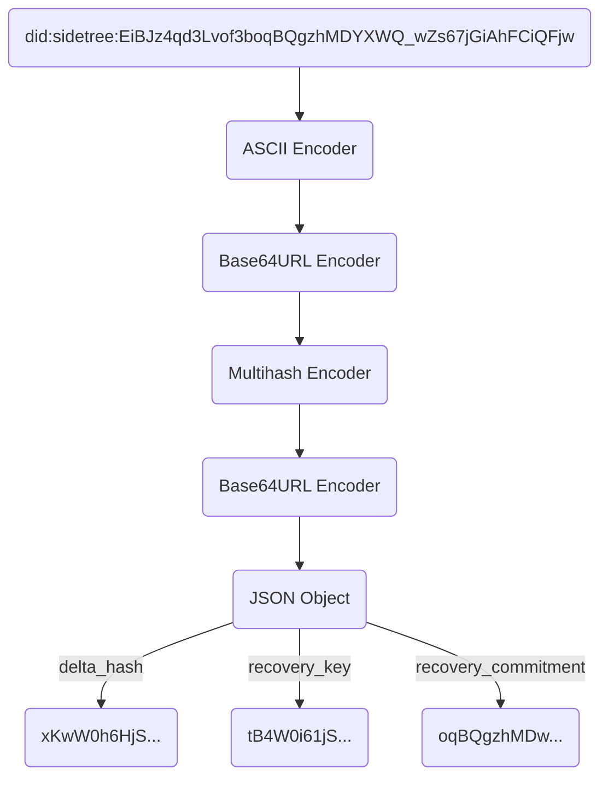

## DID Suffix Composition

DID Methods based on the Sidetree protocol all share the same identifier format. The unique identifier string is a hash of a set of initialization values the controller generates when they create a Sidetree-based DID. This composite hash of initial state values enables Sidetree DIDs to be _self-certifying_, meaning the person or entity who generates a Sidetree-based DID knows their unique identifier immediately, and it is cryptographic secured for instant use (for more on instant use capabilities of Sidetree DIDs see [Long-Form DID Resolution](#)).

Example of a resulting DID, with scheme, Method identifier, and suffix string:

```css
did:sidetree:EiBJz4qd3Lvof3boqBQgzhMDYXWQ_wZs67jGiAhFCiQFjw
```

The process below MUST be used to correctly generate a Sidetree-based DID identifier string:

1. From the values generated during the [Create](#create) operation process, assemble the [_Anchor File Create Entry_](#anchor-file-create-entry) `suffix_data` object, composed as follows:
    
    ```json
    {
      "delta_hash": DELTA_HASH,
      "recovery_key": JWK_OBJECT,
      "recovery_commitment": COMMITMENT_HASH
    }
    ```
    - The object MUST contain a `delta_hash` property, and its value MUST be a hash of the [Create Operation Delta Object](#create-delta-object).
    - The object MUST contain a `recovery_key` property, and its value MUST be the _Initial Recovery Public Key_.
    - The object MUST contain a `recovery_commitment` property, and its value MUST be the _Initial Recovery Commitment_.
2. Once assembled, `Base64URL` encode the JSON object. _(NOTE: Implementers MAY choose to canonicalize the object prior to `Base64URL` encoding it. This does not affect the outcome or other components in the system that deal with this object.)_
3. Use the [`HASH_ALGORITHM`](#hash-algorithm) to generate a [Multihash](#multihash) of the `Base64URL` encoded object.
4. Convert the output from a raw [Multihash](#multihash) buffer to its `Base64URL` encoded representation.
5. Convert the `Base64URL` encoded representation of the [Multihash](#multihash) to its ASCII encoded representation.

The following are graphical representations of the process enumerated above: 

```js
Suffix = ASCII( Base64URL( Multihash( SHA256( Base64URL( UTF8(suffix_data JSON)))))))
```

