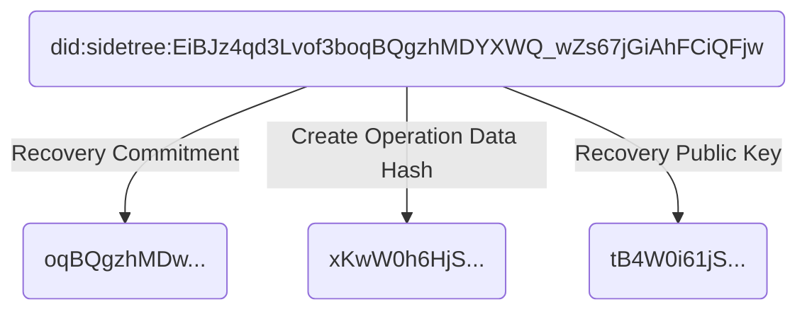

## DID Suffix Composition

DID Methods based on the Sidetree protocol all share the same identifier format. The identifier is a hash of values from the [Create](#create) operation's _Suffix Data Object_ (generated using the [`HASH_ALGORITHM`](#hash-algorithm)), and composed of the following:

