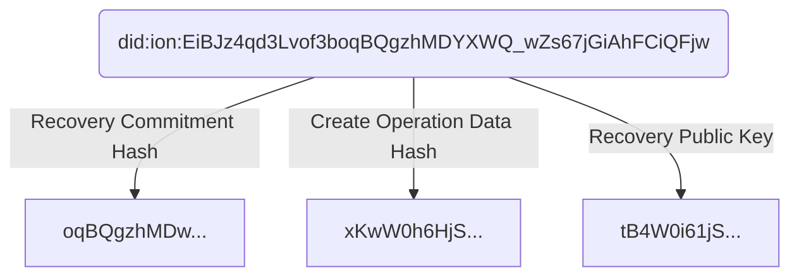

Sidetree Protocol
==================

**Specification Status:** Editor's Draft

**Latest Draft:**
  [identity.foundation/sidetree](https://identity.foundation/sidetree)

**Editors:**
~ [Daniel Buchner](https://www.linkedin.com/in/dbuchner/) (Microsoft)
~ [Orie Steele](https://www.linkedin.com/in/or13b/) (Transmute)

**Contributors:**
~ [Henry Tsai](https://www.linkedin.com/in/henry-tsai-6b884014/) (Microsoft)

**Participate:**
~ [GitHub repo](https://github.com/decentralized-identity/sidetree)
~ [File a bug](https://github.com/decentralized-identity/sidetree/issues)
~ [Commit history](https://github.com/decentralized-identity/sidetree/commits/master)

------------------------------------

## Abstract

This specification describes the Sidetree protocol, which can be applied to any decentralized ledgers (e.g. Bitcoin) to create 'Layer 2' decentralized identifier/DPKI networks that can be as open, public, and permissionless as their underlying ledger systems. Identifiers and PKI metadata in the protocol are expressed via the emerging [W3C _Decentralized Identifiers_](https://w3c.github.io/did-core/) standard, and implementations of the protocol can be codified as their own distinct DID Methods. Briefly, a _DID Method_ is a deterministic mechanism for creating unique, user-owned identifiers and managing their associated PKI metadata (_DID Documents_), all without the need for centralized entities. DID Method indicators are present in DID identifier strings via unique prefixes that distinguish one from another (`did:foo`, `did:bar`, etc.); Sidetree is not a DID Method in itself, but a protocol that can be implemented atop decentralized ledgers to create DID Method implementations (i.e. `did:ion`, `did:elem`).

## Introduction

_This section is non-normative_

Decentralized ledgers (e.g. Bitcoin) introduced the first-ever solution to the linear chronological oracle problem, which unlocked the ability to create robust decentralized identifier networks. However, current approaches that utilize these ledger systems to create decentralized identifier networks suffer from severely limited transactional volumes and other performance issues. Sidetree is a 'Layer 2' protocol that runs atop decentralized ledger systems to enable scalable [W3C _Decentralized Identifier_](https://w3c.github.io/did-core/) (DID) implementations that can be fully open, public, and permissionless. Sidetree is able to do all this without requiring trusted intermediaries, centralized authorities, special protocol tokens, or secondary consensus mechanisms, while preserving the core attributes of decentralization and immutability of the underlying ledger systems it is implemented on.

Architecturally, Sidetree-based DID Method implementations are overlay networks composed of independent peer nodes (_Sidetree nodes_) that observe an underlying decentralized ledger (as illustrated above), replicate DID PKI state data linked from the ledger, and execute against that data a set of deterministic protocol rules to produce an eventually strongly consistent view of all Decentralized Identifiers in the network. The Sidetree protocol defines a core set of DID PKI state change _operations_, structured as delta-based Conflict-Free Replicated Data Types (i.e. Create, Update, Recover, and Revoke), that mutate a Decentralized Identifier's _DID Document_ state. _Sidetree nodes_ that participate in writing operations into the overlay network do so by anchoring _content-addressable storage (CAS)_ (e.g. IPFS) references to aggregated bundles of _operations_ in an underlying ledger. The ledger acts as a linear chronological sequencing oracle, which the protocol leverages to order DID PKI operations in an immutable history all observing nodes can replay and validate. It is this ability to replay the precise sequence of DID PKI state change events, and process those events using a common set of deterministic rules, that allows _Sidetree nodes_ to achieve a consistent view of DIDs and their _DID Document_ states, without requiring any additional consensus mechanism.

## Terminology

| Term                  | Description                                                                    |
|-----------------------|--------------------------------------------------------------------------------|
| Anchor file           | The file containing metadata of a batch of Sidetree operations, of which the hash is written to the blockchain as a Sidetree transaction. |
| Batch file            | The file containing all the operation data batched together.                   |
| DCAS / CAS                  | Distributed content-addressable storage.                                       |
| DID Document          | A document containing metadata of a DID, see [DID specification](https://w3c-ccg.github.io/did-spec/). |
| DID unique suffix     | The unique portion of a DID. e.g. The unique suffix of 'did:sidetree:abc' would be 'abc'. |
| Operation             | A change to a document of a DID.                                               |
| Operation request     | A JWS formatted request sent to a Sidetree node to perform an _operation_.     |
| Recovery key          | A key that is used to perform recovery or delete operation.                    |
| Sidetree node         | A logical server executing Sidetree protocol rules.                            |
| Suffix data           | Data required to deterministically generate a DID .                            |
| Transaction           | A blockchain transaction representing a batch of Sidetree operations.          |

## Protocol Versioning & Default Parameters

The Sidetree protocol and its parameters are expected to evolve overtime. Each version of the protocol will define its protocol rules and parameters, as well as the logical _blockchain time_ at which the new rules and parameter settings will take effect. All subsequent transactions will adhere to the same rules and parameters until a newer protocol version is defined.

The following lists the parameters used by this version of the Sidetree protocol:

| Protocol Parameter          | Description                                                        | Value      |
|-----------------------------|--------------------------------------------------------------------|-----------:|
| Hash algorithm              | The hash algorithm for computation such as for DID generation.     |     SHA256 |
| Maximum anchor file size    | The maximum compressed anchor file size.                           |       1 MB |
| Maximum batch file size     | The maximum compressed batch file size.                            |      10 MB |
| Maximum encoded hash length | The maximum accepted string length of an encoded hash.             |  100 bytes |
| Maximum operation size      | The maximum uncompressed operation size.                           |       1 kb |
| Maximum operation count     | The maximum number of operations per batch.                        |     10,000 |

## Sidetree DID Base URI

DID Methods based on the Sidetree protocol all share the same identifier format. The identifier is a `SHA256` hash of values from the [Create](#create) operation's _Suffix Data Object_, composed as follows:

## Operations

### Create

The following process must be used to generate a Sidetree-based DID:

1. Generate a JSON object, referred to herein as the _Create Document_.
2. The _Create Document_ MUST contain a `type` property, and its value MUST be `create`.
3. The _Create Document_ MUST contain a `operationData` property, and its value MUST be a `base64` encoded object, referred to herein as the _Operation Data Object_, of the following composition:
    1. Generate a secret commitment value, referred to herein as the _Next Update Commitment_, and retain it for use at the next DID Update operation.
    2. The _Operation Data Object_ MUST contain a `nextUpdateOtpHash` property, and its value MUST be a SHA256 hash of the _Next Update Commitment_.
    3. The _Operation Data Object_ MUST contain a `document` property, and its value must be an object, referred to herein as a _Sidetree Delta Operations Object_, composed of Sidetree delta operations, as described in the [Sidetree Delta Operations](#sidetree-delta-operations) section of this document.
4. The _Create Document_ MUST contain a `suffixData` property, and its value MUST be a `base64` encoded object, referred to herein as the _Suffix Data Object_, of the following composition:
    1. Generate a secret commitment value, referred to herein as the _Next Recovery Commitment_, and retain it for use at the next DID Recovery operation.
    2. The _Suffix Data Object_ MUST contain a `nextRecoveryOtpHash` property, and its value MUST be a SHA256 hash of the _Next Recovery Commitment_.
    3. The _Suffix Data Object_ MUST contain an `operationDataHash` property, and its value MUST be a SHA256 hash of the `base64` encoded _Operation Data Object_.
    2. The _Suffix Data Object_ MUST contain a `recoveryKey` property, and its value MUST be an object of the following composition:
        1. Generate a `secp256k1` recovery key pair.
        2. The object MUST contain a `publicKeyHex` property, and its value MUST be be the recovery key pair's Hex encoded public key.

### Update

The following process must be used to update the state a Sidetree-based DID:

1. Generate a JSON object, referred to herein as the _Update Document_.
2. The _Update Document_ MUST contain a `type` property, and its value MUST be `update`.
3. The _Update Document_ MUST contain a `didUniqueSuffix` property, and its value MUST be a `SHA256` hash of the `base64` encoded _Suffix Data Object_ used in the Create operation for the DID in question(which includes the recovery public key, recovery commitment hash, and create operation data hash).
4. The _Update Document_ MUST contain a `updateOtp` property, and its value MUST be the revealed value for the matching _Next Update Commitment_ hash from the previous operation.
5. The _Update Document_ MUST contain a `nextUpdateOtpHash` property, and its value MUST be a SHA256 hash of the _Next Update Commitment_ value that will be revealed in the next Update operation.
6. The _Update Document_ MUST contain a `patches` property, and its value MUST be an object composed of Sidetree delta operations, as described in the [Sidetree Delta Operations](#sidetree-delta-operations) section of this document.

## Sidetree Delta Operations

