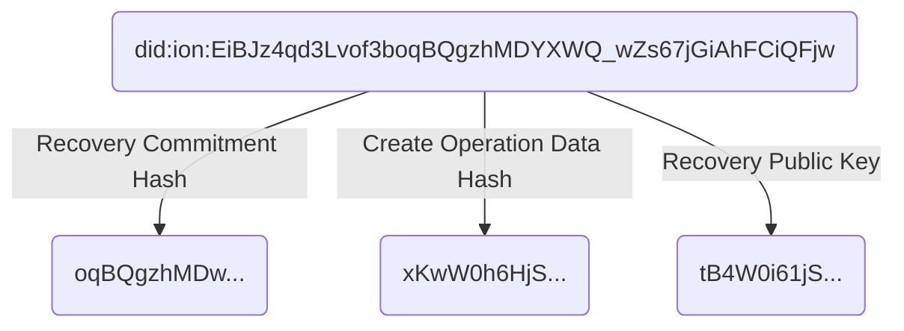

Sidetree Protocol
==================

**Specification Status:** Editor's Draft

**Latest published version:**
  [identity.foundation/sidetree/spec](https://identity.foundation/sidetree/spec)

**Editors:**
~ [Daniel Buchner](https://www.linkedin.com/in/dbuchner/) (Microsoft)
~ [Orie Steele](https://www.linkedin.com/in/or13b/) (Transmute)

**Contributors:**
~ [Henry Tsai](https://www.linkedin.com/in/henry-tsai-6b884014/) (Microsoft)

**Participate:**
~ [GitHub repo](https://github.com/decentralized-identity/sidetree)
~ [File a bug](https://github.com/decentralized-identity/sidetree/issues)
~ [Commit history](https://github.com/decentralized-identity/sidetree/commits/master)

------------------------------------

## Abstract

This specification describes the Sidetree protocol, which can be applied to any decentralized ledgers (e.g. Bitcoin) to create 'Layer 2' decentralized identifier/DPKI networks that can be as open, public, and permissionless as their underlying ledger systems. Identifiers and PKI metadata in the protocol are expressed via the emerging [W3C _Decentralized Identifiers_](https://w3c.github.io/did-core/) standard, and implementations of the protocol can be codified as their own distinct DID Methods. Briefly, a _DID Method_ is a deterministic mechanism for creating unique, user-owned identifiers and managing their associated PKI metadata (_DID Documents_), all without the need for centralized entities. DID Method indicators are present in DID identifier strings via unique prefixes that distinguish one from another (`did:foo`, `did:bar`, etc.); Sidetree is not a DID Method in itself, but a protocol that can be implemented atop decentralized ledgers to create DID Method implementations (i.e. `did:ion`, `did:elem`).

## Introduction

_This section is non-normative_

Decentralized ledgers (e.g. Bitcoin) introduced the first-ever solution to the linear chronological oracle problem, which unlocked the ability to create robust decentralized identifier networks. However, current approaches that utilize these ledger systems to create decentralized identifier networks suffer from severely limited transactional volumes and other performance issues. Sidetree is a 'Layer 2' protocol that runs atop decentralized ledger systems to enable scalable [W3C _Decentralized Identifier_](https://w3c.github.io/did-core/) (DID) implementations that can be fully open, public, and permissionless. Sidetree is able to do all this without requiring trusted intermediaries, centralized authorities, special protocol tokens, or secondary consensus mechanisms, while preserving the core attributes of decentralization and immutability of the underlying ledger systems it is implemented on.

Architecturally, Sidetree-based DID Method implementations are overlay networks composed of independent peer nodes (_Sidetree nodes_) that observe an underlying decentralized ledger (as illustrated above), replicate DID PKI state data linked from the ledger, and execute against that data a set of deterministic protocol rules to produce an eventually strongly consistent view of all Decentralized Identifiers in the network. The Sidetree protocol defines a core set of DID PKI state change _operations_, structured as delta-based Conflict-Free Replicated Data Types (i.e. [Create](#create), [Update](#update), [Recover](#recover), or [Revoke](#revoke)), that mutate a Decentralized Identifier's _DID Document_ state. _Sidetree nodes_ that participate in writing operations into the overlay network do so by anchoring _Content-Addressable Storage (CAS)_ (e.g. IPFS) references to aggregated bundles of _operations_ in an underlying ledger. The ledger acts as a linear chronological sequencing oracle, which the protocol leverages to order DID PKI operations in an immutable history all observing nodes can replay and validate. It is this ability to replay the precise sequence of DID PKI state change events, and process those events using a common set of deterministic rules, that allows _Sidetree nodes_ to achieve a consistent view of DIDs and their _DID Document_ states, without requiring any additional consensus mechanism.

The figure below illustrates the three primary components of a Sidetree-based DID overlay network:

1. The underlying ledger system that serves as the global anchoring and linear sequencing system for DID operations.
2. The Sidetree nodes themselves, which interact with the ledger system to anchor operations, fetch and replicate data from the CAS network, and process operations in accordance with the protocol deterministic ruleset.
3. An integrated Content-Addressable Storage (CAS) network layer Sidetree nodes use to distribute and replicate DID operation files.


## Terminology

| Term                  | Description                                                                    |
|-----------------------|--------------------------------------------------------------------------------|
| Anchor File           | JSON Document containing proving and index data for Create, Recovery, and Revocation operations, and a CAS link to the associated Map File. This file is anchored to the target ledger. |
| Map File              | JSON Document containing Update operation proving and index data, as well as CAS links to Batch File chunks.                   |
| Batch File            | JSON Document containing all verbose operation data for the corresponding set of DIDs specified in the related Map File.                   |
| CAS                   | Content-addressable storage                                                    |
| DID Document          | JSON Document containing public key references, service endpoints, and other PKI metadata that corresponds to a given DID (as defined in the [W3C DID Specification](https://w3c.github.io/did-core/)). |
| DID Unique Suffix     | The unique identifier string within a DID URI. e.g. The unique suffix of `did:sidetree:123` would be `123`. |
| DID Suffix Data       | Data required to deterministically generate a DID.                             |
| DID Operation         | Set of delta-based modifications that change the state of a DID Document when applied.                                               |
| Operation Request     | JWS formatted request sent to a _Sidetree Node_ to include a _DID Operation_ in a batch of operations.     |
| Recovery Key          | Public/private key pair used to perform a Recovery or Revocation operation.          |
| Sidetree Node         | Executable code that implements all the required components, functionality, and rules specified in the Sidetree protocol specification.                            |
| Transaction           | Ledger transaction that anchors a set of Sidetree operations, via a CAS link to an Anchor File.          |

## Protocol Versioning & Default Parameters

The Sidetree protocol and its parameters are expected to evolve overtime. Each version of the protocol will define its protocol rules and parameters, as well as the logical _blockchain time_ at which the new rules and parameter settings will take effect. All subsequent transactions will adhere to the same rules and parameters until a newer protocol version is defined.

The following lists the parameters used by this version of the Sidetree protocol:

| Protocol Parameter          | Description                                                                   | Suggested Value |
|-----------------------------|-------------------------------------------------------------------------------|:----------------|
| `HASH_ALGORITHM` { #hash-algorithm }       | The hash algorithm for computation such as for DID generation. |          SHA256 |
| `MAX_ANCHOR_FILE_SIZE` { #max-anchor-file-size } | The maximum compressed anchor file size.                 |            1 MB |
| `MAX_MAP_FILE_SIZE`         | The maximum compressed map file size.                                         |            1 MB |
| `MAX_BATCH_FILE_SIZE`       | The maximum compressed batch file size.                                       |           10 MB |
| `MAX_ENCODED_HASH_LENGTH`   | The maximum accepted string length of an encoded hash.                        |       100 bytes |
| `MAX_OPERATION_SIZE`        | The maximum uncompressed operation size.                                      |            1 kb |
| `MAX_OPERATION_COUNT`       | The maximum number of operations per batch.                                   |          10,000 |

## Sidetree DID Base URI

DID Methods based on the Sidetree protocol all share the same identifier format. The identifier is a `SHA256` hash of values from the [Create](#create) operation's _Suffix Data Object_, composed as follows:



## Operations

### Create

The following process must be used to generate a Sidetree-based DID:

#### Operation Values

1. Generate a `secp256k1` key pair for use as the initial recovery key of the new DID.
2. Generate a secret commitment value, referred to herein as the _Next Recovery Commitment_, and retain it for use at the next DID Recovery operation.
3. Generate an object, referred to herein as a _Sidetree Operation Object_, composed of Sidetree operations, as described in the [Sidetree Delta Operations](#sidetree-operations) section of this document.

#### Anchor File Inclusion


2. The _Suffix Data Object_ MUST contain a `nextRecoveryOtpHash` property, and its value MUST be a SHA256 hash of the _Next Recovery Commitment_.
3. The _Suffix Data Object_ MUST contain an `operationDataHash` property, and its value MUST be a SHA256 hash of the `base64` encoded _Operation Data Object_.
2. The _Suffix Data Object_ MUST contain a `recoveryKey` property, and its value MUST be an object of the following composition:
    1. Generate a `secp256k1` recovery key pair.
    2. The object MUST contain a `publicKeyHex` property, and its value MUST be be the recovery key pair's Hex encoded public key.

1. Generate an operation  and its value MUST be a `base64` encoded object, referred to herein as the _Operation Data Object_, of the following composition:
    1. Generate a secret commitment value, referred to herein as the _Next Update Commitment_, and retain it for use at the next DID Update operation.
    2. The _Operation Data Object_ MUST contain a `nextUpdateOtpHash` property, and its value MUST be a SHA256 hash of the _Next Update Commitment_.
    3. The _Operation Data Object_ MUST contain a `document` property, and its value must be an object, referred to herein as a _Sidetree Delta Operations Object_, composed of Sidetree delta operations, as described in the [Sidetree Delta Operations](#sidetree-delta-operations) section of this document.
4. The _Create Document_ MUST contain a `suffixData` property, and its value MUST be a `base64` encoded object, referred to herein as the _Suffix Data Object_, of the following composition:
    1. Generate a secret commitment value, referred to herein as the _Next Recovery Commitment_, and retain it for use at the next DID Recovery operation.
    2. The _Suffix Data Object_ MUST contain a `nextRecoveryOtpHash` property, and its value MUST be a SHA256 hash of the _Next Recovery Commitment_.
    3. The _Suffix Data Object_ MUST contain an `operationDataHash` property, and its value MUST be a SHA256 hash of the `base64` encoded _Operation Data Object_.
    2. The _Suffix Data Object_ MUST contain a `recoveryKey` property, and its value MUST be an object of the following composition:
        1. Generate a `secp256k1` recovery key pair.
        2. The object MUST contain a `publicKeyHex` property, and its value MUST be be the recovery key pair's Hex encoded public key.

### Update

The following process must be used to update the state a Sidetree-based DID:

1. Generate a JSON object, referred to herein as the _Update Document_.
2. The _Update Document_ MUST contain a `type` property, and its value MUST be `update`.
3. The _Update Document_ MUST contain a `didUniqueSuffix` property, and its value MUST be a `SHA256` hash of the `base64` encoded _Suffix Data Object_ used in the Create operation for the DID in question(which includes the recovery public key, recovery commitment hash, and create operation data hash).
4. The _Update Document_ MUST contain a `updateOtp` property, and its value MUST be the revealed value for the matching _Next Update Commitment_ hash from the previous operation.
5. The _Update Document_ MUST contain a `nextUpdateOtpHash` property, and its value MUST be a SHA256 hash of the _Next Update Commitment_ value that will be revealed in the next Update operation.
6. The _Update Document_ MUST contain a `patches` property, and its value MUST be an object composed of Sidetree delta operations, as described in the [Sidetree Delta Operations](#sidetree-delta-operations) section of this document.

## File Structures

The protocol defines the following three file structures, which house DID operation data and are designed to support key functionality to enable light node configurations, minimize permanently retained data, and ensure performant resolution of DIDs.


### Anchor File

Anchor files contain [Create](#create) and [Recovery](#recovery) operation proving data, as well as a CAS link to the related Sidetree Map file (detailed below). As the name suggests, Anchor files are anchored to the target ledger system via embedding a Content Addressable Hash link in the ledger's transactional history.

```js
{
  "map_file": CAS_HASH_LINK,
  "operations": {
    "create": [
      {
        initial_state: INITIAL_STATE_HASH,
        initial_recovery_key: PUB_KEY,
        initial_recovery_commitment: SECRET_VALUE_HASH
      },
      {...}
    ],
    "recover": [
      {
        did: DID_SUFFIX,
        recovery_reveal: REVEALED_SECRET_VALUE,
        new_recovery_commitment: SECRET_VALUE_HASH,
        new_state: RECOVERY_STATE_HASH,
        new_recovery_key: PUB_KEY,
        sig: RECOVERY_KEY_SIGNATURE
      },
      {...}
    ],
    "revoke": [
      {
        did: DID_SUFFIX,
        recovery_reveal: REVEALED_SECRET_VALUE,
        sig: RECOVERY_KEY_SIGNATURE
      },
      {...}
    ]
  }
}
```

A valid Anchor File is a JSON document MUST NOT exceed the [`MAX_ANCHOR_FILE_SIZE`](#max-anchor-file-size) of the following composition:

1. The Anchor File MUST contain a `map_file` property, and its value MUST be a _CAS URI_ for the related Map File.
2. If the set of operations to be anchored contain any [Create](#create), [Recover](#recovery), or [Revoke](#revoke) operations, the Anchor File MUST contain an `operations` property, and its value MUST be an object composed as follows:
    - If the set of operations to be anchored contains any [Create](#create) operations, add the property `create`, and let its value be an array of _Anchor File Create Operation Entries_, which are objects composed as follows for each [Create](#create) operation in the set:
        - The object MUST contain an `initial_state` property, and its value MUST be a hash value of the DID's initial state, using the [`HASH_ALGORITHM`](#hash-algorithm).
2. If the set of operations to be anchored contains any [Create](#create) operations, the Anchor File MUST contain a `create` property, and its value MUST be an object with an `ops` property, whose value MUST be an array of _Create Operation Anchor File Entries_.

### Map File

The Map file in the Sidetree protocol contains Update operation proving data, as well as the CAS-linked Batch file chunks.

```js
{
  "chunks": [
    { chunk: CHUNK_HASH }
  ],
  "updates": {
    "ops": [
      {
        did: DID_UNIQUE_SUFFIX,
        update_reveal: REVEALED_COMMITMENT_VALUE,
        update_patch: STATE_PATCH_HASH,
        sig: UPDATE_KEY_SIGNATURE
      },
      {...}
    ]
  }
}
```

### Batch File

Batch files contain Sidetree Operation source data, which are composed of delta-based CRDT entries that modify the state of a Sidetree identifier's DID Document.

```js
{
  "ops": [
    { SIDETREE_OPERATION },
    { SIDETREE_OPERATION },
    ...
  ]
}
```